# Práctica 1: Crear y Usar Módulos Reutilizables en Terraform

## Objetivo

Aprender a crear módulos reutilizables en Terraform para una **VPC**, **Subred**, **regla de Firewall (SSH)** y una **instancia de Compute Engine** en GCP, y consumirlos desde un proyecto principal.

## Requisitos

- Proyecto de GCP existente con **facturación habilitada** y `PROJECT_ID` disponible.
- **Terraform** (>= 1.6) y **gcloud CLI** instalados.
- **Visual Studio Code** instalado en tu equipo.
- Extensión de **Terraform** instalada en VS Code (HashiCorp Terraform).
- Autenticado con **Application Default Credentials (ADC)**.
- Llave pública **SSH** para acceso a la VM (o generarla durante la práctica).


## Duración aproximada

- 40 minutos

## Región

- us-central1

## Introducción

En esta práctica crearás dos módulos Terraform: uno de **red** (VPC, Subred y Firewall para SSH) y otro de **cómputo** (VM de Compute Engine). Luego, los consumirás desde un proyecto principal. Trabajarás en Visual Studio Code para escribir, organizar y ejecutar los archivos de Terraform. Al finalizar, tendrás la infraestructura desplegada y podrás conectarte por SSH a la VM usando tu llave pública.

---

**[⬅️ Atrás](https://netec-mx.github.io/TRFRM-GCP-INT_Priv/Capítulo9/lab12.html)** | **[Lista General](https://netec-mx.github.io/TRFRM-GCP-INT_Priv/)** | **[Siguiente ➡️](https://netec-mx.github.io/TRFRM-GCP-INT_Priv/Capítulo2/lab2.html)**

---

## Instrucciones

### Tarea 1: Preparación del entorno y autenticación

Preparar herramientas, autenticación y llaves necesarias para ejecutar Terraform contra tu proyecto de GCP desde VS Code.

#### Tarea 1.1

- **Paso 1.** Abre **Visual Studio Code**, puede estar en el escritorio y en la lista de aplicaciones de Windows.

- **Paso 2.** Verifica la extensión oficial de Terraform (**HashiCorp Terraform**) desde el Marketplace de VS Code. Sino se muestra como la imagen, instalala.

  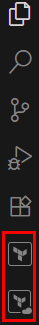

- **Paso 3.** Abre una **nueva terminal integrada** en VS Code (`Ctrl+Ñ` o `Ctrl+Shift+P` y busca "Toggle Integrated Terminal").

- **Paso 4.** Verifica instalación de Terraform:

  **NOTA:** La version puede variar a la de la imagen.

  ```bash
  terraform -version
  ```
  
  ---

  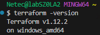

- **Paso 5.** Verifica instalación de gcloud:

  **NOTA:** La version puede variar a la de la imagen.

  ```bash
  gcloud -v
  ```

  ---

  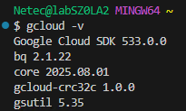

- **Paso 6.** Autentícate con ADC sigue los pasos para autenticación. Una ves autenticado regresa a la **Terminal de VSC** y verifica el exito de autenticación.

  ```bash
  gcloud auth application-default login
  ```

  ---

  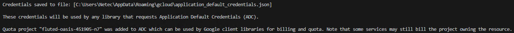

- **Paso 7.**Ahora selecciona proyecto:

  **NOTA:** El ID del proyecto se te asigno al inicio del curso.

   ```bash
   gcloud config set project <TU_PROJECT_ID>
   ```

   ---

   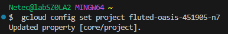

- **Paso 8.** Habilita la API de Compute:

  ```bash
  gcloud services enable compute.googleapis.com
  ```

- **Paso 9.** Verifica que este activada, si no devuelve nada, significa que no está habilitada. Debes obtener el nombre de la API activada

  ```bash
  gcloud services list --enabled --filter="NAME:compute.googleapis.com"
  ```

- **Paso 10.** Crea o verifica que tienes una llave SSH pública. Para crear una, la usaras mas adelante en la practica:

  **NOTA:** La llave pública quedará en: `~/.ssh/gcp-demo.pub`

  - Escribe la contraseña (No sera visible por seguridad): `gcp1982`

  ```bash
  ssh-keygen -t ed25519 -C "gcp-demo" -f ~/.ssh/gcp-demo
  ```

  ---

  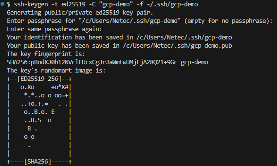
  
> **TAREA FINALIZADA**

**Resultado esperado:** Terraform y gcloud listos, autenticación configurada y llave pública disponible para usar en la VM, todo operando desde la terminal integrada de VS Code.

---

### Tarea 2: Crear la estructura de carpetas del proyecto en VS Code

Definir la jerarquía de archivos para separar módulos y proyecto principal.

#### Tarea 2.1

- **Paso 11.** En la terminal de VS Code, crea una carpeta raíz en el escritorio de la maquina virtual llamada `TERRAGCPLABS` y dentro `lab1-gcp`.

  - Escribe lo siguiente para cambiar de directorio: `cd Desktop/`
  - Ahora: `mkdir TERRAGCPLABS`
  - Finalmente: `cd TERRAGCPLABS && mkdir lab1-gcp && cd lab1-gcp`

  ---

  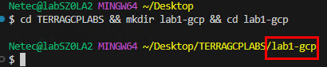

- **Paso 12.** Dentro de esta carpeta `lab1-gcp`, crea la siguiente estructura:

  - Escribe el siguiente comando: `mkdir main && touch main/main.tf main/variables.tf main/terraform.tfvars main/outputs.tf main/providers.tf`
  - Siguiente comando: `mkdir modules && mkdir modules/network && mkdir modules/vm`
  - Siguiente comando: `touch modules/network/main.tf modules/network/variables.tf modules/network/outputs.tf modules/vm/main.tf modules/vm/variables.tf modules/vm/outputs.tf`

  - `lab1-gcp/`
    - `main/`
      - `providers.tf`
      - `main.tf`
      - `variables.tf`
      - `terraform.tfvars`
      - `outputs.tf`
    - `modules/`
      - `network/`
        - `main.tf`
        - `variables.tf`
        - `outputs.tf`
      - `vm/`
        - `main.tf`
        - `variables.tf`
        - `outputs.tf`


- **Paso 13.** Usa el explorador de VS Code para confirmar que todos los archivos existen.
 
  - Da clie en el icono **File** de la barra superior de herramientas en VSC.
  - Clic en la opción **Open Folder** del menu desplegable.
  - Busca la carpeta **TERRAGCPLABS** en el **Escritorio** y da clic en **Select Folder**
  - Confirma la ventana emergente **Yes, I trust the authors**
  - Verifica la estructura del proyecto. Puedes apoyarte de la imagen

  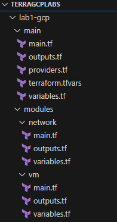

> **TAREA FINALIZADA**

**Resultado esperado:** Directorios y archivos creados en blanco con la estructura indicada.

---

### Tarea 3: Implementar el módulo de red (VPC, Subred, Firewall SSH)

Crear recursos de red reutilizables empaquetados en un módulo.

#### Tarea 3.1

- **Paso 14.** Abre el archivo `main.tf` y pega el siguiente contenido:

  **NOTA:** Si el contenido en el archivo marca errores no te preocupes se resolvera cuando esten todos los archivos configurados.

  - `modules/network/main.tf`:
  - Guarda el archivo.
  - **google_compute_network**: Crea una VPC personalizada sin subredes automáticas.
  - **google_compute_subnetwork**: Crea una subred en la VPC con rango IP definido.
  - **google_compute_firewall**: Permite acceso SSH (puerto 22) a VMs con etiqueta ssh.

  ```hcl
  resource "google_compute_network" "vpc" {
    name                    = var.network_name
    project                 = var.project_id
    auto_create_subnetworks = false
  }

  resource "google_compute_subnetwork" "subnet" {
    name          = var.subnetwork_name
    project       = var.project_id
    region        = var.region
    network       = google_compute_network.vpc.self_link
    ip_cidr_range = var.ip_cidr_range
  }

  resource "google_compute_firewall" "allow_ssh" {
    name    = "${var.network_name}-allow-ssh"
    project = var.project_id
    network = google_compute_network.vpc.name

    allow {
      protocol = "tcp"
      ports    = ["22"]
    }

    direction     = "INGRESS"
    source_ranges = ["0.0.0.0/0"]
    target_tags   = ["ssh"]
  }
  ```

- **Paso 15.** Abre el archivo `variables.tf` y pega el siguiente contenido:

  - `modules/network/variables.tf`:
  - Guarda el archivo.
  - **project_id**: ID del proyecto de GCP donde se crearán los recursos.
  - **region**: Región en la que se desplegarán los recursos.
  - **network_name**: Nombre asignado a la VPC.
  - **subnetwork_name**: Nombre asignado a la subred.
  - **ip_cidr_range**: Rango de direcciones IP para la subred (CIDR).

  ```hcl
  variable "project_id" {
    description = "ID del proyecto de GCP"
    type        = string
  }

  variable "region" {
    description = "Región"
    type        = string
  }

  variable "network_name" {
    description = "Nombre de la VPC"
    type        = string
  }

  variable "subnetwork_name" {
    description = "Nombre de la subred"
    type        = string
  }

  variable "ip_cidr_range" {
    description = "CIDR de la subred (ej. 10.0.1.0/24)"
    type        = string
  }
  ```

- **Paso 16.** Abre el archivo `outputs.tf` y pega el siguiente contenido:

  - `modules/network/outputs.tf`:
  - Guarda el archivo.
  - **network_self_link**: URL completa (self_link) de la VPC creada.
  - **subnetwork_self_link**: URL completa (self_link) de la subred creada.
  - **ssh_firewall_name**: Nombre de la regla de firewall que permite SSH.

  ```hcl
  output "network_self_link" {
    value = google_compute_network.vpc.self_link
  }

  output "subnetwork_self_link" {
    value = google_compute_subnetwork.subnet.self_link
  }

  output "ssh_firewall_name" {
    value = google_compute_firewall.allow_ssh.name
  }
  ```

> **TAREA FINALIZADA**

**Resultado esperado:** Módulo de red listo, exportando enlaces de VPC y Subred, y nombre de la regla de firewall.

---

### Tarea 4: Implementar el módulo de VM (Compute Engine)

Crear un módulo que despliegue una VM con IP pública y permita acceso por SSH usando tu llave.

#### Tarea 4.1

- **Paso 17.** Abre el archivo `main.tf` y pega el siguiente contenido:

  - `modules/vm/main.tf`:
  - Guarda el archivo.
  - **google_compute_instance**: Crea una VM en GCP con etiquetas, disco de arranque, interfaz de red y acceso SSH configurado.

  ```hcl
  resource "google_compute_instance" "vm" {
    project      = var.project_id
    name         = var.vm_name
    machine_type = var.machine_type
    zone         = var.zone
    tags         = ["ssh"]

    boot_disk {
      initialize_params {
        image = var.image
        size  = var.boot_disk_size_gb
        type  = var.boot_disk_type
      }
    }

    network_interface {
      subnetwork = var.subnetwork_self_link
      access_config {}
    }

    metadata = {
      ssh-keys = "${var.ssh_username}:${var.ssh_public_key}"
      enable-oslogin = "TRUE"
    }

    labels = {
      env = var.env
    }
  }
  ```

- **Paso 18.** Abre el archivo `variables.tf` y pega el siguiente contenido: 
  
  - `modules/vm/variables.tf`:
  - Guarda el archivo.
  - **project_id**: ID del proyecto en GCP.
  - **zone**: Zona donde se creará la VM.
  - **subnetwork_self_link**: URL de la subred donde conectará la VM.
  - **vm_name**: Nombre de la máquina virtual.
  - **machine_type**: Tipo de máquina (ej. e2-medium).
  - **image**: Imagen base del sistema operativo.
  - **boot_disk_size_gb**: Tamaño del disco de arranque (GB).
  - **boot_disk_type**: Tipo de disco de arranque (ej. pd-standard).
  - **ssh_username**: Usuario para acceso SSH.
  - **ssh_public_key**: Clave pública SSH autorizada para la VM.
  - **env**: Etiqueta de entorno (por defecto dev).

  ```hcl
  variable "project_id" {
    type = string
  }

  variable "zone" {
    type = string
  }

  variable "subnetwork_self_link" {
    type = string
  }

  variable "vm_name" {
    type = string
  }

  variable "machine_type" {
    type = string
  }

  variable "image" {
    type = string
  }

  variable "boot_disk_size_gb" {
    type = number
  }

  variable "boot_disk_type" {
    type = string
  }

  variable "ssh_username" {
    type = string
  }

  variable "ssh_public_key" {
    type        = string
    description = "Contenido de ~/.ssh/gcp-demo.pub"
  }

  variable "env" {
    type    = string
    default = "dev"
  }
  ```

- **Paso 19.** Abre el archivo `outputs.tf` y pega el siguiente contenido:

  - `modules/vm/outputs.tf`:
  - Guarda el archivo.
  - **instance_self_link**: URL completa (self_link) de la VM creada.
  - **external_ip**: Dirección IP externa asignada a la VM.
  
  ```hcl
  output "instance_self_link" {
    value = google_compute_instance.vm.self_link
  }

  output "external_ip" {
    value = google_compute_instance.vm.network_interface[0].access_config[0].nat_ip
  }
  ```

> **TAREA FINALIZADA**

**Resultado esperado:** Módulo de VM listo, exportando `self_link` e IP externa de la instancia.

---

### Tarea 5: Crear el módulo principal que consume los módulos hijos

Definir provider, habilitar API de Compute, instanciar módulos de red y VM, y parametrizar variables.

#### Tarea 5.1

- **Paso 20.** Abre el archivo `providers.tf` y pega el siguiente contenido: 

  - `main/providers.tf`:
  - Guarda el archivo.
  - Se declara el proveedor de Google Cloud Platform

  ```hcl
  terraform {
    required_providers {
      google = {
        source  = "hashicorp/google"
        version = "~> 5.40"
      }
    }
  }

  provider "google" {
    project = var.project_id
    region  = var.region
    zone    = var.zone
  }
  ```

- **Paso 21.** Abre el archivo `main.tf` y pega el siguiente contenido:

  - `main/main.tf`:
  - Guarda el archivo.
  - **google_project_service.compute**: Habilita la API de Compute Engine en el proyecto.
  - **module.network**: Despliega la VPC, subred y firewall SSH (usa el módulo network).
  - **module.vm**: Crea una VM en la subred anterior (usa el módulo vm).

  ```hcl
  resource "google_project_service" "compute" {
    project            = var.project_id
    service            = "compute.googleapis.com"
    disable_on_destroy = false
  }

  module "network" {
    source          = "../modules/network"
    project_id      = var.project_id
    region          = var.region
    network_name    = "vpc-dev"
    subnetwork_name = "subnet-dev"
    ip_cidr_range   = "10.0.1.0/24"

    depends_on = [google_project_service.compute]
  }

  module "vm" {
    source               = "../modules/vm"
    project_id           = var.project_id
    zone                 = var.zone
    subnetwork_self_link = module.network.subnetwork_self_link
    vm_name              = "vm-dev"
    machine_type         = var.machine_type
    image                = var.image
    boot_disk_size_gb    = var.boot_disk_size_gb
    boot_disk_type       = var.boot_disk_type
    ssh_username         = var.ssh_username
    ssh_public_key       = var.ssh_public_key
    env                  = "dev"

    depends_on = [google_project_service.compute]
  }
  ```

- **Paso 22.** Abre el archivo `variables.tf` y pega el siguiente contenido: 

  - `main/variables.tf`:
  - Guarda el archivo. 
  - **project_id**: ID del proyecto en GCP.
  - **region**: Región donde se desplegarán los recursos (por defecto us-central1).
  - **zone**: Zona específica para la VM (por defecto us-central1-a).
  - **machine_type**: Tipo de máquina de Compute Engine (por defecto e2-micro).
  - **image**: Imagen del sistema operativo para la VM (por defecto Debian 12).
  - **boot_disk_size_gb**: Tamaño del disco de arranque en GB (por defecto 20).
  - **boot_disk_type**: Tipo de disco de arranque (por defecto pd-standard).
  - **ssh_username**: Usuario del sistema que tendrá acceso SSH (por defecto gcpuser).
  - **ssh_public_key**: Contenido de la clave pública SSH autorizada para la VM.

  ```hcl
  variable "project_id" {
    description = "ID del proyecto de GCP"
    type        = string
  }

  variable "region" {
    description = "Región (e.g. us-central1)"
    type        = string
    default     = "us-central1"
  }

  variable "zone" {
    description = "Zona (e.g. us-central1-a)"
    type        = string
    default     = "us-central1-a"
  }

  variable "machine_type" {
    description = "Tipo de máquina de Compute Engine"
    type        = string
    default     = "e2-micro"
  }

  variable "image" {
    description = "Imagen del SO para la VM"
    type        = string
    default     = "debian-cloud/debian-12"
  }

  variable "boot_disk_size_gb" {
    description = "Tamaño del disco de arranque (GB)"
    type        = number
    default     = 20
  }

  variable "boot_disk_type" {
    description = "Tipo de disco (pd-standard, pd-balanced, pd-ssd)"
    type        = string
    default     = "pd-standard"
  }

  variable "ssh_username" {
    description = "Usuario del sistema en la VM"
    type        = string
    default     = "gcpuser"
  }

  variable "ssh_public_key" {
    description = "Contenido de la llave pública (cat ~/.ssh/gcp-demo.pub)"
    type        = string
  }
  ```
    
- **Paso 23.** Abre el archivo `terraform.tfvars` y pega el siguiente contenido:

  - `main/terraform.tfvars`
  - Sustituye el el valor del parametro **project_id** por el que se te asigno al curso.
  - En la terminal escribe el comando para obtener el valor de la llave publica ssh: `cat ~/.ssh/gcp-demo.pub`
  - Copia el valor y sustituyelo en la linea 9 del parametro **ssh_public_key**
  - Guarda el archivo. 

  ```hcl
  project_id        = "TU-PROYECTO-ID"
  region            = "us-central1"
  zone              = "us-central1-a"
  machine_type      = "e2-micro"
  image             = "debian-cloud/debian-12"
  boot_disk_size_gb = 20
  boot_disk_type    = "pd-standard"
  ssh_username      = "gcpuser"
  ssh_public_key    = "TU-LLAVE-SSH"
  ```
  
- **Paso 24.** Abre el archivo `outputs.tf` y pega el siguiente contenido:

  - `main/outputs.tf`:
  - Guarda el archivo.
  - Se obtienen los valores necesarios de toda la infraestructura desplegada.

  ```hcl
  output "vm_self_link" {
    value = module.vm.instance_self_link
  }

  output "vm_external_ip" {
    value = module.vm.external_ip
  }
  ```

> **TAREA FINALIZADA**

**Resultado esperado:** Proyecto principal configurado para instanciar la red y la VM con parámetros definidos en variables y `tfvars`.

---

### Tarea 6: Inicializar, planificar y aplicar la infraestructura

Ejecutar Terraform para crear los recursos en GCP.

#### Tarea 6.1

- **Paso 25.** Entra al directorio principal:

  ```hcl
  cd lab1-gcp/main
  ```

- **Paso 26.** Inicializa proveedores y módulos:

  ```hcl
  terraform init
  ```

  ---

  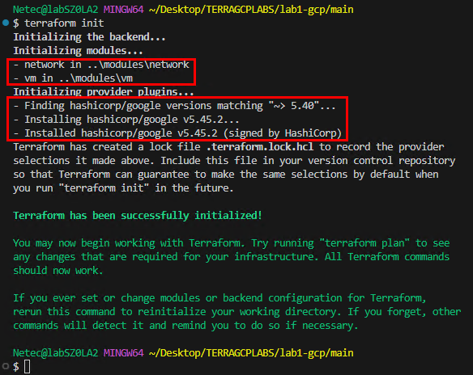

- **Paso 27.** Revisa el plan:

  **NOTA:** El plan puede ser un poco extenso las imagenes son representativas.

  ```hcl
  terraform plan
  ```

  ---

  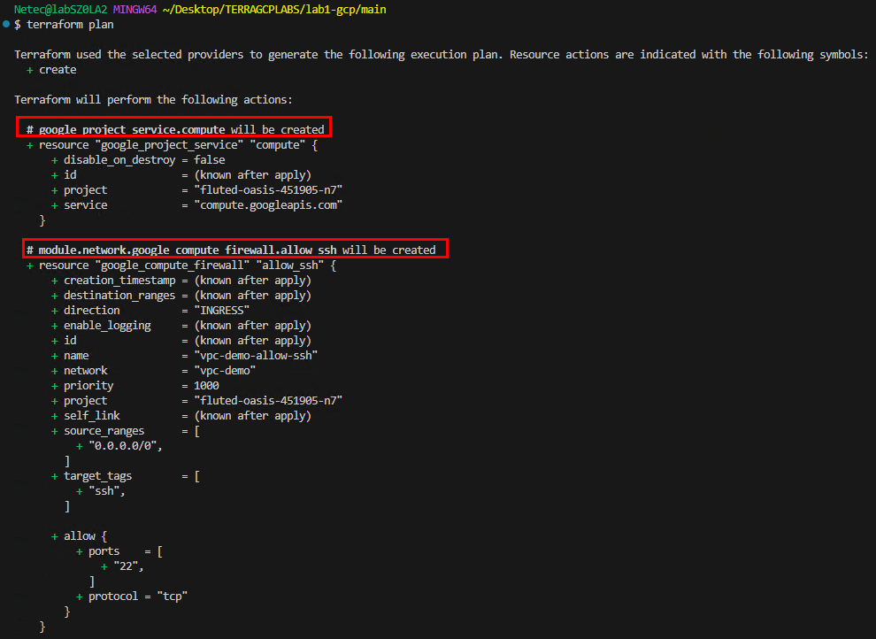

  ---

  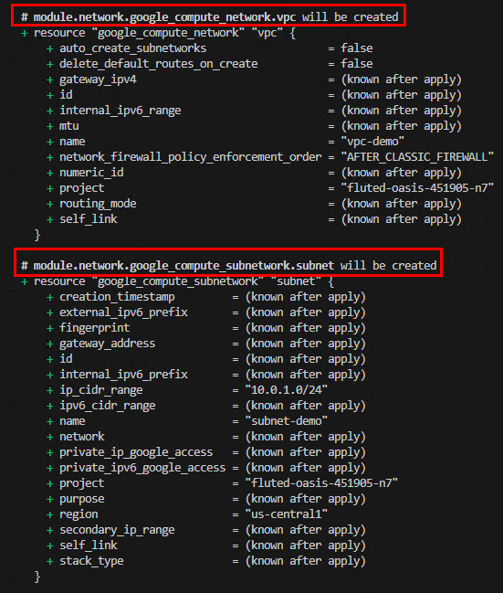

  ---

  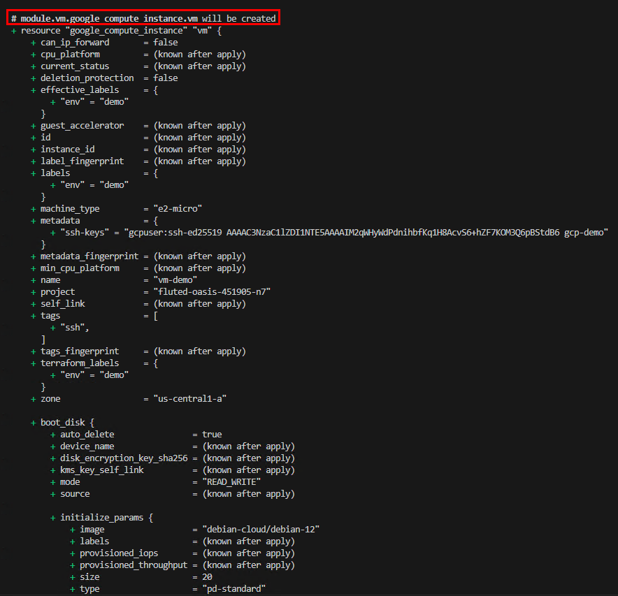

  ---

  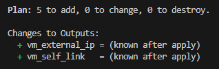

- **Paso 28.** Aplica los cambios y confirma con **"yes"**:

  **NOTA:** Puedes usar tambien `terraform apply -auto-approve`

  ```hcl
  terraform apply
  ```

- **Paso 29.** Terraform comenzara a desplegar la infraestructura definida en las plantillas basadas por modulos. Tomara unos minutos espera a que termine.

  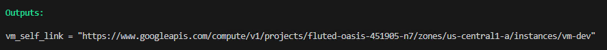

> **TAREA FINALIZADA**

**Resultado esperado:** Terraform crea VPC, Subred, Firewall SSH y VM; al finalizar muestra la IP externa en las salidas.

---

### Tarea 7: Validación y acceso por SSH a la VM

Verificar conectividad y acceso a la instancia creada.

#### Tarea 7.1

- **Paso 30.** Obtén la IP externa de la VM:

  ```bash
  terraform output -raw vm_external_ip
  ```

  ---

  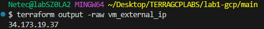

- **Paso 31.** Conéctate por SSH ajusta ruta de tu llave privada. Acepta la autenticacion con **yes**

  - Cambia **TU-PROYECTO** por el que se te asigno al curso

  ```bash
  gcloud compute ssh gcpuser@vm-dev \
    --project TU-PROYECTO --zone us-central1-a \
    --ssh-key-file ~/.ssh/gcp-demo
  ```

  ---

  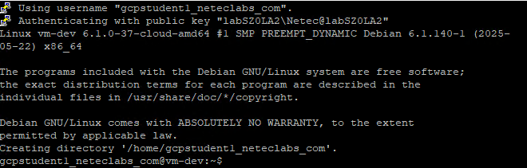

- **Paso 32.** Valida que puedes ejecutar comandos

  ```bash
  uname -a
  ```
  
  ---

  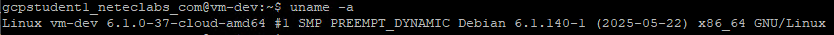

  ---
  
  ```bash
  lsb_release -a
  ```

  ---

  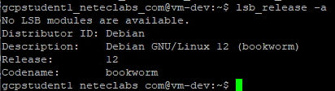

> **TAREA FINALIZADA**

**Resultado esperado:** Conexión SSH exitosa a la VM y ejecución de comandos.

---

### Tarea 8: Limpieza de la infraestructura

Eliminar recursos para evitar costos innecesarios.

#### Tarea 8.1

- **Paso 33.** Escribe el comando `exit` para salir del servidor virtual.

- **Paso 34.** Destruye la infraestructura:

  ```bash
  terraform destroy -auto-approve
  ```

- **Paso 35.** Confirma con **yes** y espera a que finalice.

  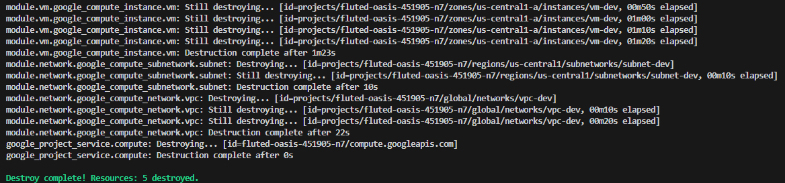

> **TAREA FINALIZADA**

**Resultado esperado:** Todos los recursos creados por Terraform han sido eliminados correctamente del proyecto.

---

> **¡FELICIDADES HAZ COMPLETADO EL LABORATORIO 1!**

---

## Resultado final

Al finalizar la práctica, tendrás **módulos reutilizables** de red y cómputo para GCP, un **proyecto principal** que los consume de forma limpia, una **VM accesible por SSH** con su IP externa, y un flujo estándar de **despliegue y destrucción** con Terraform.

## Notas y/o Consideraciones

- **Seguridad:** la regla de firewall abre el puerto 22 (SSH) a Internet (`0.0.0.0/0`). Para entornos reales, restringe `source_ranges` a rangos confiables o usa **IAP/OS Login**.
- **Llaves SSH:** considera **OS Login con IAM** para centralizar control de acceso y rotación, en lugar de inyectar llaves manualmente.
- **Costos:** usar instancias e IPs públicas puede generar costos. Destruye recursos al terminar y monitorea **presupuestos** y **cuotas**.
- **Regiones/Zonas:** elige región y zona cercanas a tus usuarios o políticas corporativas. Verifica **disponibilidad** de tipos de máquina.
- **Service Accounts:** para cargas reales, usa **cuentas de servicio** específicas con permisos mínimos necesarios (principio de **menor privilegio**).
- **Módulos versionados:** publica los módulos en **Git** y referencia con `?ref=vX.Y.Z` para garantizar reproducibilidad entre entornos.
- **Workspaces:** si gestionas múltiples entornos (dev/test/prod), utiliza `terraform workspace` para aislar estados.

## URLs de referencia

- [Terraform Google Provider (documentación)](https://registry.terraform.io/providers/hashicorp/google/latest)
- [`google_compute_instance`](https://registry.terraform.io/providers/hashicorp/google/latest/docs/resources/compute_instance)
- [`google_compute_network`](https://registry.terraform.io/providers/hashicorp/google/latest/docs/resources/compute_network)
- [`google_compute_subnetwork`](https://registry.terraform.io/providers/hashicorp/google/latest/docs/resources/compute_subnetwork)
- [`google_compute_firewall`](https://registry.terraform.io/providers/hashicorp/google/latest/docs/resources/compute_firewall)
- [Autenticación con ADC (gcloud)](https://cloud.google.com/docs/authentication/provide-credentials-adc)
- [Conectarse a VMs Linux por SSH](https://cloud.google.com/compute/docs/connect/standard-ssh)

---

**[⬅️ Atrás](https://netec-mx.github.io/TRFRM-GCP-INT_Priv/Capítulo9/lab12.html)** | **[Lista General](https://netec-mx.github.io/TRFRM-GCP-INT_Priv/)** | **[Siguiente ➡️](https://netec-mx.github.io/TRFRM-GCP-INT_Priv/Capítulo2/lab2.html)**