# Práctica 2: Migrar el Estado Local a Google Cloud Storage (GCS) con locking habilitado

## Objetivo

Configurar un **backend remoto GCS** para el estado de Terraform, migrar el estado local existente y validar el versionado y el bloqueo de estado para trabajo colaborativo seguro.

## Requisitos

- **Terraform** >= 1.5.0
- **Google Cloud SDK (gcloud)** instalado
- **Proyecto de GCP** con facturación habilitada y permisos para crear buckets
- Autenticación activa y proyecto.

## Duración aproximada

- 30 minutos

## Región

- us-central1

## Introducción

Terraform guarda el estado de los recursos en `terraform.tfstate`. En equipos, mantenerlo **centralizado** evita conflictos y pérdidas. GCS es un backend estable que admite **versionado de objetos** y bloqueo mediante **precondiciones de generación**, lo que previene escrituras concurrentes. En esta práctica crearás un bucket con versionado, configurarás `backend.tf`, migrarás el estado y validarás el resultado.

---

**[⬅️ Atrás](https://netec-mx.github.io/TRFRM-GCP-INT_Priv/Capítulo1/lab1.html)** | **[Lista General](https://netec-mx.github.io/TRFRM-GCP-INT_Priv/)** | **[Siguiente ➡️](https://netec-mx.github.io/TRFRM-GCP-INT_Priv/Capítulo3/lab3.html)**

---

## Instrucciones

**IMPORTANTE:** Recuerda siempre autenticarte a GCP en la terminal de VSC con el comando `gcloud auth application-default login` y el usuario y contraseña asignado al curso.

### Tarea 1: Estructurar el proyecto local

Preparar la carpeta de trabajo y los archivos base. Se creará un directorio `lab2-gcp/` con archivos Terraform mínimos para probar la migración del estado.

#### Tarea 1.1

- **Paso 1.** En la terminal de VSC escribe el siguiente comando para crear la estructura de carpetas y entrar al proyecto:

  **NOTA:** Asegurate de estar dentro del directorio llamado **TERRAGCPLABS** y luego escribe el comando de abajo.

  ```bash
  mkdir -p lab2-gcp && cd lab2-gcp
  ```

  ---

  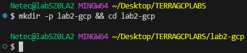

- **Paso 2.** Crea la estructura y archivos vacíos escribe el siguiente comando:

  ```bash
  touch main.tf variables.tf backend.tf terraform.tfvars
  ```

  ---

  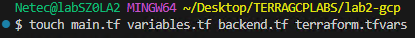

- **Paso 3.** Estructura de archivos esperada.

  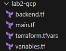

> **TAREA FINALIZADA**

**Resultado esperado:** Proyecto inicial listo en `TERRAGCPLABS/lab2-gcp/`

---

### Tarea 2: Preparar variables de entorno de GCP

Definir variables comunes y verificar el proyecto actual. Se definira el `PROJECT_ID`, nombre del bucket y región para asegurar nombres únicos y consistentes.

#### Tarea 2.1

- **Paso 4.** Obtener y mostrar el **Project ID** activo:

  **NOTA:** El proyecto debe de ser el mismo que se te asigno al curso.

  ```bash
  PROJECT_ID="$(gcloud config get-value project)"
  echo "Proyecto actual: $PROJECT_ID"
  ```

  ---

  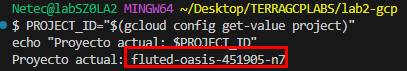

- **Paso 5.** Definir las variables del bucket. Copia y pega las variables en la terminal de VSC.

  **NOTA:** El `BUCKET_NAME` debe ser único.

  ```bash
  BUCKET_LOCATION="us-central1"
  BUCKET_NAME="tfstate-${PROJECT_ID}-${RANDOM}"
  PREFIX="terraform/state"
  echo "Bucket propuesto: gs://${BUCKET_NAME} en ${BUCKET_LOCATION}"
  ```

  ---

  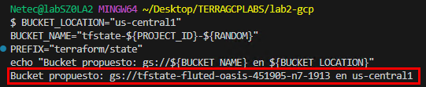

> **TAREA FINALIZADA**

**Resultado esperado:** Variables de entorno listas para crear el bucket de estado.

---

### Tarea 3: Crear el bucket en GCS con versionado

Crear un bucket con **uniform bucket-level access** y **versionado** habilitado y se comprobara la configuración.

#### Tarea 3.1

- **Paso 6.** Crear el bucket que guardara el estado con el siguiene comando:

  **NOTA:** No debe marcarte ningun error al crear el bucket.

  ```bash
  gcloud storage buckets create gs://${BUCKET_NAME} --project="${PROJECT_ID}" --location="${BUCKET_LOCATION}" --uniform-bucket-level-access
  ```

  ---

  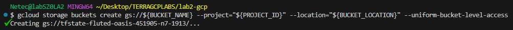

- **Paso 7.** Habilita versionado de objetos (buena practica) escribe el siguiente comando:

  ```bash
  gsutil versioning set on gs://${BUCKET_NAME}
  ```

  ---

  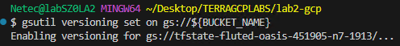

- **Paso 8.** Escribe el siguiene comando para validar que el bucket existe y el versionado está activo:

  ```bash
  gcloud storage buckets describe gs://${BUCKET_NAME} --format="value(versioning_enabled)"

  ```

  ---

  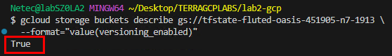

> **TAREA FINALIZADA**

**Resultado esperado:** Bucket `gs://${BUCKET_NAME}` creado con versionado habilitado.

---

### Tarea 4: Definir archivos Terraform (proveedor + recurso de prueba)

En esta actividad definiras los archivos `main.tf`, `variables.tf` y `terraform.tfvars` para desplegar una VPC en GCP. Configurarás el proveedor google.

#### Tarea 4.1

- **Paso 9.** En el archivo `main.tf` copia y pega el siguiente codigo:

  ```hcl
  terraform {
      required_providers {
        google = {
          source  = "hashicorp/google"
          version = ">= 5.0"
        }
      }
    }

    provider "google" {
      project = var.project_id
      region  = var.region
    }

    resource "google_compute_network" "lab2" {
      name                    = var.network_name
      auto_create_subnetworks = true
    }
  ```

- **Paso 10.** En el archivo `variables.tf` copia y pega el siguiente contenido:

  ```hcl
  variable "project_id" {
    type        = string
    description = "ID del proyecto de GCP"
    default     = null
  }

  variable "region" {
    type        = string
    description = "Región por defecto de recursos"
    default     = "us-central1"
  }

  variable "network_name" {
    type        = string
    description = "Nombre de la red de ejemplo a crear"
    default     = "vpc-lab2-estado-remoto"
  }
  ```

- **Paso 11.** Ahora en `terraform.tfvars` define los valores correspondientes:

  - Sustituye el valor **TU-PROYECTO** con el que se te asigno al curso.
  - Este comando puede mostrar tu proyecto: `gcloud config get-value project`

  ```hcl
  project_id = "tu-proyecto"
  region     = "us-central1"
  network_name = "vpc-lab2-estado-remoto"
  ```

- **Paso 12.** Ahora inicializa Terraform con el siguiente comando localmente antes de declarar el backend:

  ```bash
  terraform init
  ```

  ---

  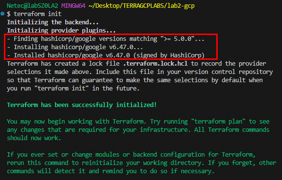

> **TAREA FINALIZADA**

**Resultado esperado:** Archivos Terraform base listos y terraform inicializado.

---

### Tarea 5: Configurar el backend GCS

En esta tarea se definira el archivo `backend.tf` apuntando al bucket creado y al prefijo de estado para centralizar el estado.

#### Tarea 5.1

- **Paso 13.** En el archivo `backend.tf` escribe el siguiente codigo.:

  ```hcl
  terraform {
    backend "gcs" {
      bucket = "REEMPLAZAR_POR_TU_BUCKET"
      prefix = "terraform/state"
    }
  }
  ```

- **Paso 14.** Reemplaza el placeholder por tu bucket real:

  **IMPORTANTE:** Este proceso es dinamico y depende de la varibale **BUCKET_NAME** si el valor se perdio no funcionara, puedes volver a definir la variable o especificar el nombre manualmente en el archivo.

  ```bash
  sed -i "s|REEMPLAZAR_POR_TU_BUCKET|${BUCKET_NAME}|g" backend.tf
  ```

- **Paso 15.** Confirmar contenido, verifica que se haya actualizado la variable en el archivo:

  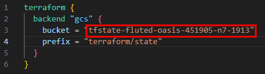

> **TAREA FINALIZADA**

**Resultado esperado:** El archivo `backend.tf` contiene tu `bucket` y `prefix` correctos.

---

### Tarea 6: Inicializar Terraform y migrar el estado

Ejecutaras `terraform init` que detectará el cambio de backend y propondrá copiar el estado local al bucket.

#### Tarea 6.1

- **Paso 16.** Inicializar backend. Asegurate de estar dentro de la carpeta **lab2-gcp**:

  ```bash
  terraform init
  ```

  ---

  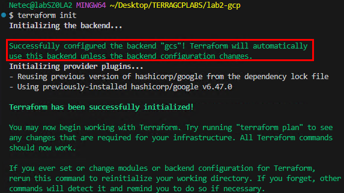

- **Paso 17.** Si llega a aparecer la pregunta **"Do you want to copy the state from "local" to "gcs"?"**. Escribe `yes` cuando lo solicite.

- **Paso 18.** Si no aparece la pregunta anterior avanza con las demas tareas.

> **TAREA FINALIZADA**

**Resultado esperado:** Estado local migrado a GCS exitosamente.

---

### Tarea 7: Validar estado remoto y versionado

Comprobar que el `tfstate` está en GCS y que el versionado funciona. Listar el objeto de estado y sus versiones, y generar una nueva versión con un `plan` o cambio trivial.

#### Tarea 7.1

- **Paso 19.** Listar los objetos del prefijo de estado:

  **NOTA:** Recuerda tener correctamente las variables definidas.

  ```bash
  gcloud storage ls gs://${BUCKET_NAME}/${PREFIX}
  ```

  ---

  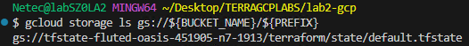

- **Paso 20.** Ver versiones del objeto:

  ```bash
  gcloud storage ls -a gs://${BUCKET_NAME}/${PREFIX}
  ```

  ---

  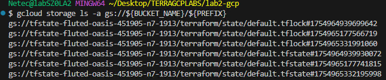  

- **Paso 21.** Forzar una nueva versión (ejemplo, cambia el nombre de la VPC):

  ```bash
  sed -i 's/vpc-lab2-estado-remoto/vpc-lab2-estado-remoto-v2/' variables.tf
  terraform plan -var="project_id=${PROJECT_ID}"
  ```
  
  ---

  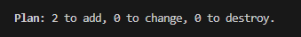  

- **Paso 22.** Aplica la configuración para reflejar los cambios.

  ```bash
  terraform apply -auto-approve -var="project_id=${PROJECT_ID}"
  ```

  ---

  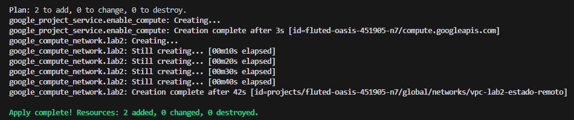

- **Paso 23.** Verifica los cambios en las versiones. Compara la salida anterior con esta nueva.

  ```bash
  gcloud storage ls -a gs://${BUCKET_NAME}/${PREFIX}
  ```

  ---

  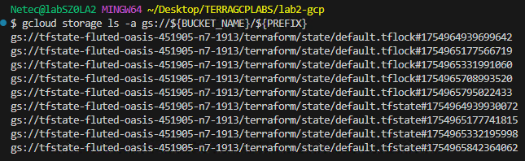

> **TAREA FINALIZADA**

**Resultado esperado:** El objeto de estado aparece en GCS y su historial de versiones aumenta tras los cambios aplciados.

---

### Tarea 8 (Opcional): Probar bloqueo de estado

Verificar que una segunda ejecución concurrente no pueda escribir el estado. Simularas dos operaciones concurrentes en el mismo directorio (dos terminales).

#### Tarea 8.1

- **Paso 24.** En **terminal A** (Abre cualquier terminal), ejecuta:

  **NOTA:** Sino te funciona el Apply puedes intentarlo con Plan. **Debes de ser muy rapido entre las terminales para detectar el bloqueo.**.

  - Sino te sale a la primera intentalo varias veces

  ```bash
  sed -i 's/vpc-lab2-estado-remoto-v2/vpc-lab2-estado-remoto-v3/' variables.tf
  terraform apply -var="project_id=${PROJECT_ID}"
  ```
- **Paso 25.** Mientras sigue corriendo, en **terminal B** (Abre otra terminal en VSC), intentar otro `apply` o `plan`:

  ```bash
  PROJECT_ID="$(gcloud config get-value project)"
  terraform plan -var="project_id=${PROJECT_ID}"
  ```

  ---

  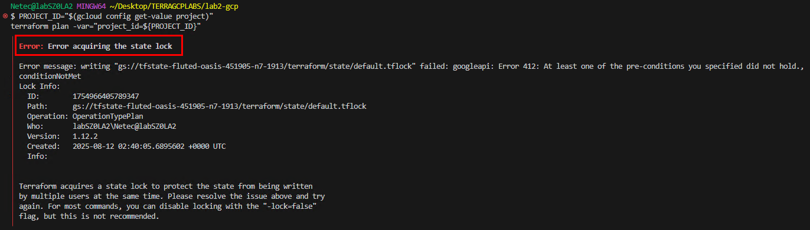

> **TAREA FINALIZADA**

**Resultado esperado:** La ejecución concurrente se bloquea/rehúsa mientras el estado está retenido por otra operación. Se debe esperar a que se libere el uso.

---

### Tarea 9: Limpieza

Eliminar recursos creados por el laboratorio 2 y el bucket de estado. Destruir la VPC de ejemplo, borrar objetos del bucket y eliminar el bucket (irreversible).

#### Tarea 9.1

- **Paso 26.** Destruir infraestructura del Laboratorio 2:

  ```bash
  terraform destroy -auto-approve -var="project_id=${PROJECT_ID}"
  ```

  ---

- **Paso 27.** Borra los objetos y versiones del estado y elimina el bucket:

  ```bash
  gcloud storage rm -r gs://${BUCKET_NAME}
  ```

  ---

  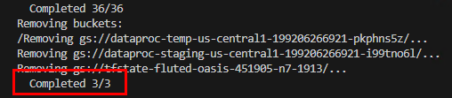

- **Paso 28.** Ahora borra el bucket que se creo para el estado remoto. Si te marca error como en la imagen esta correcto quiere decir que ya no existe y se borro al borrar los objetos.

  ```bash
  gcloud storage buckets delete gs://${BUCKET_NAME}
  ```

  ---

  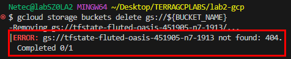

- **Paso 29.** Verificar realmente que ya no exista. Si devuelve **Listed 0 items** esta correcto.

  ```bash
  gcloud storage buckets list --filter="name:${BUCKET_NAME}"
  ```

  ---

  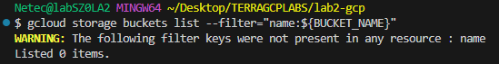

> **TAREA FINALIZADA**

**Resultado esperado:** Infraestructura y bucket eliminados. El entorno queda limpio.

---

> **¡FELICIDADES HAZ COMPLETADO EL LABORATORIO 2!**

---

## Resultado final

- Estado de Terraform **centralizado** en GCS con **versionado** y **bloqueo** efectivo.
- Proyecto con estructura clara y archivos listos para trabajo en equipo.
- Validaciones realizadas que evidencian la migración y el historial de generaciones del estado.

## Notas y/o Consideraciones

- No subas `terraform.tfstate` a Git. Añade `*.tfstate*` en `.gitignore`.
- Usa un **bucket por proyecto/entorno** o un `prefix` por equipo para aislar estados.
- El locking se basa en **precondiciones de generación** del objeto GCS (no requiere servicios extra).
- Controla acceso al bucket con **IAM** (roles `Storage Object Admin` solo para CI/CD o SREs).
- Considera **políticas de retención** y **lifecycle rules** para manejar costo y cumplimiento.
- Fija versiones mínimas de proveedores y Terraform para reproducibilidad.

## URLS de referencia

- [Terraform – Backend GCS](https://developer.hashicorp.com/terraform/language/settings/backends/gcs)
- [Google Cloud Storage – Versionado de objetos](https://cloud.google.com/storage/docs/using-object-versioning)
- [Google Cloud SDK – Instalación](https://cloud.google.com/sdk/docs/install)
- [Proveedor Google para Terraform](https://registry.terraform.io/providers/hashicorp/google/latest)

---

**[⬅️ Atrás](https://netec-mx.github.io/TRFRM-GCP-INT_Priv/Capítulo1/lab1.html)** | **[Lista General](https://netec-mx.github.io/TRFRM-GCP-INT_Priv/)** | **[Siguiente ➡️](https://netec-mx.github.io/TRFRM-GCP-INT_Priv/Capítulo3/lab3.html)**