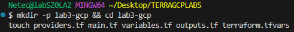
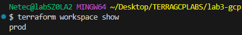

# Práctica 3: Crear y Gestionar Entornos con Workspaces

## Objetivo

Estandarizar **workspaces** para operar múltiples entornos con un solo código. Crear **VPC** + **subred** por entorno con nombres y **CIDR diferenciados** (`dev`, `test`, `prod`). Validar **separación del estado** por workspace (local y/o GCS). Operar desde **VSCode** con buenas prácticas y comandos reproducibles.

## Requisitos

- **Terraform** >= 1.5.0 (verifica con `terraform version`).
- **Google Cloud SDK (gcloud)** instalado y actualizado.
- Proyecto de **GCP** con **facturación habilitada**.
- Permisos para habilitar la API de Compute y crear redes/subredes.
- Autenticación activa y proyecto seleccionado:

## Duración aproximada

- 30 minutos

## Región

- us-central1

## Introducción

Los **workspaces** de Terraform permiten aislar **entornos** (como `dev`, `test`, `prod`) sin duplicar módulos o carpetas. Cada workspace mantiene su propio **archivo de estado**, evitando colisiones. En esta práctica, crearás una **VPC** y **subred** por entorno con nombres dinámicos derivados de `terraform.workspace`. Usarás **VSCode** para editar, **Terraform** para planificar/aplicar, y **gcloud** para **validar** que los recursos existen en el proyecto/region correctos.

---

**[⬅️ Atrás](https://netec-mx.github.io/TRFRM-GCP-INT_Priv/Capítulo2/lab2.html)** | **[Lista General](https://netec-mx.github.io/TRFRM-GCP-INT_Priv/)** | **[Siguiente ➡️](https://netec-mx.github.io/TRFRM-GCP-INT_Priv/Capítulo4/lab4.html)**

---

## Instrucciones

**IMPORTANTE:** Recuerda siempre autenticarte a GCP en la terminal de VSC con el comando `gcloud auth application-default login` y el usuario y contraseña asignado al curso.

### Tarea 1: Preparar estructura en VSCode

Crear la estructura base del proyecto en la ruta indicada y asegurarte de trabajar dentro de VSCode.

#### Tarea 1.1

- **Paso 1.** En VSCode, abre una **ventana** y selecciona **File > Open Folder...** y abre `TERRAGCPLABS`.

- **Paso 2.** Abre la **Terminal Integrada** en VSCode dentro de la carpeta **TERRAGCPLABS** y ejecuta el siguiente comando:

  ```bash
  mkdir -p lab3-gcp && cd lab3-gcp
  touch providers.tf main.tf variables.tf outputs.tf terraform.tfvars
  ```

  ---

  

- **Paso 3.** Estructura de archivos esperada:

  

> **TAREA FINALIZADA**

**Resultado esperado:** Proyecto base creado en `TERRAGCPLABS/lab3-gcp/` y abierto en VSCode con terminal apuntando a esta carpeta.

---

### Tarea 2: Definir proveedor, API y recursos por entorno

Escribir los archivos Terraform para crear una **VPC** (custom) y una **subred**. Los nombres y CIDR dependen del workspace activo.

#### Tarea 2.1

- **Paso 4.** En VSCode, abre **providers.tf** y pega el siguiente código:

  ```hcl
  terraform {
    required_version = ">= 1.5.0"
    required_providers {
      google = {
        source  = "hashicorp/google"
        version = ">= 5.0"
      }
    }
  }

  provider "google" {
    project = var.project_id
    region  = var.region
  }
  ```

- **Paso 5.** Ahora abre el archivo de **main.tf** y agrega el siguiente código para definir la infraestructura.

  - `locals.env` asegura que, si estás en el workspace `default`, tus recursos usen `dev` para evitar nombres inesperados.

  ```hcl
  locals {
    env = terraform.workspace == "default" ? "dev" : terraform.workspace
  }

  resource "google_compute_network" "vpc" {
    name                    = "${local.env}-vpc"
    auto_create_subnetworks = false
    description             = "VPC para entorno ${local.env}"
  }

  resource "google_compute_subnetwork" "subnet" {
    name          = "${local.env}-subnet"
    ip_cidr_range = lookup(var.subnet_cidrs, local.env)
    region        = var.region
    network       = google_compute_network.vpc.id
    description   = "Subred para entorno ${local.env} en ${var.region}"
  }
  ```

- **Paso 6.** Abre **variables.tf** y pega el siguiente código:

    - Esta variable **mapa** te permite personalizar fácilmente rangos por entorno sin duplicar módulos.

  ```hcl
  variable "project_id" {
    type        = string
    description = "ID del proyecto de GCP"
    default     = null
  }

  variable "region" {
    type        = string
    description = "Región por defecto para recursos regionales"
    default     = "us-central1"
  }

  variable "subnet_cidrs" {
    type        = map(string)
    description = "CIDR de la subred por entorno (dev/test/prod)"
    default = {
      dev  = "10.10.1.0/24"
      test = "10.20.1.0/24"
      prod = "10.30.1.0/24"
    }
  }
  ```

- **Paso 7.** Abre **outputs.tf** y pega el código:

  ```hcl
  output "env" {
    value       = terraform.workspace
    description = "Workspace activo"
  }

  output "vpc_name" {
    value       = google_compute_network.vpc.name
    description = "Nombre de la VPC creada"
  }

  output "subnet_name" {
    value       = google_compute_subnetwork.subnet.name
    description = "Nombre de la subred creada"
  }

  output "subnet_cidr" {
    value       = google_compute_subnetwork.subnet.ip_cidr_range
    description = "CIDR de la subred"
  }
  ```

- **Paso 8.** Abre **terraform.tfvars** y define valores faltantes.

  - Cambia el valor de la llave **project_id** por el proyecto que se te asigno al curso.
  - Tambien puedes usar este comando para obtenerlo: `PROJECT_ID="$(gcloud config get-value project)"`
  - Y este comando para visualizarlo: `echo "Proyecto actual: $PROJECT_ID"`

  ```hcl
  project_id = "TU-PROYECTO"
  region     = "us-central1"
  subnet_cidrs = {
    dev  = "10.10.1.0/24"
    test = "10.20.1.0/24"
    prod = "10.30.1.0/24"
  }
  ```

> **TAREA FINALIZADA**

**Resultado esperado:** Archivos de Terraform correctos; la extensión de VSCode marca sintaxis válida, sin errores.

---

### Tarea 3: Inicializar Terraform en VSCode

Descargar proveedores y preparar el directorio para operaciones.

#### Tarea 3.1

- **Paso 9.** En la Terminal Integrada de VSCode (ubicada en `TERRAGCPLABS/lab3-gcp/`), ejecuta:

  ```bash
  terraform init
  ```

  ---

  

> **TAREA FINALIZADA**

**Resultado esperado:** Proveedores descargados y backend local listo 

---

### Tarea 4: Crear y listar Workspaces (dev/test/prod)

Crear los workspaces, comprobar que existen y entender su propósito.

#### Tarea 4.1

- **Paso 10.** Crear 3 workspaces que representaran cada ambiente de la infraestructura:

  - Cada workspace mantiene su **propio estado**. Para no mezclar recursos entre entornos.

  ```bash
  terraform workspace new dev
  terraform workspace new test
  terraform workspace new prod
  ```

  ---

  

- **Paso 11.** Listar y verificar los workspaces:

  - Debes ver `default, dev, test, prod`. El activo tiene `*`.

  ```bash
  terraform workspace list
  ```

  ---

  

- **Paso 12.** Tambien puedes ocupar el siguiente comando para asegurar cual es el cluster activo.

  ```bash
  terraform workspace show
  ```

  ---

  

> **TAREA FINALIZADA**

**Resultado esperado:** Workspaces creados y visibles en la lista; VSCode sigue en la misma carpeta (solo cambia el workspace lógico).

---

### Tarea 5: Aplicar por entorno y validar con gcloud

Seleccionar workspace, planificar/aplicar y validar en GCP con `gcloud` desde VSCode.

#### Tarea 5.1 Configuración del workspace (dev)

- **Paso 13.** Selecciona el workspace `dev`:

  ```bash
  terraform workspace select dev
  ```

  ---

  

- **Paso 14.** Valida que la seleccion haya sido exitosa. Escribe el siguiente comando

  ```bash
  terraform workspace show
  ```

  ---

  

- **Paso 15.** Ejecuta terraform `plan`, para analizar la infraestructura basado en el workspace `dev`.

    - `-auto-approve` elimina la confirmación interactiva, útil en laboratorios.
    - El plan presenta una salida grande, en la imagen solo representa los valores puntuales gracias a los **outputs**

  ```bash
  terraform plan
  ```

  ---

  

- **Paso 16.** Ahora escribe el comando par aplicar la configuración:

  ```bash
  terraform apply -auto-approve
  ```

  ---

  

- **Paso 17.** Valida con `gcloud` (en la misma terminal VSCode). escribe los siguientes comandos:

  - Debe listar una VPC `dev-vpc` y una subred `dev-subnet` en la **región** definida.

  ```bash
  gcloud compute networks list --filter="name=dev-vpc"
  gcloud compute networks subnets list --filter="name=dev-subnet"
  ```

  ---

  

> **TAREA FINALIZADA**

**Resultado esperado:** Recursos `dev` creados y visibles con `gcloud`; `terraform output` muestra nombres esperados:

---

#### Tarea 5.2 Configuración de los workspaces restantes (test / prod)

- **Paso 18.** Repite primero el plan para el workspace **test**:

  - Nota como las variables se ajustan dependiendo del workspace seleccionado.

  ```bash
  terraform workspace select test
  terraform plan
  ```

  ---

  

- **Paso 19.** Ahora aplica la configuración con el **apply**:

  ```bash
  terraform apply -auto-approve
  ```

  ---

  

- **Paso 20.** Ahora el plan para el workspace **prod**:

  ```bash
  terraform workspace select prod
  terraform plan
  ```

  ---

  

- **Paso 21.** Ahora aplica la configuración con el **apply**:

  ```bash
  terraform apply -auto-approve
  ```

  ---

  

- **Paso 22.** Ahora valida todo junto y revisa las 3 implementaciones basadas en los workspaces:

  ```bash
  gcloud compute networks list
  gcloud compute networks subnets list
  ```

  ---

  

> **TAREA FINALIZADA**

**Resultado esperado:** VPC/subred por entorno (`test-*`, `prod-*`) creadas y visibles en GCP.

---

### Tarea 6: Verificar separación del estado por workspace

Revisar dónde guarda Terraform el estado por workspace (local).

#### Tarea 6.1

- **Paso 23.** En VSCode, lista la carpeta de estados por la terminal es mas rapido:

  - Tambien puedes usar el explorador de archivos dentro de VSCode en el menú lateral izquiero.
  - Para backend **local**, Terraform crea `terraform.tfstate.d/<ws>/terraform.tfstate`.

  ```bash
  find . -type d -name "terraform.tfstate.d" -print
  ls -la terraform.tfstate.d/dev || true
  ls -la terraform.tfstate.d/test || true
  ls -la terraform.tfstate.d/prod || true
  ```

  ---

  

  ---

  

- **Paso 24.** **(Este paso no se ejecutara solo es de referencia, avanza a la siguiente tarea)** Si en algun momento tienes configurado **backend GCS** (Práctica 2), re-inicializa por entorno con `-backend-config` para usar **prefix** por workspace, p. ej.:

  - Terraform preguntará si deseas **migrar** el estado al backend remoto.

  ```bash
  terraform init -migrate-state     -backend-config="bucket=<tu-bucket>"     -backend-config="prefix=terraform/state/dev"
  ```

> **TAREA FINALIZADA**

**Resultado esperado:** Confirmas que el estado está **aislado** por workspace (local o remoto).

---

### Tarea 7 (Opcional): Ajustar CIDR por entorno (test) y validar cambios

Modificar parámetros por entorno y observar el impacto solo en ese workspace.

#### Tarea 7.1

- **Paso 25.** Cambia el valor de CIDR para `test` en `terraform.tfvars`.

  ```hcl
  test = "10.25.1.0/24"
  ```

  ---

  

- **Paso 26.** Selecciona el workspace de `test` y aplica la nueva configuración:

  - Observa como se raliza el cambio de la red.

  ```bash
  terraform workspace select test
  terraform apply -auto-approve 
  ```

  ---

  

- **Paso 27.** Valida con el comando de `gcloud` en la terminal:

  ```bash
  gcloud compute networks subnets list
  ```

  ---

  

> **TAREA FINALIZADA**

**Resultado esperado:** Solo el entorno `test` refleja el nuevo CIDR; `dev` y `prod` permanecen iguales.

---

### Tarea 8: Limpieza por entorno y eliminación de workspaces

Destruir recursos de cada entorno y, si ya no los usarás, borrar workspaces.

#### Tarea 8.1

- **Paso 28.** Destruye por entorno (repite para cada uno):

  - Asegúrate de seleccionar el workspace correcto antes de destruir.

  ```bash
  terraform workspace select dev
  terraform destroy -auto-approve
  ```

  ---

  ```bash
  terraform workspace select test
  terraform destroy -auto-approve
  ```
  
  ---

  ```bash
  terraform workspace select prod
  terraform destroy -auto-approve
  ```


- **Paso 29.** Elimina los workspaces (solo si están vacíos):

  ```bash
  terraform workspace delete dev
  terraform workspace delete test
  terraform workspace delete prod
  ```

  ---

    

- **Paso 30.** Como puedes observar la imagen del paso anterior dice que no puedes borrar un workspace activo.

  - Ejecuta el siguiente comando para selecciona el workspace `default`
  - Luego borra el workspace `prod`

  ```bash
  terraform workspace select default
  terraform workspace delete prod
  ```

  ---

   

> **TAREA FINALIZADA**

**Resultado esperado:** Sin recursos residuales en GCP y sin workspaces adicionales en el repo.

---

> **¡FELICIDADES HAZ COMPLETADO EL LABORATORIO 3!**

---

## Resultado final

Laboratorio completo en **VSCode**: administración de **entornos con workspaces**, provisión de **recursos por entorno** con **nombres/CIDR dinámicos**, validaciones con `gcloud`, y limpieza controlada por entorno.

---

## Notas y/o Consideraciones

- Evita usar `default` en producción; usa `dev` como base de desarrollo.
- En organizaciones grandes, usa **proyectos separados** por entorno y/o buckets GCS con **prefix** por workspace.
- Para CI/CD, usa **Workload Identity Federation** en lugar de subir claves JSON.
- Define **políticas de lifecycle** y **retención** si empleas GCS para estado.
- Mantén **CIDR no superpuestos** para evitar conflictos de routing.

---

## URLs de referencia
- [Terraform Workspaces](https://developer.hashicorp.com/terraform/language/state/workspaces)
- [Proveedor Google (Terraform Registry)](https://registry.terraform.io/providers/hashicorp/google/latest)
- [google_compute_network](https://registry.terraform.io/providers/hashicorp/google/latest/docs/resources/compute_network)
- [google_compute_subnetwork](https://registry.terraform.io/providers/hashicorp/google/latest/docs/resources/compute_subnetwork)
- [Backend GCS (Terraform)](https://developer.hashicorp.com/terraform/language/settings/backends/gcs)

---

**[⬅️ Atrás](https://netec-mx.github.io/TRFRM-GCP-INT_Priv/Capítulo2/lab2.html)** | **[Lista General](https://netec-mx.github.io/TRFRM-GCP-INT_Priv/)** | **[Siguiente ➡️](https://netec-mx.github.io/TRFRM-GCP-INT_Priv/Capítulo4/lab4.html)**