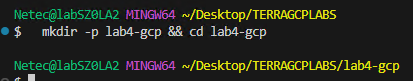
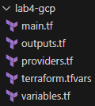
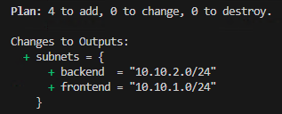
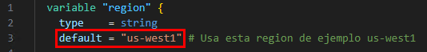
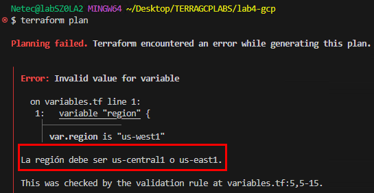
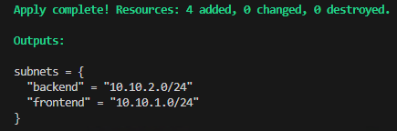
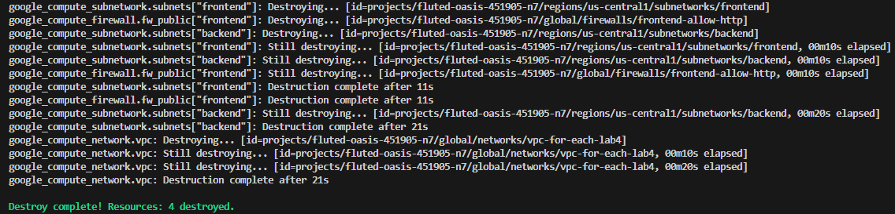

# Práctica 4. Crear múltiples subredes y validar valores de entrada

## Objetivo

Aprender a declarar variables con validaciones en Terraform, aplicar expresiones condicionales y utilizar `for_each` para crear múltiples subredes de forma dinámica en una red virtual de Google Cloud Platform (GCP).

## Requisitos

- Terraform instalado (versión >= 1.5).
- Google Cloud SDK (gcloud) instalado y autenticado.
- Proyecto de GCP creado con facturación habilitada.
- VSCode instalado para edición del código.

## ⏱️ Duración aproximada

- 40 minutos

## Región

- us-central1

## Introducción

En esta práctica se implementará un despliegue de red virtual en GCP con múltiples subredes creadas dinámicamente mediante `for_each`. Se aplicarán validaciones con `validation {}` en las variables para restringir valores aceptados y se usará un condicional para crear un recurso adicional (firewall) únicamente para las subredes de tipo público.

---

**[⬅️ Atrás](https://netec-mx.github.io/TRFRM-GCP-INT_Priv/Capítulo3/lab3.html)** | **[Lista General](https://netec-mx.github.io/TRFRM-GCP-INT_Priv/)** | **[Siguiente ➡️](https://netec-mx.github.io/TRFRM-GCP-INT_Priv/Capítulo5/lab5.html)**

---

## Instrucciones

**IMPORTANTE:** Recuerda siempre autenticarte a GCP en la terminal de VSC con el comando `gcloud auth application-default login` y el usuario y contraseña asignado al curso.

### Tarea 1: Definir la estructura de proyecto

Crear la carpeta base del laboratorio y los archivos necesarios para manejar variables, configuraciones y salidas.

#### Tarea 1.1

- **Paso 1.** En VSCode, abre una **ventana** y selecciona **File > Open Folder...** y abre `TERRAGCPLABS`.

- **Paso 2.** Abre la **Terminal Integrada** en VSCode dentro de la carpeta **TERRAGCPLABS** y ejecuta el siguiente comando:

  ```bash
  mkdir -p lab4-gcp && cd lab4-gcp
  ```

  ---

  

- **Paso 3.** Dentro de la carpeta, crea los siguientes archivos:

  ```
  touch providers.tf main.tf variables.tf outputs.tf terraform.tfvars
  ```

- **Paso 4.** Estructura de archivos esperada:

  

> **TAREA FINALIZADA**

**Resultado esperado:** Carpeta `TERRAGCPLABS/lab4-gcp` con los archivos base vacíos listos para edición.

---

### Tarea 2: Configurar variables con validaciones

Definir variables para la ubicación, CIDR y lista de subredes con validaciones de entrada.

#### Tarea 2.1

- **Paso 5.** Abre el archivo `variables.tf` y agrega el siguiente contenido:

  - Toma unos minutos para analizar las variables con el campo `validation`

  ```hcl
  variable "region" {
    type    = string
    default = "us-central1" # Usa esta region de ejemplo us-west1

    validation {
      condition     = contains(["us-central1", "us-east1"], var.region)
      error_message = "La región debe ser us-central1, us-east1 o us-west1."
    }
  }

  variable "network_name" {
    type    = string
    default = "vpc-for-each-lab4"
  }

  variable "subnets" {
    description = "Lista de subredes a crear"
    type = map(object({
      cidr = string
      tipo = string
    }))
  }
  ```

> **TAREA FINALIZADA**

**Resultado esperado:** Variables listas para validar entradas y definir recursos dinámicos.

---

### Tarea 3: Definir valores de subredes

Especificar subredes en el archivo `terraform.tfvars` para ser creadas dinámicamente.

#### Tarea 3.1

- **Paso 6.** Abre el archivo `terraform.tfvars` y agrega:

  ```hcl
  subnets = {
    frontend = {
      cidr = "10.10.1.0/24"
      tipo = "public"
    }
    backend = {
      cidr = "10.10.2.0/24"
      tipo = "private"
    }
  }
  ```

> **TAREA FINALIZADA**

**Resultado esperado:** Archivo `.tfvars` con subredes configuradas.

---

### Tarea 4: Crear la configuración principal

Implementar el código que crea la VPC, las subredes y un firewall condicional para subredes públicas.

#### Tarea 4.1

- **Paso 7.** Abre el archivo `providers.tf` y agrega el siguiente contenido:

  - Sustituye el valor de la llave **project** por el nombre de tu proyecto asignado al curso.
  - Tambien puedes usar este comando para obtenerlo: `PROJECT_ID="$(gcloud config get-value project)"`
  - Y este comando para visualizarlo: `echo "Proyecto actual: $PROJECT_ID`

  ```hcl
  terraform {
    required_version = ">= 1.5.0"
    required_providers {
      google = {
        source  = "hashicorp/google"
        version = ">= 5.0"
      }
    }
  }

  provider "google" {
    project = "TU-PROYECTO"
    region  = var.region
  }
  ```

- **Paso 8.** Abre el archivo `main.tf` y agrega el siguiente contenido:

  - Toma unos minutos y analiza de la **linea 14 a la linea 29** el comportamiento del `for_each`
  - Realiza una iteración comparando el valor **public** en un `if`.

  ```hcl
  resource "google_compute_network" "vpc" {
    name                    = var.network_name
    auto_create_subnetworks = false
  }

  resource "google_compute_subnetwork" "subnets" {
    for_each                  = var.subnets
    name                      = each.key
    ip_cidr_range             = each.value.cidr
    region                    = var.region
    network                   = google_compute_network.vpc.id
  }

  resource "google_compute_firewall" "fw_public" {
    for_each = {
      for k, v in var.subnets : k => v
      if v.tipo == "public"
    }

    name    = "${each.key}-allow-http"
    network = google_compute_network.vpc.name

    allow {
      protocol = "tcp"
      ports    = ["80"]
    }

    source_ranges = ["0.0.0.0/0"]
  }
  ```

> **TAREA FINALIZADA**

**Resultado esperado:** Configuración principal con `for_each` y condicionales.

---

### Tarea 5: Definir salidas

Mostrar las subredes creadas al final de la ejecución.

#### Tarea 5.1

- **Paso 9.** Abre el archivo `outputs.tf` y agrega el siguiente contenido:

  - Observa como dentro del output hay otro for iterando de manera mas dinamica los resultados evitando crear 1 output por cada 1.

  ```hcl
  output "subnets" {
    value = {
      for k, s in google_compute_subnetwork.subnets : k => s.ip_cidr_range
    }
  }
  ```

> **TAREA FINALIZADA**

**Resultado esperado:** Terraform mostrará las subredes con su rango de IP al finalizar.

---

### Tarea 6: Inicializar y aplicar

Ejecutar Terraform para desplegar los recursos.

#### Tarea 6.1

- **Paso 10.** Inicializa el proyecto:

  ```bash
  terraform init
  ```

- **Paso 11.** Muestra el plan de ejecución:

  ```bash
  terraform plan
  ```

  ---

  

- **Paso 12.** Ahora abre el archivo `variables.tf` y edita la linea 3 para cambiar la región a una que no sea permitida, puedes apoyarte de la imagen

  ```hcl
  default = "us-west1"
  ```

  ---

  

- **Paso 13.** Vuele a ejecutar el comando `terraform plan` y observa el resultado bloqueado basado en la validación de la condición.

  

- **Paso 14.** Ahora escribe correctamente la región `us-central1` en el archivo `variables.tf`.

- **Paso 15.** Aplica los cambios con **apply**:

  - Debera crearse correctamente la infraestructura sin restricciones.

  ```bash
  terraform apply -auto-approve
  ```

  ---

  

> **TAREA FINALIZADA**

**Resultado esperado:** Recursos creados exitosamente en GCP. VPC creada con subredes `frontend` y `backend`. Firewall HTTP solo para la subred `frontend` y las validaciones impiden el uso de regiones no autorizadas.

---

### Tarea 7: Validaciones y condiciones mas estrictas

En esta tarea se modificaran los archivos para aplicar mas fuerte la restricción de la infraestructura

- **Paso 16.** Abre el archivo `variables.tf` y sustituyelo por todo el siguiente contenido.

  - **`project_id:`** Cadena que guarda el ID del proyecto GCP; si está vacío, el proveedor usará el proyecto activo configurado localmente.
  - **`region:`** Cadena con la región de despliegue; la validación obliga a que sea us-central1, us-east1 o us-west1, rechazando cualquier otra.
  - **`network_name:`** Cadena con el nombre de la VPC; la validación impide que esté vacío o tenga espacios, asegurando nombres limpios.
  - **`subnets:`** Mapa de subredes con cidr y tipo; las validaciones exigen nombres en minúsculas sin espacios, tipo public o private, formato CIDR válido y sin rangos duplicados.

  ```hcl
  variable "project_id" {
    type        = string
    default     = ""
    description = "ID del proyecto GCP"
  }

  variable "region" {
    type    = string
    default = "us-central1"
    validation {
      condition     = contains(["us-central1", "us-east1", "us-west1"], var.region)
      error_message = "La región debe ser una de: us-central1, us-east1, us-west1."
    }
  }

  variable "network_name" {
    type        = string
    default     = "vpc-for-each-lab4"
    description = "Nombre de la VPC."
    validation {
      condition     = length(trimspace(var.network_name)) > 0 && !can(regex("\\s", var.network_name))
      error_message = "El nombre de la VPC no debe contener espacios y no puede estar vacío."
    }
  }

  variable "subnets" {
    description = "Mapa de subredes: key = nombre, value = { cidr, tipo }"
    type = map(object({
      cidr = string
      tipo = string
    }))

    validation {
      condition = alltrue([
        for k, v in var.subnets :
        can(regex("^[a-z0-9-]+$", k))
      ])
      error_message = "Los nombres de subred deben ser minúsculas, números o guiones."
    }

    validation {
      condition = alltrue([
        for k, v in var.subnets :
        contains(["public", "private"], v.tipo)
      ])
      error_message = "El campo 'tipo' debe ser 'public' o 'private'."
    }

    validation {
      condition = alltrue([
        for k, v in var.subnets :
        can(regex("^([0-9]{1,3}\\.){3}[0-9]{1,3}/(\\d|[12]\\d|3[0-2])$", v.cidr))
      ])
      error_message = "Cada 'cidr' debe estar en formato IPv4/CIDR válido."
    }

    validation {
      condition = length(distinct([
        for k, v in var.subnets : v.cidr
      ])) == length([
        for k, v in var.subnets : v.cidr
      ])
      error_message = "Hay CIDRs duplicados."
    }
  }
  ```

- **Paso 17.** Abre el archivo `terraform.tfvars` y ajustalo con el codigo siguiente.

  - Sustituye el valor del parametro **project_id** con el de tu proyecto asignado al curso.
  - Tambien puedes usar este comando para obtenerlo: `PROJECT_ID="$(gcloud config get-value project)"`
  - Y este comando para visualizarlo: `echo "Proyecto actual: $PROJECT_ID`


  ```hcl
  region      = "us-central1"
  network_name = "vpc-for-each-lab4"
  project_id = "TU-PROYECTO"

  subnets = {
    frontend = {
      cidr = "10.10.1.0/24"
      tipo = "public"
    }
    backend = {
      cidr = "10.10.2.0/24"
      tipo = "private"  
    }
  }
  ```

- **Paso 18.** Ahora ajusta el archivo `providers.tf` con la siguiente configuración

  - Solo cambiala sección **provider**

  ```hcl
  provider "google" {
    project = var.project_id != "" ? var.project_id : null
    region  = var.region
  }
  ```

- **Paso 19.** Avanza en la edición, abre `main.tf` y sustituye el codigo actual por el siguiente:

  - **`google_compute_network "vpc":`** Crea una red VPC con el nombre definido en `var.network_name`.
  - **`google_compute_subnetwork "subnets":`** Genera dinámicamente cada subred definida en `var.subnets` usando for_each, asignándole nombre, rango CIDR, región y asociándola a la VPC creada.
  - **`locals.public_subnets:`** Filtra de `var.subnets` solo las que tienen tipo = "public", para usarlas en recursos que requieran reglas abiertas.
  - **`google_compute_firewall "fw_public":`** Crea, para cada subred pública, una regla de firewall que permita tráfico HTTP (puerto 80 TCP) desde cualquier origen, usando el filtrado previo en `local.public_subnets`.

  ```hcl
  resource "google_compute_network" "vpc" {
    name                    = var.network_name
    auto_create_subnetworks = false
  }

  resource "google_compute_subnetwork" "subnets" {
    for_each      = var.subnets
    name          = each.key
    ip_cidr_range = each.value.cidr
    region        = var.region
    network       = google_compute_network.vpc.id
  }

  locals {
    public_subnets = { for k, v in var.subnets : k => v if v.tipo == "public" }
  }

  resource "google_compute_firewall" "fw_public" {
    for_each = local.public_subnets

    name    = "${each.key}-allow-http"
    network = google_compute_network.vpc.name

    allow {
      protocol = "tcp"
      ports    = ["80"]
    }

    source_ranges = ["0.0.0.0/0"]
  }
  ```

- **Paso 20.** Finalmente reforcemos el archivo `outputs.tf` cambia el codigo actual por el siguiente:

  - **`output "subnets":`** Devuelve un mapa con las subredes creadas, donde cada clave es el nombre y cada valor incluye su rango CIDR y la región, generando la lista dinámicamente con un for para mostrar solo la información relevante al finalizar el despliegue.

  ```hcl
  output "subnets" {
    value = {
      for k, s in google_compute_subnetwork.subnets : k => {
        cidr   = s.ip_cidr_range
        region = s.region
      }
    }
  }
  ```

- **Paso 21.** Ahora ejecuta el plan.

  - Realiza cambios en el archivo `terraform.tfvars`, deja vacion el segmento de red. Luego prueba el plan
  - Deja vacio el nombre **tipo**. Luego prueba el plan
  - Cambia la región. Luego prueba el plan
  - Realiza mas cambios que afecten las restricciones y observa el comportamiento.

  ```bash
  terraform plan
  ```

> **TAREA FINALIZADA**

**Resultado esperado:** Se agregaron mas restricciones que permitio reforzar la cración de infraestructura, se valido el funcionamiento correcto.

### Tarea 8: Validaciones y condiciones mas estrictas

Eliminar recursos creados por el laboratorio 4. Destruir la VPC de ejemplo.

#### Tarea 8.1

- **Paso 22.** Destruir infraestructura del Laboratorio 4:

  ```bash
  terraform destroy -auto-approve 
  ```

  ---

  

> **TAREA FINALIZADA**

**Resultado esperado:** Infraestructura eliminada. El entorno queda limpio.

---

> **¡FELICIDADES HAZ COMPLETADO EL LABORATORIO 4!**

---

## Resultado final

Una infraestructura de red virtual en GCP con subredes y firewalls generados dinámicamente, reutilizando código y garantizando entradas válidas.

## Notas y/o Consideraciones

- Usa nombres únicos para evitar conflictos en el proyecto GCP.
- Las validaciones ayudan a mantener consistencia en entornos de equipo.
- El patrón `for_each` es ideal para infraestructura escalable y repetitiva.

## URLs de referencia

- [Terraform Provider Google](https://registry.terraform.io/providers/hashicorp/google/latest/docs)
- [Terraform for_each meta-argument](https://developer.hashicorp.com/terraform/language/meta-arguments/for_each)
- [Terraform variable validation](https://developer.hashicorp.com/terraform/language/values/variables#custom-validation-rules)

---

**[⬅️ Atrás](https://netec-mx.github.io/TRFRM-GCP-INT_Priv/Capítulo3/lab3.html)** | **[Lista General](https://netec-mx.github.io/TRFRM-GCP-INT_Priv/)** | **[Siguiente ➡️](https://netec-mx.github.io/TRFRM-GCP-INT_Priv/Capítulo5/lab5.html)**