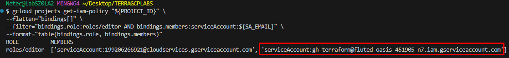
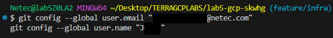

# Práctica 5. Crear pipeline que haga plan en pull requests y apply en merges

## Objetivo

Automatizar el flujo de trabajo con Terraform en GitHub Actions para Google Cloud Platform (GCP):
- Ejecutar `terraform plan` automáticamente al crear un Pull Request.
- Ejecutar `terraform apply` al fusionar a la rama `main`.

## Requisitos

- Cuenta en GitHub (o crear una nueva).
- Repositorio en GitHub con código Terraform.
- GitHub CLI o Git configurado para subir cambios.
- Google Cloud SDK instalado y autenticado (`gcloud auth login`).
- Service Account con permisos y credenciales JSON para GCP.

## Duración aproximada

- 50 minutos

## Región

- us-central1

## Introducción

En esta práctica crearemos un flujo CI/CD básico con Terraform en **GitHub Actions** para desplegar infraestructura en GCP. Usaremos autenticación mediante Service Account y configuraremos un pipeline que ejecute `terraform plan` al abrir Pull Requests y `terraform apply` al hacer merge a `main`. Esto permite control de cambios y evita que se apliquen cambios sin revisión.

---

**[⬅️ Atrás](https://netec-mx.github.io/TRFRM-GCP-INT_Priv/Capítulo4/lab4.html)** | **[Lista General](https://netec-mx.github.io/TRFRM-GCP-INT_Priv/)** | **[Siguiente ➡️](https://netec-mx.github.io/TRFRM-GCP-INT_Priv/Capítulo6/lab6.html)**

---

## Instrucciones

**IMPORTANTE:** Recuerda siempre autenticarte a GCP en la terminal de VSC con el comando `gcloud auth application-default login` y el usuario y contraseña asignado al curso.

#### Tarea 1: Crear una cuenta y repositorio en GitHub

Crear una cuenta en GitHub y un repositorio para almacenar el código Terraform.

- **Paso 1.** Registrarse en [GitHub Aquí](https://github.com/join) y sigue los pasos para crear una cuenta.

  - GitHub es la plataforma donde alojaremos el repositorio para que GitHub Actions ejecute el pipeline. Similar a tener un **"servidor de versiones"** centralizado para tu equipo.

- **Paso 2.** Si ya tienes una cuenta da clic [Aquí](https://github.com/login) para iniciar sesión.

  - Coloca tu usuario y contraseña.

- **Paso 3.** Ya que estes dentro de tu cuenta da clic en el icono **New**.

  

- **Paso 4.** Crear un repositorio nuevo en GitHub.

  - La interfaz la puede que aparezca diferente ya que GitHub esta actualizandola.
  - Escribe el nombre `lab5-gcp-xxxx`
  - Cambia las letras `x`por tus iniciales o numeros aleatorios.
  - Activa la opción `Add README`.
  - Este repositorio será el punto de control para el código Terraform, como un **"archivador digital"** de la infraestructura.

  

- **Paso 5.** Clic en el botón **Create repository**.

  

> **TAREA FINALIZADA**

**Resultado esperado:** Repositorio vacío listo para recibir el código.

---

## Tarea 2: Crear Service Account y credenciales en GCP (CLI)

Generar las credenciales necesarias para que GitHub Actions se autentique en GCP.

#### 2.1 Definir variables (una sola vez)

- **Paso 6.** Ve tu VSCode y abre una terminal para copiar y pegar las siguientes variables.

  - Antes de ejecutar estas varibales, editalas en un bloc de notas.
  - Sustituye el valor del parametro **PROJECT_ID** con el de tu proyecto asignado al curso.
  - Tambien puedes usar este comando para obtenerlo: `PROJECT_ID="$(gcloud config get-value project)"`
  - Y este comando para visualizarlo: `echo "Proyecto actual: $PROJECT_ID"`
  - Reutilizar variables evita errores de tipeo y facilita repetir comandos.

  ```bash
  PROJECT_ID="TU-PROYECTO"       
  SA_NAME="gh-terraform"                    
  SA_DISPLAY="GitHub Terraform SA"          
  SA_EMAIL="${SA_NAME}@${PROJECT_ID}.iam.gserviceaccount.com"
  ```

#### 2.2 Habilitar APIs requeridas

- **Paso 7.** Ejecuta el siguiente comando en la terminal:

  - Sin estas APIs Terraform/GitHub Actions no podrán administrar recursos en GCP.

  ```bash
  gcloud services enable iam.googleapis.com cloudresourcemanager.googleapis.com serviceusage.googleapis.com compute.googleapis.com storage.googleapis.com --project "${PROJECT_ID}"
  ```

  ---

  

#### 2.3 Crear la Service Account

- **Paso 8.** Escribe el siguiente comando para crear el Service Account.

  - La Service Account es el “usuario robot” que usará el pipeline.

  ```bash
  gcloud iam service-accounts create "${SA_NAME}" --display-name="${SA_DISPLAY}" --project "${PROJECT_ID}"
  ```

  ---

  

- **Paso 9.** Ahora ejecuta el siguiente comando para validar la creación del Service Account.

  ```bash
  gcloud iam service-accounts list --project "${PROJECT_ID}" --filter="email:${SA_NAME}@${PROJECT_ID}.iam.gserviceaccount.com"
  ```

  ---

  

#### 2.4 Conceder permisos

- **Paso 10.** Define los permisos para la cuenta de servicio se usaran permisos abiertos para mayor facilidad

  ```bash
  gcloud projects add-iam-policy-binding "${PROJECT_ID}" --member="serviceAccount:${SA_EMAIL}" --role="roles/editor"
  ```

  ---

  

- **Paso 11.** Verifica que la politica sea asignada correctamente.

  - En el lab se usa la politica de `Editor`.

  ```bash
  gcloud projects get-iam-policy "${PROJECT_ID}" \
  --flatten="bindings[]" \
  --filter="bindings.role:roles/editor AND bindings.members:serviceAccount:${SA_EMAIL}" \
  --format="table(bindings.role, bindings.members)"
  ```

  ---

  

#### 2.5 Generar la clave **JSON**

- **Paso 12.** Ahora genera el archivo **JSON** que se usara para la autenticación en GitHub. 

  ```bash
  gcloud iam service-accounts keys create "./${SA_NAME}.json" --iam-account "${SA_EMAIL}" --project "${PROJECT_ID}"
  ```

  ---

  

#### 2.6 Verificar que la credencial funciona

- **Paso 13.** Verifica que se haya creado correctamente. Con el siguiente ejemplo.

  - Confirma que la SA tiene permisos y que el JSON es válido.
  - Se autentica con las credenciales.
  - Debe listar las cuentas de autenticación
  - Y un ejemplo de google compute.

  ```bash
  gcloud auth activate-service-account "${SA_EMAIL}" --key-file "./${SA_NAME}.json"
  gcloud auth list
  gcloud compute regions list --project "${PROJECT_ID}" --limit=1
  ```

  

> **TAREA FINALIZADA**

**Resultado esperado:**  Service Account creada y con permisos efectivos guardado en el archivo `json` generado y verificado.

---

## Tarea 3: Subir las credenciales como secreto en GitHub

Guardar el JSON en los **Secrets** del repositorio para su uso en el pipeline.

#### 3.1 Abrir la sección de secretos

- **Paso 14.** Ve a tu cuenta en GitHub, entra a tu repositorio previamente creado.

- **Paso 15.** Ve a **Settings → Secrets and variables → Actions**.

  

#### 3.2 Crear secreto `GCP_CREDENTIALS`

- **Paso 16.** Clic en el botón **New repository secret**.

  - Los **Secrets** son **"cajas fuertes"** para llaves/contraseñas del repo.

  

- **Paso 17.** Configura los siguientes datos:

  - **Name:** `GCP_CREDENTIALS`
  - **Secret:** Abre el archivo en VSCode llamdo `gh-terraform.json` copia todo el contenido y **pega TODO** en el campo de **Secret**.

  

- **Paso 18.** Ahora da clic en el botón **Add secret**.

  - El pipeline leerá este valor sin exponerlo en el código.
  - El secreto quedara guardado exitosamente.

  

> **TAREA FINALIZADA**

**Resultado esperado:** El Secreto **`GCP_CREDENTIALS`** creado y disponible para los jobs de Actions.

---

### Tarea 4: Crear estructura del proyecto

Organizar los archivos de Terraform y el pipeline.

- **Paso 19.** Primero tienes que clonar el repositorio a tu area de trabajo.

  - Dentro de tu repositorio(1) da clic en la opción **Code**(2).
  - Luego asegurate de estar en la opción **Local**(3)
  - Finalmente da clic en el icono de **"Copiar"**(4) para obtener la URL de clonación

  

- **Paso 20.** Ahora regresa a tu VSCode y dentro de la carpeta **TERRAGCPLABS** escribe el siguiente comando.

  - Sustituye el parametro `<URL>` por la url de tu repositorio y ejecuta el comando.

  ```bash
  git clone <URL>
  ```

  ---

  

- **Paso 21.** Crea carpetas y archivos necesarios para el ambiente.

  - Asegurate de estar dentro de la carpeta de tu repositorio **lab5-gcp-xxxx**
  - Tener una estructura ordenada facilita el mantenimiento, similar a tener “carpetas etiquetadas” en una oficina.
  - Sustituye las `x` por los caracteres que indica el nombre de tu repositorio

  ```bash
  cd lab5-gcp-xxxx
  ```

  ---

  

- **Paso 22.** Agrega el resto de la estructura de archivos dentro de la carpeta de tu respositorio.

  ```bash
  mkdir -p .github/workflows
  touch providers.tf main.tf variables.tf terraform.tfvars outputs.tf .github/workflows/terraform.yml
  ```  

- **Paso 23.** Estructura de archivos esperada.

  

> **TAREA FINALIZADA**

**Resultado esperado:** Estructura de carpetas lista dentro del repositorio para comenzar a escribir código.

---

### Tarea 5: Escribir el código Terraform

Crear un los recursos para validar el funcionamiento del pipeline.

- **Paso 24.** Abre el archivo `providers.tf` para declarar el proveedor de GCP.

  - Copia y pega el siguiente codigo.

  ```hcl
  terraform {
    required_providers {
      google = {
        source  = "hashicorp/google"
        version = "5.0.0"
      }
    }
  }

  provider "google" {
    project     = var.project_id
    region      = var.region
  }
  ```

- **Paso 25.** Ahora edita el archivo `main.tf` para la creación de bucket GCS:

  - Este recurso es un "almacén en la nube" para comprobar que el pipeline funciona.
  - Agrega el siguiente codigo en el archivo.

  ```hcl
  resource "google_storage_bucket" "lab5" {
    name          = "${var.project_id}-lab5-bucket"
    location      = var.region
    force_destroy = false

    uniform_bucket_level_access = true

    labels = { env = "lab5" }
  }
  ```  

> **TAREA FINALIZADA**

**Resultado esperado:** Código listo para con la declaración del proveedor y el recurso a crear.

---

### Tarea 6: Configurar variables

Declarar variables necesarias para la infraestructura.

- **Paso 26.** Edita el archivo de `variables.tf`:  

  - Agrega el siguiente codigo al archivo.
  - Sustituye el valor del parametro **default** con el de tu proyecto asignado al curso.
  - Tambien puedes usar este comando para obtenerlo: `PROJECT_ID="$(gcloud config get-value project)"`
  - Y este comando para visualizarlo: `echo "Proyecto actual: $PROJECT_ID`
  - Recuerda que las variables permiten cambiar valores sin modificar el código principal, como **"etiquetas"** reutilizables.

  ```hcl
  variable "project_id" {
    default = "TU-PROYECTO"
  }

  variable "region" {
    default = "us-central1"
  }
  ``` 

> **TAREA FINALIZADA**

**Resultado esperado:** Variables listas para recibir valores.

---

### Tarea 7: Crear el pipeline de GitHub Actions

Definir el flujo CI/CD dentro del archivo terraform.yml para la ejecución del pipeline.

- **Paso 27.** Edita el archivo `.github/workflows/terraform.yml`:

  - Descarga el achivo [terraform.yml](https://s3.us-west-2.amazonaws.com/labs.netec.com/courses/TRFRM-GCP-INT/terraform.yml), abrelo con el editor de texto.
  - Copia y pega el contenido al archivo **terraform.yml** de tu repositorio.
  - El `push` a rama `main`: Ejecuta y aplica cambios.
  - Para el `pull_request`: Ejecuta solo terraform plan.
  - **GitHub Actions** es como un **"robot asistente"** que ejecuta tareas automáticamente cuando se cumplen ciertas condiciones.

> **TAREA FINALIZADA**

**Resultado esperado:** Archivo YAML del pipeline configurado correctamente.

---

### Tarea 8: Probar el flujo continuo

Validar que el pipeline funciona como se espera.

- **Paso 28.** Crear nueva rama para simular la colaboración de repositorios:

  - En la terminal de VSCode ejecuta el siguiente comando.
  - Trabajar en ramas separadas evita afectar la rama principal, como hacer pruebas en un **"borrador"** antes de publicarlo.
  - Verifica que estes en la rama correcta como lo muestra la imagen.

  ```bash
  git checkout -b feature/infra
  ```

  

- **Paso 29.** Antes de subir los archivos configura el correo y usuario de tu cuenta de GitHub.

  - Sustituye `your@example.com` por el correo de la cuenta de GitHub.
  - Sustituye `Your Name` por tu nombre.
  - Ejecuta los comandos en la terminal.

  ```bash
  git config --global user.email "you@example.com"
  git config --global user.name "Your Name"
  ```

  ---

  

- **Paso 30.** Ahora sube los cambios al repositorio y creamos el Pull Request.

  - El **Pull Request** permite revisar y discutir cambios antes de aplicarlos.
  - Si te pide autenticación a GitHub sigue los pasos e inicia sesión.

  ```bash
  git add .
  git commit -m "Carga de archivos de infraestructura"
  git push --set-upstream origin feature/infra
  ```

  ---

  

- **Paso 31:** Ahora ve a tu cuenta de GitHub en el navegador detectaras un nuevo mensaje en tu respositorio como lo muestra la imegen.
 
  

- **Paso 32.** Da clic en el botón **Compare & pull request**

- **Paso 33.** Cargara con los datos del push que realizaste y los cambios detallados que se uniran a la rama `main`.

  - Toma unos minutos para analizar el `Pull Requests`

- **Paso 34.** Cuando termines de analizar da clic en el botón **Create pull request**

- **Paso 35.** Observaras que empieza a ejecutarse el workflow.

  

- **Paso 36.** Puedes dar clic en el botón **View Details** para darle seguimiento al workflow y las fases que esta ralizando.

  

- **Paso 37.** En la nueva ventana observaras como el workflow esta trabajando pero despues de unos minutos se queda pendiente en la fase **Plan**.

  - Esta esperando a que confirmemos la union de la rama **feature/infra** a la rama **main**

  

- **Paso 38.** Regresa a la interfaz del **Pull Requests** y confirma la unión dando clic en el botón **Merge pull request**

  

- **Paso 39.** Confirma el nuevo mensaje pre-poblado y da clic en el botón **Confirm merge**

  

- **Paso 40.** Ahora regresa a la ventana de la lista del los workflows CI/CD que esta realizando **GitHub Actions**

  - Puede demorar unos segundos en lo que aparece

- **Paso 41.** Notaras que se lanza otro workflow, explora los detalles para que observes como el **Apply** aplica la configuración.

  

- **Paso 42.** Muy bien! ahora regresa a la terminal de VSCode y escribe el siguiente comando para validar la creación de la infraestructura.

  ```bash
  gcloud storage buckets list
  ```

  ---

  

- **Paso 43.** Ahora elimina la infraestructura para que el ambiente quede listo y limpio para las demas practicas.

  ```bash
  PROJECT_ID="$(gcloud config get-value project)"
  BUCKET_NAME=gs://$(gcloud storage buckets list --project=$PROJECT_ID --format="value(name)")
  echo $BUCKET_NAME
  gcloud storage buckets delete "$BUCKET_NAME" --project=$PROJECT_ID --quiet
  ```

  ---

    

- **Paso 44.** Finalmente verifica que ya no existan buckets creados.

  ```bash
  gcloud storage buckets list
  ```

  ---

    

> **TAREA FINALIZADA**

**Resultado esperado:** Se ejecuta `terraform plan` al abrir PR y `terraform apply` al hacer merge a `main` todo automatizado.

---

> **¡FELICIDADES HAZ COMPLETADO EL LABORATORIO 5!**

---

## Resultado final

Un pipeline funcional que ejecuta validaciones y despliegues automáticos de infraestructura en GCP mediante Terraform y GitHub Actions.

## Notas y/o Consideraciones

- En proyectos reales, es mejor habilitar aprobaciones manuales antes de aplicar cambios.
- Mantener credenciales seguras y rotarlas periódicamente.

## URLS de referencia

- [Terraform Google Provider](https://registry.terraform.io/providers/hashicorp/google/latest/docs)
- [GitHub Actions](https://docs.github.com/es/actions)
- [Autenticación en GCP con GitHub Actions](https://github.com/google-github-actions/auth)

---

**[⬅️ Atrás](https://netec-mx.github.io/TRFRM-GCP-INT_Priv/Capítulo4/lab4.html)** | **[Lista General](https://netec-mx.github.io/TRFRM-GCP-INT_Priv/)** | **[Siguiente ➡️](https://netec-mx.github.io/TRFRM-GCP-INT_Priv/Capítulo6/lab6.html)**