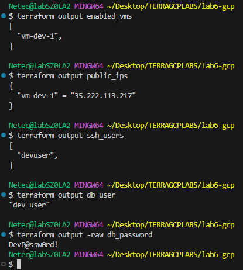

# Práctica 6. Crear archivos .tfvars por entorno y outputs condicionales

## Objetivo

Usar variables complejas (listas de objetos, mapas), declarar variables `sensitive`, crear recursos condicionales con `for_each` + `if`, y separar configuración por entornos (`dev`, `prod`) mediante archivos `.tfvars`.

## Requisitos

- Terraform >= 1.4 instalado.
- Google Cloud SDK instalado (`gcloud`).
- Proyecto GCP existente con permisos suficientes (Editor).
- Visual Studio Code (VSC).

## Duración aproximada

- 30 inutos.

## Región

- us-central1

## Introduccion

Esta práctica crea infraestructura en GCP usando Terraform: una VPC, subred, regla de firewall segura para SSH vía IAP y un conjunto de instancias de Compute Engine que se despliegan de forma condicional según parámetros por entorno. Además, gestiona secretos como variables `sensitive` y publica outputs filtrados (p.ej., IPs públicas solo para VMs que lo requieran).

---

**[⬅️ Atrás](https://netec-mx.github.io/TRFRM-GCP-INT_Priv/Capítulo5/lab5.html)** | **[Lista General](https://netec-mx.github.io/TRFRM-GCP-INT_Priv/)** | **[Siguiente ➡️](https://netec-mx.github.io/TRFRM-GCP-INT_Priv/Capítulo7/lab7.html)**

---

## Instrucciones

**IMPORTANTE:** Recuerda siempre autenticarte a GCP en la terminal de VSC con el comando `gcloud auth application-default login` y el usuario y contraseña asignado al curso.

### Tarea 1: Preparar los archivos del proyecto

Crear la estructura de carpetas y archivos base del laboratorio para mantener orden y separar entornos por `.tfvars`.

#### Tarea 1.1

- **Paso 1.** En VSCode, abre una **ventana** y selecciona **File > Open Folder...** y abre `TERRAGCPLABS`.

- **Paso 2.** Abre la **Terminal Integrada** en VSCode dentro de la carpeta **TERRAGCPLABS** y ejecuta el siguiente comando:

  ```bash
  mkdir -p lab6-gcp/env && cd lab6-gcp
  ```

  ---

  

- **Paso 3.** Dentro de la carpeta, crea los siguientes archivos:

  ```bash
  touch providers.tf main.tf variables.tf outputs.tf env/dev.tfvars env/prod.tfvars
  ```

- **Paso 4.** Estructura de archivos esperada:

  

> **TAREA FINALIZADA**

**Resultado esperado:** Carpeta `lab6-gcp` con subcarpeta `env/` creada y accesible en VSC.

---

### Tarea 2: Definir variables complejas (`variables.tf`)

Declarar variables para proyecto, red, usuarios SSH, configuración de VMs y secretos sensibles (`app_secrets`).

#### Tarea 2.1

- **Paso 5.** Copia el siguiente contenido en `variables.tf` y guarda el archivo:

  - **`admin_users (list(object)):`** Almacena varios usuarios con sus claves públicas SSH, permitiendo configurar automáticamente acceso seguro a las VMs durante el despliegue.
  - **`vm_config (list(object)):`** Define múltiples instancias de VM con parámetros clave (nombre, tipo, etiquetas, tags, IP pública opcional) para controlar de forma centralizada su creación.
  - **`app_secrets (object, sensitive):`** Contiene credenciales críticas de aplicaciones (usuario y contraseña de BD) en formato sensible para evitar su exposición en logs o salidas de Terraform
  - El resto de variables se interpretan directamente.

  ```hcl
  variable "project_id" {
    type        = string
    description = "ID del proyecto GCP"
  }

  variable "region" {
    type        = string
    default     = "us-central1"
    description = "Región principal para recursos regionales"
  }

  variable "zone" {
    type        = string
    default     = "us-central1-a"
    description = "Zona para instancias de cómputo"
  }

  variable "network_name" {
    type        = string
    default     = "vpc-vars"
  }

  variable "subnet_cidr" {
    type        = string
    default     = "10.10.0.0/24"
    description = "CIDR de la subred"
  }

  variable "admin_users" {
    description = "Usuarios con sus llaves públicas SSH"
    type = list(object({
      username       = string
      ssh_public_key = string
    }))
  }

  variable "vm_config" {
    description = "Lista de instancias a desplegar por entorno"
    type = list(object({
      name         = string
      machine_type = string
      enabled      = bool
      labels       = map(string)
      tags         = list(string)
      create_eip   = bool
    }))
  }

  variable "app_secrets" {
    description = "Credenciales sensibles para apps (ejemplo)"
    type = object({
      db_user     = string
      db_password = string
    })
    sensitive = true
  }
  ```

> **TAREA FINALIZADA**

**Resultado esperado:** Archivo `variables.tf` correcto y guardado, listo para usar en los demás archivos. `list(object(...))` modela múltiples VMs por entorno; `sensitive` oculta secretos en salidas y logs.

---

### Tarea 3: Definir recursos condicionales (`main.tf`)

Configurar provider de Google, crear VPC, subred, firewall SSH vía IAP, y VMs condicionales con `for_each` + `if` y `dynamic` para IP pública.

#### Tarea 3.1

- **Paso 6.** Copia el siguiente contenido en `providers.tf` y guardalo:

  ```hcl
  terraform {
    required_providers {
      google = {
        source  = "hashicorp/google"
        version = ">= 5.0"
      }
    }
  }

  provider "google" {
    project = var.project_id
    region  = var.region
    zone    = var.zone
  }
  ```

- **Paso 7.** Copia el siguiente contenido en `main.tf` y guarda:

  - **`google_compute_network`** y **`google_compute_subnetwork:`** Crea una VPC personalizada sin subredes automáticas y una subred definida por variables para mayor control de red.
  - **`google_compute_firewall:`** Permite acceso SSH únicamente vía IAP (IP range `35.235.240.0/20`), incrementando la seguridad.
  - **`locals.ssh_keys:`** Construye dinámicamente el formato requerido de llaves SSH a partir de la variable `admin_users` para inyectarlas en las VMs.
  - **`google_compute_instance.vm:`** Despliega de forma condicional múltiples instancias basadas en `vm_config`, con configuración de disco, etiquetas, tags, IP pública opcional y mensaje de bienvenida personalizado en `/etc/motd`.

  ```hcl
  # VPC y Subred
  resource "google_compute_network" "vpc" {
    name                    = var.network_name
    auto_create_subnetworks = false
  }

  resource "google_compute_subnetwork" "subnet" {
    name          = "${var.network_name}-subnet"
    ip_cidr_range = var.subnet_cidr
    region        = var.region
    network       = google_compute_network.vpc.id
  }

  # Firewall SSH vía IAP (35.235.240.0/20)
  resource "google_compute_firewall" "allow_ssh_iap" {
    name    = "${var.network_name}-allow-ssh-iap"
    network = google_compute_network.vpc.name

    allow {
      protocol = "tcp"
      ports    = ["22"]
    }

    source_ranges = ["35.235.240.0/20"]
    direction     = "INGRESS"
    target_tags   = ["ssh"]
  }

  # Construir metadata ssh-keys a partir de admin_users
  locals {
    ssh_keys = join("\n", [
      for u in var.admin_users : "${u.username}:${u.ssh_public_key}"
    ])
  }

  # Instancias condicionales
  resource "google_compute_instance" "vm" {
    for_each = {
      for vm in var.vm_config : vm.name => vm
      if vm.enabled
    }

    name         = each.value.name
    machine_type = each.value.machine_type
    zone         = var.zone
    tags         = each.value.tags
    labels       = each.value.labels

    boot_disk {
      initialize_params {
        image = "projects/debian-cloud/global/images/family/debian-12"
        size  = 10
        type  = "pd-standard"
      }
    }

    network_interface {
      subnetwork = google_compute_subnetwork.subnet.name

      # IP pública condicional
      dynamic "access_config" {
        for_each = each.value.create_eip ? [1] : []
        content {}
      }
    }

    metadata = {
      "ssh-keys" = local.ssh_keys
    }

    metadata_startup_script = <<-EOT
      #!/bin/bash
      echo "Hello from ${each.value.labels["env"]}-${each.value.labels["app"]}" > /etc/motd
    EOT
  }
  ```

> **TAREA FINALIZADA**

**Resultado esperado (tarea):** El archivo `main.tf` listo con recursos de red y cómputo, y lógica condicional implementada. El uso de `for_each` con filtro `if vm.enabled` evita crear VMs innecesarias; `dynamic "access_config"` condiciona la IP pública por VM.

---

### Tarea 4: Outputs condicionales (`outputs.tf`)

Publicar información relevante: VMs creadas, IPs públicas (o `null`), usuarios SSH y secretos.

#### Tarea 4.1

- **Paso 8.** Copia el siguiente contenido en `outputs.tf` y guardalo:

  - **`enabled_vms:`** Lista los nombres de todas las VMs creadas en el entorno.
  - **`public_ips:`** Muestra un mapa con el nombre de cada VM y su IP pública si la tiene; en caso contrario, `null`.
  - **`ssh_users:`** Lista todos los usuarios SSH definidos en la variable `admin_users`.
  - **`db_user:`** Muestra el usuario de la base de datos definido en
  `app_secrets` (visible, no sensible).
  - **`db_password:`** Muestra la contraseña de la base de datos de `app_secrets` pero marcada como **sensible** para que no se imprima en texto plano.
  
  ```hcl
  output "enabled_vms" {
    description = "Nombres de VMs creadas en este entorno"
    value       = [for name, vm in google_compute_instance.vm : name]
  }

  output "public_ips" {
    description = "IPs públicas por VM (si corresponde)"
    value = {
      for name, vm in google_compute_instance.vm :
      name => (length(vm.network_interface[0].access_config) > 0
        ? vm.network_interface[0].access_config[0].nat_ip
        : null)
    }
  }

  output "ssh_users" {
    description = "Usuarios SSH declarados"
    value       = [for u in var.admin_users : u.username]
  }

  output "db_user" {
    value       = var.app_secrets.db_user
    description = "Usuario de la base (demo)"
    sensitive   = true
  }

  output "db_password" {
    value       = var.app_secrets.db_password
    description = "Password de la base (demo)"
    sensitive   = true
  }
  ```

> **TAREA FINALIZADA**

**Resultado esperado:** Outputs sensibles se ocultan por defecto y requieren `terraform output -raw` para ver el valor (útil solo en desarrollo controlado). El archivo `outputs.tf` correcto con visibilidad segura de datos.

---

### Tarea 5: Crear archivos `.tfvars` por entorno

Separar parámetros por entorno para facilitar despliegues y evitar cambios manuales.

#### Tarea 5.1 — Definicion de valores en el archivo `dev.tfvars`

- **Paso 9.** Copia el siguiente contenido y pegalo en el archivo `env/dev.tfvars`:

    - Sustituye el valor de la llave **project_id** por el nombre de tu proyecto asignado al curso.
    - Tambien puedes usar este comando para obtenerlo: `PROJECT_ID="$(gcloud config get-value project)"`
    - Y este comando para visualizarlo: `echo "Proyecto actual: $PROJECT_ID"`
    - Este entorno crea una sola VM habilitada y otra deshabilitada para probar la lógica condicional.


  ```hcl
  project_id   = "<TU_PROJECT_ID>"
  region       = "us-central1"
  zone         = "us-central1-a"
  network_name = "vpc-vars-dev"
  subnet_cidr  = "10.10.0.0/24"

  admin_users = [
    {
      username       = "devuser"
      ssh_public_key = "ssh-rsa AAAAB3NzaC1yc2EAAAADAQABAAABAQDevDevDev... devuser@laptop"
    }
  ]

  vm_config = [
    {
      name         = "vm-dev-1"
      machine_type = "e2-micro"
      enabled      = true
      labels       = { env = "dev", app = "demo" }
      tags         = ["ssh", "demo"]
      create_eip   = true
    },
    {
      name         = "vm-disabled"
      machine_type = "e2-micro"
      enabled      = false
      labels       = { env = "dev", app = "disabled" }
      tags         = []
      create_eip   = false
    }
  ]

  app_secrets = {
    db_user     = "dev_user"
    db_password = "DevP@ssw0rd!"
  }
  ```

> **TAREA FINALIZADA**

**Resultado esperado:** Archivo `env/dev.tfvars` listo para plan/apply con 1 VM habilitada.

#### Tarea 5.2 — Definicion de valores en el archivo `prod.tfvars`

- **Paso 10.** Copia el siguiente contenido y pegalo en el archivo `env/prod.tfvars`:

    - Sustituye el valor de la llave **project_id** por el nombre de tu proyecto asignado al curso.
    - Tambien puedes usar este comando para obtenerlo: `PROJECT_ID="$(gcloud config get-value project)"`
    - Y este comando para visualizarlo: `echo "Proyecto actual: $PROJECT_ID"`
    - El archivo `prod` crea 2 VMs para validar outputs múltiples e IP pública condicional.

  ```hcl
  project_id   = "<TU_PROJECT_ID>"
  region       = "us-central1"
  zone         = "us-central1-b"
  network_name = "vpc-vars-prod"
  subnet_cidr  = "10.20.0.0/24"

  admin_users = [
    {
      username       = "produser"
      ssh_public_key = "ssh-rsa AAAAB3NzaC1yc2EAAAADAQABAAABAQProdProd... produser@workstation"
    }
  ]

  vm_config = [
    {
      name         = "vm-prod-2"
      machine_type = "e2-small"
      enabled      = true
      labels       = { env = "prod", app = "web" }
      tags         = ["ssh", "web"]
      create_eip   = true
    },
    {
      name         = "vm-prod-3"
      machine_type = "e2-micro"
      enabled      = true
      labels       = { env = "prod", app = "api" }
      tags         = ["ssh", "api"]
      create_eip   = false
    }
  ]

  app_secrets = {
    db_user     = "prod_user"
    db_password = "Sup3rS3cure!"
  }
  ```

> **TAREA FINALIZADA**

**Resultado esperado:** El Archivo `env/prod.tfvars` esta listo para plan/apply con 2 VMs habilitadas.

---

### Tarea 6: Inicializar, validar, planear y aplicar por entorno

Ejecutar Terraform con el archivo de variables correcto para cada entorno y confirmar la creación condicional de recursos.

#### Tarea 6.1 — Entorno `dev`

- **Paso 11.** Inicializa Terraform en, escribe el siguiente comando en la terminal:

  ```bash
  terraform init
  ```

- **Paso 12.** Genera el plan para el ambiente con valores del archivo `dev`:

  - Analiza el resultado del plan, es un poco extenso.
  - La imagen solo demuestra los resultados finales.
  - El `plan` muestra creación de: VPC, subred, firewall y **1 VM** (`vm-dev-1`), omitiendo `vm-disabled`.

  ```bash
  terraform plan -var-file="env/dev.tfvars"
  ```

  ---

  

- **Paso 13.** Aplica la configuracion para `dev`:

  - Verifica los resultados y la infraestructura correctamente configurada en el **Apply**

  ```bash
  terraform apply -var-file="env/dev.tfvars" -auto-approve
  ```

  ---

  

- **Paso 14.** Consulta outputs para `dev`:

  - Analiza los resultados de los outputs individuales.
  - Tras el `apply`, `terraform output enabled_vms` devuelve `["vm-dev-1"]`.

  ```bash
  terraform output enabled_vms
  terraform output public_ips
  terraform output ssh_users
  terraform output db_user
  terraform output -raw db_password
  ```

  ---

  

#### Tarea 6.2 — Entorno `prod`

- **Paso 15.** Genera plan para `prod`:
  
  - Se eliminara la vm `vm-dev-1` 
  - El `plan` muestra creación de **2 VMs** (`vm-prod-2`, `vm-prod-3`).
  - Cambios en el usuario `devuser` a `produser`

  ```bash
  terraform plan -var-file="env/prod.tfvars"
  ```

  ---

  

- **Paso 16.** Aplica para la infraestructura para `prod`:

  ```bash
  terraform apply -var-file="env/prod.tfvars" -auto-approve
  ```

  ---

  

- **Paso 17.** Consulta outputs para `prod`:

  - Analiza los resultados de los outputs individuales.
  - Tras `apply`, `public_ips` muestra IP para `vm-prod-2` y `null` para `vm-prod-3` (sin IP pública).

  ```bash
  terraform output enabled_vms
  terraform output public_ips
  terraform output ssh_users
  ```
  
  ---

  

> **TAREA FINALIZADA**

**Resultado esperado:** La Infraestructura `dev` creada con 1 VM (`vm-dev-1`) y una IP pública asignada (por `create_eip=true`). La Infraestructura `prod` creada con 2 VMs, solo una con IP pública, ambas etiquetadas con `labels` y `tags` definidos.

---

### Tarea 7: Verificación cruzada con `gcloud`

Confirmar desde la CLI de GCP que las instancias se han creado correctamente y revisar atributos clave.

#### Tarea 7.1

- **Paso 18.** Lista instancias en el proyecto:

  - La lista debe mostrar VMs creadas con su zona, estado `RUNNING` y, si aplica, la IP externa.

  ```bash
  gcloud compute instances list --project $PROJECT_ID
  ```

  ---

  

- **Paso 19.** Describe una VM de `dev` (ajusta zona si cambiaste):

  - El mensaje de **ERROR** es normal ya que la `vm-dev-1` fue eliminada al aplicar `prod`

  ```bash
  gcloud compute instances describe vm-dev-1 --zone us-central1-a --project $PROJECT_ID
  ```

  ---

  

  ---

  - Prueba con este comando.
  - El resultado muestra detalles extensos, la imagen es representativa

  ```bash
  gcloud compute instances describe vm-prod-2 --zone us-central1-b --project $PROJECT_ID
  ```

  ---

  

> **TAREA FINALIZADA**

**Resultado esperado:** Verificación positiva de que los recursos existen y coinciden con los outputs de Terraform. La descripción debe incluir etiquetas (`labels`) y tags de red (`tags`).

---

### Tarea 8: Limpieza

Eliminar recursos para evitar costos innecesarios.

#### Tarea 8.1 Destruir `prod`

- **Paso 20.** Ejecuta el siguiente comando para eliminar la infraestructura.

  ```bash
  terraform destroy -var-file="env/prod.tfvars" -auto-approve
  ```

  ---

  


- **Paso 21.** Tras eliminar los recursos ejecuta el siguiente comando para validar.

  - Ya no deberian de aparecer las maquinas virtuales.
  - Mantener una rutina de limpieza previene cargos inesperados y deja tu proyecto listo para el siguiente laboratorio.

  ```bash
  gcloud compute instances list
  ```

  ---

  

> **TAREA FINALIZADA**

**Resultado esperado:** Todos los recursos creados por la práctica han sido eliminados correctamente.

---

> **¡FELICIDADES HAZ COMPLETADO EL LABORATORIO 6!**

---

## Resultado final

Una plantilla Terraform **multi-entorno y funcional** para GCP, con control condicional de recursos, manejo seguro de secretos (`sensitive`), outputs útiles para integraciones y verificación cruzada con `gcloud`. La estructura en `lab6-gcp` permite escalar la solución y adoptarla en pipelines CI/CD sin duplicar código.

## Notas y/o Consideraciones

- No subas `.tfvars` con secretos a repos públicos. Considera `terraform.tfvars.example` sin valores sensibles.
- Puedes inyectar secretos mediante variables de entorno (`TF_VAR_app_secrets`) o Google Secret Manager (vía data sources o scripts).
- Ajusta tamaños de máquina, zonas y CIDR según tus cuotas y políticas.
- SSH seguro recomendado vía IAP; si no lo usarás, limita puertos solo a tu IP pública.
- Si deseas aislar estados por entorno, considera `terraform workspace` además de `.tfvars`.

## URLs de referencia

- [Terraform Google Provider](https://registry.terraform.io/providers/hashicorp/google/latest)
- [Compute Engine](https://cloud.google.com/compute/docs)
- [IAP TCP Forwarding](https://cloud.google.com/iap/docs/using-tcp-forwarding)
- [Terraform Variables](https://developer.hashicorp.com/terraform/language/values/variables)

---

**[⬅️ Atrás](https://netec-mx.github.io/TRFRM-GCP-INT_Priv/Capítulo5/lab5.html)** | **[Lista General](https://netec-mx.github.io/TRFRM-GCP-INT_Priv/)** | **[Siguiente ➡️](https://netec-mx.github.io/TRFRM-GCP-INT_Priv/Capítulo7/lab7.html)**