# Práctica 7: Usar secretos desde GCP Secrets Manager

## Objetivo

Aprender a **almacenar y consumir secretos** desde **Google Secret Manager** con **Terraform** y usarlos para autenticar una conexión a una base de datos **Cloud SQL (MySQL)** desde una **VM de Compute Engine** mediante **Cloud SQL Auth Proxy**, **sin exponer credenciales** en archivos `.tf` o `.tfvars`.

## Requisitos

- Terraform ≥ 1.4 instalado.
- Google Cloud SDK (`gcloud`) instalado y autenticado.
- Proyecto de GCP con permisos (Editor o superior) y cuotas para **Compute Engine** y **Cloud SQL**.

## Duración aproximada

- 35 minutos

## Región

- us-central1

## Introduccion

Crearás una **VPC**, una **instancia de Cloud SQL (MySQL)**, un **secreto en Secret Manager** con la contraseña de la aplicación, y una **VM** con un **Service Account** que tenga permisos mínimos para **leer el secreto** y **conectarse a Cloud SQL**. La VM leerá el secreto en tiempo de arranque y usará el **Auth Proxy** para crear un túnel seguro hacia la base de datos. Finalmente, harás una **prueba real**: crear tabla e insertar datos usando la contraseña leída del secreto.

---

**[⬅️ Atrás](https://netec-mx.github.io/TRFRM-GCP-INT_Priv/Capítulo6/lab6.html)** | **[Lista General](https://netec-mx.github.io/TRFRM-GCP-INT_Priv/)** | **[Siguiente ➡️](https://netec-mx.github.io/TRFRM-GCP-INT_Priv/Capítulo8/lab8.html)**

---

## Instrucciones

**IMPORTANTE:** Recuerda siempre autenticarte a GCP en la terminal de VSC con el comando `gcloud auth application-default login` y el usuario y contraseña asignado al curso.

### Tarea 1: Preparar el proyecto en VSC

Crear la carpeta **`lab7-gcp`** con archivos base y subcarpeta `env` para variables por entorno.

#### Tarea 1.1

- **Paso 1.** En VSCode, abre una **ventana** y selecciona **File > Open Folder...** y abre `TERRAGCPLABS`.

- **Paso 2.** Abre la **Terminal Integrada** en VSCode dentro de la carpeta **TERRAGCPLABS** y ejecuta el siguiente comando:

  ```bash
  mkdir -p lab7-gcp/env && cd lab7-gcp
  ```

  ---

  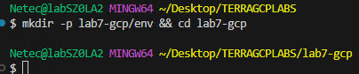

- **Paso 3.** Abre la carpeta en VS Code y crea archivos vacíos: `main.tf`, `variables.tf`, `outputs.tf`, `env/dev.tfvars`.

  ```bash
  touch providers.tf main.tf variables.tf outputs.tf env/dev.tfvars env/prod.tfvars
  ```

  ---

  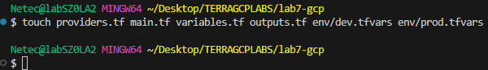

- **Paso 4.** Estructura de archivos esperada:

  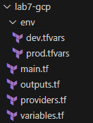

> **TAREA FINALIZADA**

**Resultado esperado:** Estructura `lab7-gcp/` creada y lista para integrar el contenido de los archivos.

---

### Tarea 2: Definir variables y parámetros del entorno

Declarar las variables necesarias y centralizar valores del entorno en `env/dev.tfvars`.

#### Tarea 2.1

- **Paso 5.** Copia el siguiente contenido en el archivo **`variables.tf`** y guardalo:

  ```hcl
  variable "project_id" {
    type        = string
    description = "ID del proyecto GCP"
  }

  variable "region" {
    type        = string
    default     = "us-central1"
    description = "Región por defecto"
  }

  variable "zone" {
    type        = string
    default     = "us-central1-a"
    description = "Zona por defecto"
  }

  variable "network_cidr" {
    type        = string
    default     = "10.30.0.0/24"
    description = "CIDR de la subred"
  }

  variable "db_instance_name" {
    type        = string
    default     = "lab7-mysql"
  }

  variable "db_name" {
    type        = string
    default     = "appdb"
  }

  variable "db_user" {
    type        = string
    default     = "app_user"
  }

  variable "secret_name" {
    type        = string
    default     = "db-app-password"
    description = "Nombre del secreto en Secret Manager"
  }

  variable "machine_type" {
    type        = string
    default     = "e2-micro"
  }
  ```

#### Tarea 2.2

- **Paso 6.** Copia el siguiente contenido en el archivo **`env/dev.tfvars`** y guardalo:

  - Sustituye el valor de la llave **project_id** por el nombre de tu proyecto asignado al curso.
  - Tambien puedes usar este comando para obtenerlo: `PROJECT_ID="$(gcloud config get-value project)"`
  - Y este comando para visualizarlo: `echo "Proyecto actual: $PROJECT_ID"`
  - Centralizar variables en `.tfvars` permite **cambiar de entorno** sin tocar el código.

  ```hcl
  project_id       = "<TU_PROJECT_ID>"
  region           = "us-central1"
  zone             = "us-central1-a"
  network_cidr     = "10.30.0.0/24"
  db_instance_name = "lab7-mysql"
  db_name          = "appdb"
  db_user          = "app_user"
  secret_name      = "db-app-password"
  machine_type     = "e2-micro"
  ```

> **TAREA FINALIZADA**

**Resultado esperado:** Variables y parámetros del entorno **listas** para el despliegue.

---

### Tarea 3: Infraestructura, secreto y base de datos (Terraform)

En esta tarea se creara **VPC/subred**, **generar contraseña aleatoria**, **guardar secreto en Secret Manager**, **aprovisionar Cloud SQL (MySQL)**, **DB/usuario**, y **preparar Service Account**.

#### Tarea 3.1

- **Paso 7.** Copia el siguiente contenido **completo** en el archivo **`providers.tf`** y guardalo:

  ```hcl
  terraform {
    required_providers {
      google = {
        source  = "hashicorp/google"
        version = ">= 5.0"
      }
      random = {
        source  = "hashicorp/random"
        version = ">= 3.5"
      }
    }
  }

  provider "google" {
    project = var.project_id
    region  = var.region
    zone    = var.zone
  }
  ```

- **Paso 8.** Ahora el siguiente contenido **completo** copialo en el archivo **`main.tf`** y guardalo:

  - Se genera la contraseña con `random_password`, la guardas en Secret Manager y se **reutiliza** para crear el usuario que se conectara ala base de datos.
  - A continuación se resalta la descripción de algunos recursos.
  random_password – Genera una contraseña aleatoria de 20 caracteres incluyendo los símbolos !@#%^*-_+=.
  - **`google_secret_manager_secret:`** Crea un secreto en Secret Manager con ID `var.secret_name` y réplica en la región `var.region`.
  - **`google_secret_manager_secret_version:`** Almacena en el secreto la contraseña generada por `random_password.app_password`.
  - **`google_sql_database_instance:`** Crea una instancia MySQL 8.0 llamada `var.db_instance_name` en la región `var.region` con tier `db-f1-micro` y IPv4 habilitado.
  - **`google_sql_database:`** Crea una base de datos llamada `var.db_name` en la instancia MySQL creada.
  - **`google_sql_user:`** Crea un usuario llamado `var.db_user` en la instancia MySQL con la contraseña generada.
  - **`google_compute_instance:`** Crea una VM Debian 12 llamada **lab7-vm** con IP pública, etiqueta ssh, cuenta de servicio asignada y **script de inicio que instala herramientas**, obtiene la contraseña de Secret Manager, descarga Cloud SQL Proxy, inicia el proxy hacia la instancia MySQL y ejecuta comandos SQL para crear tabla y registrar datos de prueba.

  ```hcl
  resource "google_compute_network" "vpc" {
    name                    = "lab7-vpc"
    auto_create_subnetworks = false
  }

  resource "google_compute_subnetwork" "subnet" {
    name          = "lab7-subnet"
    ip_cidr_range = var.network_cidr
    region        = var.region
    network       = google_compute_network.vpc.id
  }

  resource "google_compute_firewall" "allow_ssh_iap" {
    name    = "lab7-allow-ssh-iap"
    network = google_compute_network.vpc.name

    allow {
      protocol = "tcp"
      ports    = ["22"]
    }

    source_ranges = ["35.235.240.0/20"]
    direction     = "INGRESS"
    target_tags   = ["ssh"]
  }

  resource "google_service_account" "vm_sa" {
    account_id   = "lab7-vm-sa"
    display_name = "Lab7 VM Service Account"
  }

  resource "google_project_iam_member" "vm_sa_secret_accessor" {
    role   = "roles/secretmanager.secretAccessor"
    member = "serviceAccount:${google_service_account.vm_sa.email}"
    project = var.project_id
  }

  resource "google_project_iam_member" "vm_sa_cloudsql_client" {
    role   = "roles/cloudsql.client"
    member = "serviceAccount:${google_service_account.vm_sa.email}"
    project = var.project_id
  }

  resource "random_password" "app_password" {
    length              = 20
    special             = true
    override_special = "!@#%^*-_+="
  }

  resource "google_secret_manager_secret" "db_password_secret" {
    secret_id = var.secret_name
    replication {
      user_managed {
        replicas {
          location = var.region
        }
      }
    }
  }

  resource "google_secret_manager_secret_version" "db_password_secret_version" {
    secret      = google_secret_manager_secret.db_password_secret.id
    secret_data = random_password.app_password.result
  }

  resource "google_sql_database_instance" "mysql" {
    name             = var.db_instance_name
    database_version = "MYSQL_8_0"
    region           = var.region

    settings {
      tier = "db-g1-small"
      ip_configuration {
        ipv4_enabled = true
      }
    }

    deletion_protection = false
  }

  resource "google_sql_database" "appdb" {
    name     = var.db_name
    instance = google_sql_database_instance.mysql.name
  }

  resource "google_sql_user" "app_user" {
    name     = var.db_user
    instance = google_sql_database_instance.mysql.name
    password = random_password.app_password.result
  }

  resource "google_compute_instance" "vm" {
    name         = "lab7-vm"
    machine_type = var.machine_type
    zone         = var.zone
    tags         = ["ssh"]

    service_account {
      email  = google_service_account.vm_sa.email
      scopes = ["https://www.googleapis.com/auth/cloud-platform"]
    }

    boot_disk {
      initialize_params {
        image = "projects/debian-cloud/global/images/family/debian-12"
        size  = 10
        type  = "pd-standard"
      }
    }

    network_interface {
      subnetwork   = google_compute_subnetwork.subnet.name
      access_config {} # IP pública
    }

      metadata = {
      enable-oslogin = "TRUE"
    }

    depends_on = [
      google_sql_user.app_user,
      google_secret_manager_secret_version.db_password_secret_version
    ]
  }
  ```

> **TAREA FINALIZADA**

**Resultado esperado:** Infraestructura montada: secreto creado, Cloud SQL desplegado, usuario/DB configurados, y VM lista para **leer el secreto** y **conectarse** vía proxy.

---

### Tarea 4: Outputs

Exponer información útil (sin secretos) para validar el despliegue.

#### Tarea 4.1

- **Paso 9.** Copia el siguiente contenido en el archivo **`outputs.tf`** y guardalo:

  - Tras aplicar, `terraform output` muestra los **tres outputs** sin revelar contraseñas.

  ```hcl
  output "secret_name" {
    value       = var.secret_name
    description = "Nombre del secreto en Secret Manager"
  }

  output "sql_connection_name" {
    value       = google_sql_database_instance.mysql.connection_name
    description = "Connection name de la instancia Cloud SQL"
  }

  output "vm_name" {
    value       = google_compute_instance.vm.name
    description = "Nombre de la VM de prueba"
  }
  ```

> **TAREA FINALIZADA**

**Resultado esperado:** Outputs visibles y útiles **sin exponer secretos**.

---

### Tarea 5: Inicializar, planear, aplicar y probar la conexión

Ejecutar Terraform y validar que la VM **leyó el secreto** y **se conectó** a Cloud SQL usando el proxy.

#### Tarea 5.1

- **Paso 10.** Inicializa terraform escribe el siguiente comando:

  - La inicialización debe cargar correctamente los providers definidos.

  ```bash
  terraform init
  ```

  ---

  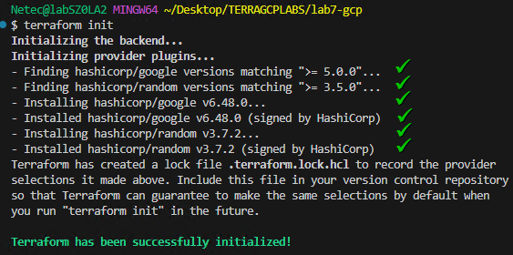

- **Paso 11.** Ejecuta **Plan** siempre como buena practica.

  - El resultado del plan es un poco extenso. En la imagen se muestra la información final.
  - Toma tu tiempo para analizar el plan.

  ```bash
  terraform plan -var-file="env/dev.tfvars"
  ```

  ---

  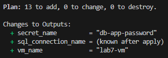

- **Paso 12.** Ahora ejecuta el **Apply**:

  - Espera unos minutos en lo que termina de crear la infraestructura, ve analizando los logs de la creación.
  - La base de datos puede tardar **6 minutos aproximadamnte**
  - El `apply` termina sin errores.

  ```bash
  terraform apply -var-file="env/dev.tfvars" -auto-approve
  ```

  ---

  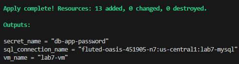

- **Paso 13.** Verifica outputs con el siguiente comando:

  - El `terraform output` muestra nombres y `connectionName`.
  
  ```bash
  terraform output
  ```

  ---

  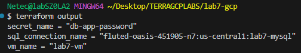

- **Paso 14.** Comprueba en mediante la linea de comandos de GCP:
  
  - Verifica la cración del secreto mediante el siguiente comando.
  - Solo si es necesario reautenticarte con el usuario del curso escribe este comando: `gcloud config set account USUARIO-DEL-CURSO`
  - Vuelve a ejecutar el comando de **Secrets**

  ```bash
  PROJECT_ID="$(gcloud config get-value project)"
  gcloud secrets versions access latest --secret=db-app-password --project $PROJECT_ID
  ```

  ---

  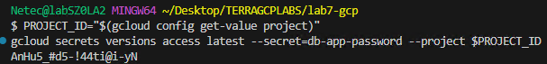

- **Paso 15.** Verfica que la base de datos este correctamente visible.
  
  ```bash
  gcloud sql instances describe lab7-mysql --project $PROJECT_ID --format="value(connectionName)"
  ```

  ---

  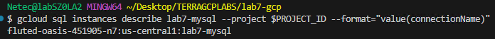

- **Paso 16.** Tambien revisa la maquina virtual creada correctamente.


  ```bash
  gcloud compute instances list --project $PROJECT_ID --filter="name=lab7-vm"
  ```

  ---

  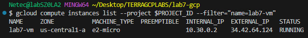

#### Tarea 5.2

- **Paso 17.** Ahora conectate a la maquina virtual para realizar las pruebas correspondientes.

  - Este procedimiento se realizara desde la interfaz grafica.
  - Haz clic [**AQUÍ**](https://console.cloud.google.com/compute) para abrir la consola de **Google Compute Engine**
  - Debes de ver tu maquina virtual llamada **lab7-vm**

  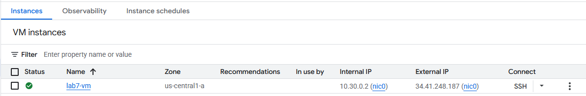

- **Paso 18.** Ahora da clic en la opción **SSH**

  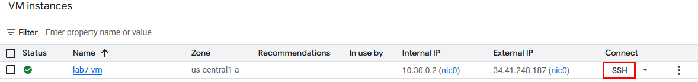

- **Paso 19.** Se abrira una ventana emergente que te pedira **Autorización** dale clic en **Authorize**.

  **NOTA:** Si te pide iniciar sesion, hazlo para entrar a la maquina virtual.

  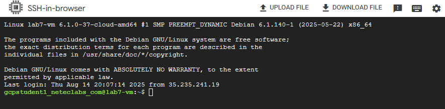

- **Paso 20.** Dentro de la maquina virtual ejecuta el siguiente comando:

  - Con esto verificas el nombre de la **vm** y el usuario autenticado.

  ```bash
  hostname
  whoami
  ```

  ---

  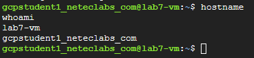

- **Paso 21.** Ahora ejecuta la siguiente serie de comandos para preparar el servidor.

  - Actualizar paquetes: `sudo apt-get update`
  - Instalar cliente MySQL: `sudo apt-get install -y default-mysql-client`
  - Descargar el Cloud SQL Auth Proxy: `wget https://storage.googleapis.com/cloud-sql-connectors/cloud-sql-proxy/v2.11.4/cloud-sql-proxy.linux.amd64 -O cloud-sql-proxy`
  - Dar permisos de ejecución: `chmod +x cloud-sql-proxy`
  - Moverlo a /usr/local/bin: `sudo mv cloud-sql-proxy /usr/local/bin/`

- **Paso 22.** Ahora valida la instalación de **mysql** y **cloud sql proxy**.

  - Si todo sale bien deberas ver las versiones de cada software instalado.

  ```bash
  mysql --version
  cloud-sql-proxy --version
  ```

  ---

  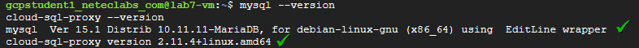

- **Paso 23.** Ahora obten el nombre de tu proyecto.

  ```bash
  PROJECT_ID=$(curl -sH 'Metadata-Flavor: Google' \
  http://metadata.google.internal/computeMetadata/v1/project/project-id)
  echo $PROJECT_ID
  ```

  ---

  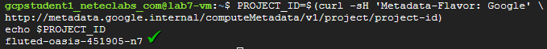

- **Paso 24.** Ahora obten la contraseña del secreto para la autenticacion a la base de datos.

  ```bash
  DB_PASS=$(gcloud secrets versions access latest \
  --secret="db-app-password" \
  --project "$PROJECT_ID")
  echo $DB_PASS
  ```

  ---

  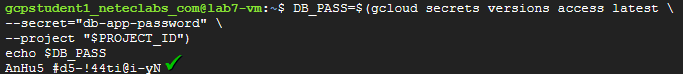

- **Paso 25.** Ahora obten el **Connection name** de tu instancia, ejecuta el siguiente comando.

  ```bash
  CONN_NAME="$PROJECT_ID:us-central1:lab7-mysql"
  echo $CONN_NAME
  ```

  ---

  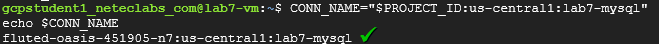

- **Paso 26.** Ahora conectate usando el siguiente comando.

  - Si es necesario presiona la tecla **Enter** para continuar en la terminal

  ```bash
  cloud-sql-proxy --port 3306 "$CONN_NAME" &
  ```

  ---

  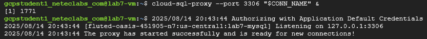

- **Paso 27.** Llego el momento de la verdad, con el siguiente comando probaremos si el secreto esta funcionando correctamente.

  - ¡Resultado exitoso! el error que muestra la imagen es correcto indica que si se pudo conectar a la base, pero no existe.
  - En el siguiente paso crearemos una de ejemplo.

  ```bash
  mysql -h 127.0.0.1 -P 3306 \
  -u app_user \
  -p"$DB_PASS" \
  -e "SELECT * FROM appdb.demo;"
  ```

  ---

  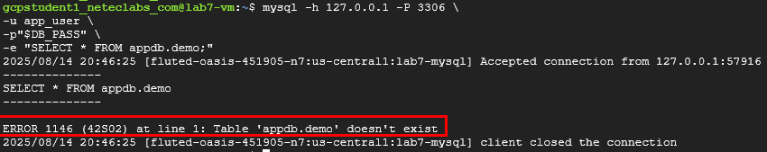

- **Paso 28.** Como el paso anterior mostro que no existe la tabla, ahora hagamosla con el siguiente comando.

  - Como puedes observar se insertaron los datos y se mostro el mensaje **Conexión OK desde VM**.
  - La VM obtiene el secreto **en vm** con su SA. El **Auth Proxy** maneja identidad/SSL hacia Cloud SQL; no expones puertos ni contraseñas en archivos.

  ```bash
  mysql -h 127.0.0.1 -P 3306 \
  -u app_user \
  -p"$DB_PASS" \
  -e "CREATE TABLE appdb.demo(id INT PRIMARY KEY AUTO_INCREMENT, msg VARCHAR(100)); \
      INSERT INTO appdb.demo(msg) VALUES('Conexión OK desde VM'); \
      SELECT * FROM appdb.demo;"
  ```

  ---

  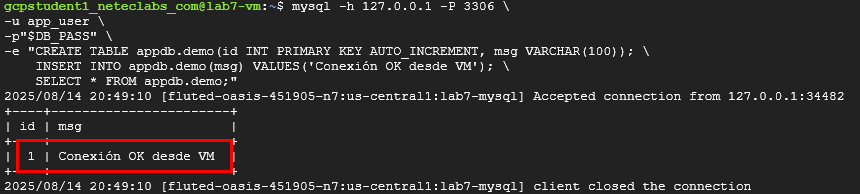

> **TAREA FINALIZADA**

**Resultado esperado:** Conexión exitosa a la base vía proxy usando la contraseña leída de **Secret Manager** y consulta funcionando correctamente.

---

### Tarea 6: Limpieza

Eliminar recursos para evitar costos y dejar el proyecto limpio.

#### Tarea 6.1

- **Paso 29.** Ejecuta el comando **destroy** dentro de la terminal de **VSCode** para limpiar la infraestrucutra.

  - Espera unos minutos en lo que se destruye la infraestructura.

  ```bash
  terraform destroy -var-file="env/dev.tfvars" -auto-approve
  ```

- **Paso 30.** Verifica que no queden recursos:

  - Practicar **higiene** de recursos evita cargos y conflictos futuros.

  ```bash
  gcloud compute instances list
  gcloud sql instances list
  gcloud secrets list
  ```

  ---

  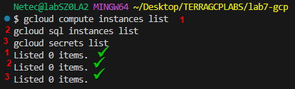  

> **TAREA FINALIZADA**

**Resultado esperado:** Proyecto sin recursos activos del laboratorio.

---

> **¡FELICIDADES HAZ COMPLETADO EL LABORATORIO 7!**

---

## Resultado final

Implementaste un flujo completo de **secreto → consumo en vm → conexión segura a DB**. Generaste credenciales con Terraform, las guardaste en **Secret Manager**, configuraste **IAM mínimo** para una VM y usaste el **Cloud SQL Auth Proxy** para conectarte de forma segura y ejecutar operaciones SQL reales **sin exponer credenciales** en texto plano.

## Notas y/o Consideraciones

- **Estado de Terraform y secretos:** `random_password` y `google_sql_user` pueden dejar valores en el estado. En producción, evalúa crear el usuario fuera de Terraform o rotar secretos con mecanismos externos.
- **Principio de mínimo privilegio:** Mantén `roles/secretmanager.secretAccessor` y `roles/cloudsql.client` solo donde sea indispensable.
- **Proxy local:** Puedes ejecutar el proxy en tu máquina con el `connection_name` y `gcloud auth application-default login` para pruebas locales.
- **Red privada:** En empresas, prioriza **Private IP** para Cloud SQL y conectividad VPC (setup adicional).
- **Rotación:** Implementa rotación periódica de secretos y reinicio/recarga de consumidores.

## URLS de referencia

- [Secret Manager](https://cloud.google.com/secret-manager/docs)
- [Cloud SQL Auth Proxy (v2)](https://cloud.google.com/sql/docs/mysql/connect-auth-proxy)
- [Terraform Google Provider](https://registry.terraform.io/providers/hashicorp/google/latest)
- [Terraform Random Provider](https://registry.terraform.io/providers/hashicorp/random/latest)
- [Cloud SQL MySQL](https://cloud.google.com/sql/docs/mysql)

---

**[⬅️ Atrás](https://netec-mx.github.io/TRFRM-GCP-INT_Priv/Capítulo6/lab6.html)** | **[Lista General](https://netec-mx.github.io/TRFRM-GCP-INT_Priv/)** | **[Siguiente ➡️](https://netec-mx.github.io/TRFRM-GCP-INT_Priv/Capítulo8/lab8.html)**