# Práctica 8: Refactorizar un proyecto real monolítico en modular y validado

## Objetivo

Refactorizar un proyecto Terraform monolítico, separando el código en módulos reutilizables, aplicando formato y validación con herramientas integradas, y documentando correctamente el código. Durante el proceso, se identificarán y corregirán malas prácticas comunes.

## Requisitos

- Terraform instalado en el sistema.
- Visual Studio Code (VSC) instalado.
- Proyecto Terraform que contenga al menos

## Duración aproximada

- 30 minutos

## Región

- us-central1

## Introducción

En entornos reales, los proyectos Terraform suelen crecer rápidamente, y si no se estructuran correctamente, se vuelven difíciles de mantener. En esta práctica transformaremos un proyecto monolítico en una arquitectura modular. Esto permitirá reutilizar código, mejorar la legibilidad, facilitar el mantenimiento y asegurar que todo cumpla con las buenas prácticas.

---

**[⬅️ Atrás](https://netec-mx.github.io/TRFRM-GCP-INT_Priv/Capítulo7/lab7.html)** | **[Lista General](https://netec-mx.github.io/TRFRM-GCP-INT_Priv/)** | **[Siguiente ➡️](https://netec-mx.github.io/TRFRM-GCP-INT_Priv/Capítulo9/lab9.html)**

---

## Instrucciones

**IMPORTANTE:** Recuerda siempre autenticarte a GCP en la terminal de VSC con el comando `gcloud auth application-default login` y el usuario y contraseña asignado al curso.

### Tarea 1: Estructura inicial (monolítica) con malas prácticas

Crear la carpeta del laboratorio y un proyecto monolítico **"funcional pero con issues"** para tener línea base.

#### Tarea 1.1

- **Paso 1.** En VSCode, abre una **ventana** y selecciona **File > Open Folder...** y abre `TERRAGCPLABS`.

- **Paso 2.** Abre la **Terminal Integrada** en VSCode dentro de la carpeta **TERRAGCPLABS** y ejecuta el siguiente comando:

  ```bash
  mkdir -p lab8-gcp/monolitico && cd lab8-gcp/monolitico
  ```

  ---

  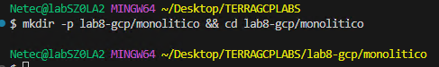

- **Paso 3.** Crea los archivos base del proyecto monolitico:

  ```bash
  touch main.tf variables.tf outputs.tf
  ```

- **Paso 4.** Agrega el siguiente contenido en el archivo `variables.tf`

  - **Malas prácticas:** Defaults dudosos, sin descripciones ni validaciones.
  - Codigo irregular mal organizado dentro del archivo.

  ```hcl
    variable "project_id" {
    default         = "<TU_PROJECT_ID>"
               }

               variable "region" {
    default        = "us-central1"
           }

           variable "zone" {
    default             = "us-central1-a"
       }

  variable "admin_password" {
                 default         = "Admin123!"
            }
  ```

- **Paso 4.** Agrega el siguiente contenido en el archivo `main.tf`

  - **Malas prácticas:** Todo mezclado, nombres poco claros, formato irregular.
  - **Provider** en el lugar incorrecto.

  ```hcl
    provider "google" {
             project            =             var.project_id
    region  =    var.region
    zone      =    var.zone
  }

  resource "google_compute_network" "vpc1" {
    name = "vpc1"
    auto_create_subnetworks = false
  }

  resource "google_compute_subnetwork" "sn1" {
    name          = "sn1"
    region                = var.region
    network               =             google_compute_network.vpc1.id
    ip_cidr_range             = "10.50.0.0/24"
  }

             resource "google_compute_firewall" "fw_ssh_all" {
    name    = "fw-ssh-all"
    network          = google_compute_network.vpc1.name

    allow {
               protocol = "tcp"
      ports                = ["22"]
    }
    source_ranges         = ["0.0.0.0/0"]
    direction      = "INGRESS"
  }

            resource "google_compute_instance" "vm" {
    name                = "myvm"
    machine_type               = "e2-micro"
    zone                = var.zone
    labels       =         {env = "dev"}

    boot_disk {
      initialize_params {
        image =                "projects/debian-cloud/global/images/family/debian-12"
      }
    }

    network_interface {
                  subnetwork = google_compute_subnetwork.sn1.name
      access_config {}
    }

               metadata_startup_script = <<-EOT
      #!/bin/bash
                echo "Admin password (no real): ${var.admin_password}" > /root/info.txt
    EOT
  }
  ```

- **Paso 5.** Agrega el siguiente contenido en el archivo `output.tf`

  - **Malas prácticas:** Salida mínima y poco contextual.

  ```hcl
  output "vm_self_link" {
            value = google_compute_instance.vm.self_link
          }
  ```

- **Paso 6.** Ejecuta la **inicialización** de terraform en la terminal:

  - Inicialización normal como base funcional.

  ```bash
  terraform init
  ```

  ---

  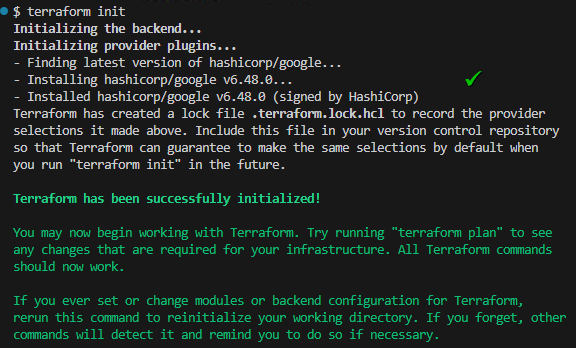

- **Paso 7.** Ahora realiza la **validación** de la infraestructura.

  - Funcional pero con riesgos, apertura **0.0.0.0/0** a SSH, "password" en texto plano, "todo en un archivo", variables sin descripción.
  - El comando verificara la funcioanlidad, no que realmente funcione la implementación.
  - Apesar de las inconsistencias la declaración del codigo es valida.
  - Validar primero es como hacer un chequeo médico antes de operar: garantiza que no introduzcamos más problemas en un código que ya está roto.

  ```bash
  terraform validate
  ```

  ---

  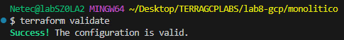

- **Paso 8.** Ahora realiza la **planeación** de la infraestructura.

  - Debe de mostrar la futura creación de 1 VPC, 1 subred, 1 firewall y 1 VM.
  - Debe mostrar un plan sin errores.
  - El plan guardado se puede leer con el comando: `terraform show tfplan-monolitico`

  ```bash
  terraform plan -out=tfplan-monolitico
  ```

  ---

  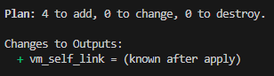

- **Paso 9.** Ahora ejecuta el siguiente comando que formateara el contenido de los archivos y tendra una mejor visibilidad

  - Los archivos se generaron con una mala visibilidad y el comando **fmt** la mejoro.
  - Abra cualquier de los archivos y se entendera mucho mejor.

  ```hcl
  terraform fmt
  ```
  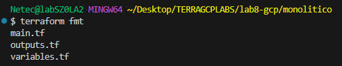

> **TAREA FINALIZADA**

**Resultado esperado:** Plan base capturado y listo para comparar.

---

### Tarea 2: Crear la estructura modular

Organizar el proyecto en carpetas y archivos para separar recursos y lógica.

#### Tarea 2.1 Modulo de red

- **Paso 10.** En la raíz del proyecto, crea la carpeta `modularizado`.

  - Separar en módulos es como empaquetar piezas de Lego: cada bloque es reutilizable y no depende del resto.

  ```bash
  cd ..
  mkdir -p modularizado/main modularizado/modules/network modularizado/modules/compute
  ```

- **Paso 11.** Crea los archivos del modulo **network**.

  - **La información de estos modulos se baso en el codigo del diseño monolitico para la migración, pero ya con buenas practicas y separada la informacion**

  ```bash
  touch modularizado/modules/network/main.tf modularizado/modules/network/variables.tf modularizado/modules/network/outputs.tf
  ```

- **Paso 12.** Ahora abre el archivo `modules/network/variables.tf` y carga el siguiente contenido y guardalo.

  ```hcl
    variable "network_name" {
    type        = string
    description = "Nombre de la VPC"
    validation {
      condition     = can(regex("^[a-z]([a-z0-9-]{0,61}[a-z0-9])?$", var.network_name))
      error_message = "network_name debe ser DNS compliant, minúsculas, guiones medios."
    }
  }

                      variable "subnet_name" {
                        type        = string
                        description = "Nombre de la subred"
                      }

  variable "region" {
                         type        = string
    description = "Región de la subred"
  }

  variable "subnet_cidr" {
    type        = string
                    description = "CIDR de la subred (ej. 10.50.0.0/24)"
                    validation {
                      condition     = can(cidrhost(var.subnet_cidr, 0))
                      error_message = "subnet_cidr debe ser una red válida (CIDR)."
    }
  }

  variable "allow_ssh_iap" {
                      type        = bool
                      description = "Si true, permite SSH solo vía IAP"
                      default     = true
                    }
  ```

- **Paso 13.** Ahora abre el archivo `modules/network/main.tf` y carga el siguiente contenido y guardalo.

  ```hcl
      resource "google_compute_network" "vpc" {
        name                    = var.network_name
        auto_create_subnetworks = false
      }

      resource "google_compute_subnetwork" "subnet" {
        name          = var.subnet_name
        region        = var.region
        network       = google_compute_network.vpc.id
        ip_cidr_range = var.subnet_cidr
      }

      resource "google_compute_firewall" "allow_ssh_iap" {
        count   = var.allow_ssh_iap ? 1 : 0
        name    = "${var.network_name}-allow-ssh-iap"
        network = google_compute_network.vpc.name

        allow {
          protocol = "tcp"
          ports    = ["22"]
        }

                    source_ranges = ["35.235.240.0/20"]
                    direction     = "INGRESS"
                    target_tags   = ["ssh"]
                  }
  ```

- **Paso 14.** Ahora abre el archivo `modules/network/outputs.tf` y carga el siguiente contenido y guardalo.

  ```hcl
  output "network_name" {
            value       = google_compute_network.vpc.name
            description = "Nombre de la VPC creada"
          }

          output "subnet_self_link" {
            value       = google_compute_subnetwork.subnet.self_link
            description = "Self link de la subred"
          }
  ```

#### Tarea 2.2 Modulo de computo

- **Paso 15.**  Crea los archivos del modulo **compute**.

  - **La información de estos modulos se baso en el codigo del diseño monolitico para la migración, pero ya con buenas practicas y separada la informacion**
  - Asegurate de estar en la raiz de la carpeta **lab8-gcp**

  ```bash
  touch modularizado/modules/compute/main.tf modularizado/modules/compute/variables.tf modularizado/modules/compute/outputs.tf
  ```

- **Paso 16.** Ahora abre el archivo `modules/compute/variables.tf` y carga el siguiente contenido y guardalo.

  ```hcl
    variable "instance_name" {
      type        = string
      description = "Nombre de la instancia"
      validation {
        condition     = can(regex("^[a-z]([a-z0-9-]{0,61}[a-z0-9])?$", var.instance_name))
        error_message = "Nombre inválido. Usa minúsculas, números y guiones medios."
      }
                  }

                  variable "machine_type" {
                    type        = string
                    description = "Tipo de máquina (ej. e2-micro)"
                    default     = "e2-micro"
                  }

                  variable "zone" {
                    type        = string
      description = "Zona de despliegue"
    }

                variable "subnet_self_link" {
                  type        = string
                  description = "Self link de la subred donde se conectará la VM"
                }

                variable "labels" {
                  type        = map(string)
                  description = "Etiquetas para la instancia"
                  default     = {}
                }

    variable "tags" {
                        type        = list(string)
                        description = "Tags de red (ej. ['ssh'])"
                        default     = []
                      }

                      variable "create_external_ip" {
                        type        = bool
                        description = "Si true, crea IP pública (access_config)"
      default     = true
    }

    variable "startup_script" {
      type        = string
      description = "Script de inicio opcional"
      default     = ""
    }
  ```

- **Paso 17.** Ahora abre el archivo `modules/compute/main.tf` y carga el siguiente contenido y guardalo.

  ```hcl
  resource "google_compute_instance" "vm" {
    name         = var.instance_name
    machine_type = var.machine_type
    zone         = var.zone
    labels       = var.labels
    tags         = var.tags

    boot_disk {
      initialize_params {
        image = "projects/debian-cloud/global/images/family/debian-12"
      }
    }

    network_interface {
      subnetwork = var.subnet_self_link

      dynamic "access_config" {
        for_each = var.create_external_ip ? [1] : []
        content {}
      }
    }

    metadata_startup_script = var.startup_script
  }
  ```

- **Paso 18.** Ahora abre el archivo `modules/compute/outputs.tf` y carga el siguiente contenido y guardalo.

  ```hcl
  output "instance_name" {
    value       = google_compute_instance.vm.name
    description = "Nombre de la VM"
  }

  output "self_link" {
    value       = google_compute_instance.vm.self_link
    description = "Self link de la VM"
  }

  output "internal_ip" {
    value       = google_compute_instance.vm.network_interface[0].network_ip
    description = "IP interna"
  }

  output "external_ip" {
    value       = try(google_compute_instance.vm.network_interface[0].access_config[0].nat_ip, null)
    description = "IP externa (si existe)"
  }
  ```

- **Paso 19.** Entra la carpeta **modularizado** para validar y formatear los archivos.

  ```bash
  cd modularizado
  terraform validate
  terraform fmt -recursive
  ```

  ---

  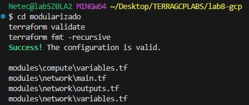

> **TAREA FINALIZADA**

**Resultado esperado:** Estructura organizacional creada y lista para un mejor consumo.

---

### Tarea 3: Consumir los módulos desde el root limpio

Configurar el proyecto raíz `modularizado/main` para usar los módulos y parametrizar con `.tfvars`.

#### Tarea 3.1

- **Paso 20.** Cambia de directorio al modulo **main**.

  - Ajusta la ruta si es necesario.

  ```bash
  cd main/
  ```

- **Paso 21.** Dentro del modulo main crea los siguientes archivos de terraform.

  ```bash
  mkdir env/
  touch providers.tf main.tf variables.tf outputs.tf env/dev.tfvars
  ```

- **Paso 22.** En el archivo `variables.tf` agrega el siguietne codigo y guarda.

  ```hcl
    variable "project_id" {
    type        = string
                description = "ID del proyecto GCP"
  }

  variable "region" {
    type        = string
    default     = "us-central1"
    description = "Región por defecto"
  }

  variable "zone" {
              type        = string
              default     = "us-central1-a"
              description = "Zona por defecto"
            }

            variable "network_name" {
    type        = string
                    default     = "vpc-refactor"
                    description = "Nombre de la VPC"
                  }

  variable "subnet_name" {
                type        = string
    default     = "subnet-refactor"
    description = "Nombre de la subred"
                    }

                    variable "subnet_cidr" {
                      type        = string
                      default     = "10.60.0.0/24"
                      description = "CIDR de la subred"
                    }

                    variable "instance_name" {
                      type        = string
                      default     = "refactor-vm"
                      description = "Nombre de la VM"
                    }
  ```

- **Paso 23.** En el archivo `main.tf` agrega el siguietne codigo y guarda.

  - Recuerda que el **root** no contiene recursos: solo orquesta módulos más limpio y mantenible.

  ```hcl
  module "network" {
    source       = "../modules/network"
        network_name = var.network_name
        subnet_name  =                  var.subnet_name
        region       = var.region
    subnet_cidr  = var.subnet_cidr
    allow_ssh_iap               = true  
  }

  module "compute" {
    source           = "../modules/compute"
    instance_name    = var.instance_name
    machine_type     =                 "e2-micro"
    zone             = var.zone
    subnet_self_link                = module.network.subnet_self_link
    labels           = { env = "dev", app = "refactor" }
    tags             = ["ssh"]
    create_external_ip = true
    startup_script                      = <<-EOT
      #!/bin/bash
      echo "Hello from modular refactor" > /etc/motd
    EOT
  }
  ```
- **Paso 24.** En el archivo `providers.tf` agrega el siguietne codigo y guarda.

  ```hcl
  terraform {
    required_providers {
      google = {
                      source  = "hashicorp/google"
        version = ">= 5.0"
      }
    }
  }

  provider "google" {
    project = var.project_id
            region  = var.region
    zone    = var.zone
  }
  ```

- **Paso 25.** En el archivo `outputs.tf` agrega el siguietne codigo y guarda.

  ```hcl
  output "network_name" {
    value       = module.network.network_name
    description = "VPC creada"
  }

  output "vm_name" {
    value       = module.compute.instance_name
    description = "Nombre de la VM creada"
  }

  output "vm_ips" {
    value       = { internal = module.compute.internal_ip, external = module.compute.external_ip }
    description = "IPs de la VM (interna/externa)"
  }
  ```

- **Paso 26.** En el archivo `env/dev.tfvars` agrega el siguietne codigo y guarda.

  - Sustituye el valor de la llave **project_id** por el nombre de tu proyecto asignado al curso.
  - Tambien puedes usar este comando para obtenerlo: `PROJECT_ID="$(gcloud config get-value project)"`
  - Y este comando para visualizarlo: `echo "Proyecto actual: $PROJECT_ID"`

  ```hcl
  project_id   = "TU_PROJECT_ID"
  region       = "us-central1"
  zone         = "us-central1-a"
  network_name = "vpc-refactor"
  subnet_name  = "subnet-refactor"
  subnet_cidr  = "10.60.0.0/24"
  instance_name = "refactor-vm"
  ```

> **TAREA FINALIZADA**

**Resultado esperado:** Root configurado y parametrizado; módulos consumidos correctamente.

---

### Tarea 4: Formateo y validación (antes/después)

Aplicar fmt y validate para estandarizar y detectar errores.

#### Tarea 4.1

- **Paso 27.** Asegurate de estar en la carpeta `modularizado/main/` para inicializar el ambiente:

  - La estructura organizacional debe inicializar correctamente.

  ```hcl
  terraform init
  ```

  ---

  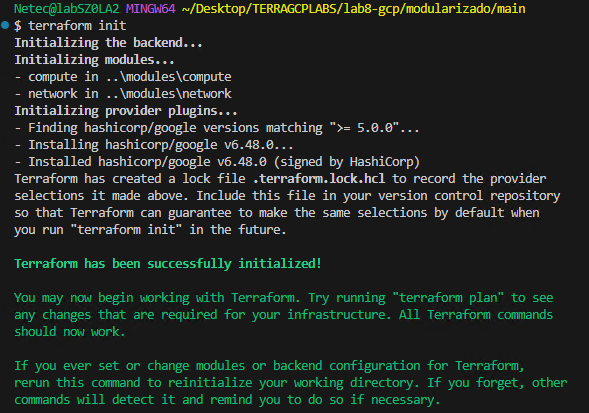

- **Paso 28.** Ejecuta loos comandos para validad y formatear los archivos.

  ```hcl
  terraform validate
  terraform fmt -recursive
  ```

  ---

  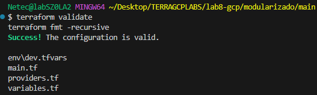

- **Paso 29.** Ejecuta el plan con la nueva estructura organizacional:

  - Analiza el plan para detectar la nueva mejor estrucutra y buenas practicas.
  - El **plan** debe mostrar recursos equivalentes al monolítico (VPC, Subnet, Firewall, VM).
  - `fmt` evita diffs ruidosos y `validate` atrapa errores temprano; ambos **son hábitos previos a cada commit**.

  ```hcl
  terraform plan -var-file="env/dev.tfvars" -out=tfplan-modular
  ```

  ---

  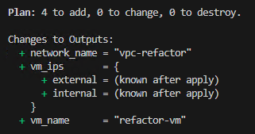

> **TAREA FINALIZADA**

**Resultado esperado:** Proyecto modular válido y formateado con plan generado.

---

### Tarea 5: Migración y comparación (mejoras de seguridad y orden)

Contrastar el monolítico y el modular; eliminar malas prácticas.

#### Tarea 5.1

- **Paso 30.** Diferencias clave

  - **SSH:** Antes `0.0.0.0/0`; ahora **IAP only (35.235.240.0/20)**.
  - **Credenciales:** Antes variable `admin_password` en texto plano; ahora **no** se exponen ni se usan como ejemplo.
  - **Orden:** Antes todo en un archivo; ahora **módulos** (`network`, `compute`) + root mínimo.
  - **Validaciones:** Ahora hay **validation** en variables (`regex`, `CIDR`, etc.).
  - Outputs: Más **contexto** y **estructurados**.

- **Paso 31.** (Opcional) Si aplicaste la infraestructura de monolitico eliminala.

  - Este paso solo es por si aplicaste monolitico, sino avanza al siguiente paso.
  - Dependiendo en que carpeta estes, ajusta la ruta para ir al directorio monolitico y luego destruir la infraestructura.

  ```bash
  cd ../../monolitico
  terraform destroy -auto-approve.
  ```

- **Paso 31.** Entra a la carpeta **main** del modulo **modularizado**, y aplica la configuración.

  - Recuerda que sino estas dentro de la carpeta `main`, navega hasta ella mediante CLI
  - Pasamos de **funciona pero peligroso** a **funciona y está bien diseñado**.

  ```bash
  terraform apply -var-file="env/dev.tfvars" -auto-approve
  ```

  ---

  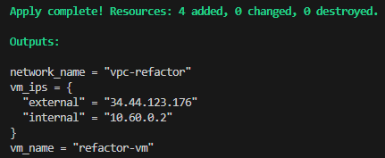  

> **TAREA FINALIZADA**

**Resultado esperado:** Infraestructura modular en pie, sin malas prácticas del monolítico.

---

### Tarea 6: Agregar documentación en README.md

Documentar la estructura y uso del proyecto es importante para el equipo.

#### Tarea 6.1

- **Paso 32.** En `modularizado/` crea un archivo `README.md` con:

  - Asegurate de estar en la raíz de la carpeta **`lab8-gcp`**

  ```bash
  touch modularizado/README.md
  ```

- **Paso 33.** Abre el archivo **README.md** y agrega el siguiente contenido.

  - Documentar es como dejar un mapa para el siguiente desarrollador: facilita la comprensión y continuidad del proyecto.

  ``````markdown
  # Proyecto Terraform organizacional (GCP)

  Este proyecto despliega una VPC/Subred/Firewall (IAP) y una VM usando módulos reutilizables.

  ## Estructura

  - `modules/network/`: VPC, Subred y Firewall (SSH vía IAP).
  - `modules/compute/`: VM con opciones de etiquetas, tags e IP pública condicional.
  - `main/`: Root que orquesta módulos y variables por entorno (`env/dev.tfvars`).

  ## Uso

  ```bash
  cd main
  terraform init
  terraform plan -var-file="env/dev.tfvars"
  terraform apply -var-file="env/dev.tfvars"
  ```

  ## Variables principales

  ```hcl
  variable "project_id"   {}
  variable "region"       { default = "us-central1" }
  variable "zone"         { default = "us-central1-a" }
  variable "network_name" { default = "vpc-refactor" }
  variable "subnet_name"  { default = "subnet-refactor" }
  variable "subnet_cidr"  { default = "10.60.0.0/24" }
  variable "instance_name"{ default = "refactor-vm" }
  ```

  ## Buenas prácticas aplicadas

  - Módulos con **inputs** validados y **outputs** claros.
  - **Principio de mínimo privilegio** en red (SSH vía IAP).
  - **fmt** y **validate** antes de cada commit.
  - Root sin recursos: sólo **orquestación**.
  ``````

> **TAREA FINALIZADA**

**Resultado esperado:** Proyecto documentado y listo para ser reutilizado. Con información clara para operar y mantener.

---

### Tarea 7: Limpieza

Evitar costos innecesarios.

#### Tarea 7.1

- **Paso 34.** Destruir recursos del ambiente modular organizacional.

  - Entra a la carpeta **main** del ambiente **modularizado**

  ```bash
  terraform destroy -var-file="env/dev.tfvars" -auto-approve
  ```

  ---

  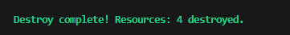  


- **Paso 35.** En caso de que aun tengas la infraestructura del ambiente monolitico, eliminala tambien.

> **TAREA FINALIZADA**

**Resultado esperado:** Proyecto sin recursos activos.

---

> **¡FELICIDADES HAZ COMPLETADO EL LABORATORIO 8!**

---

## Resultado final

Refactorizaste un proyecto **monolítico** a una arquitectura **modular**, **validada** y **documentada**, eliminando riesgos y preparando el código para **escala** y **mantenimiento**. Ganaste **claridad**, **seguridad** y **reutilización** sin perder funcionalidad.

## Notas y/o Consideraciones

- **SSH seguro:** preferir **IAP**; si requieres IP pública, restringe origen a tu IP (no `0.0.0.0/0`).
- **Variables sensibles:** evita contraseñas en texto claro (usa Secret Manager/variables de entorno).
- **Calidad:** ejecuta `terraform fmt` y `terraform validate` en CI (pre-commit hooks).
- **Versionado:** etiqueta tus módulos con **semver** si los publicas interna/externamente.
- **Observabilidad:** añade etiquetas/labels estándar (`env`, `app`, `owner`).

## URLs de referencia

- [Módulos en Terraform](https://developer.hashicorp.com/terraform/language/modules)
- [Validations en variables](https://developer.hashicorp.com/terraform/language/values/variables)
- [Google Provider](https://registry.terraform.io/providers/hashicorp/google/latest)
- [Compute Engine](https://cloud.google.com/compute/docs)
- [IAP para SSH](https://cloud.google.com/iap/docs/using-tcp-forwarding)

---

**[⬅️ Atrás](https://netec-mx.github.io/TRFRM-GCP-INT_Priv/Capítulo7/lab7.html)** | **[Lista General](https://netec-mx.github.io/TRFRM-GCP-INT_Priv/)** | **[Siguiente ➡️](https://netec-mx.github.io/TRFRM-GCP-INT_Priv/Capítulo9/lab9.html)**