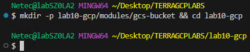
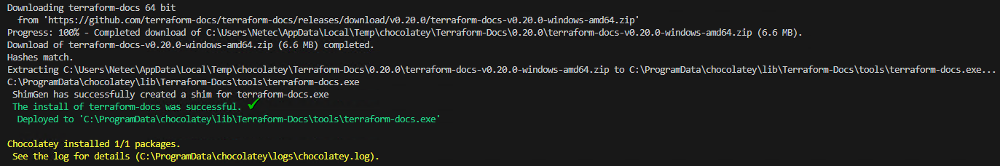
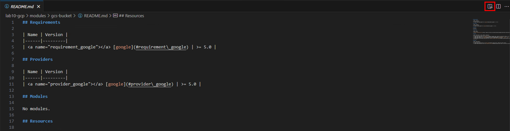
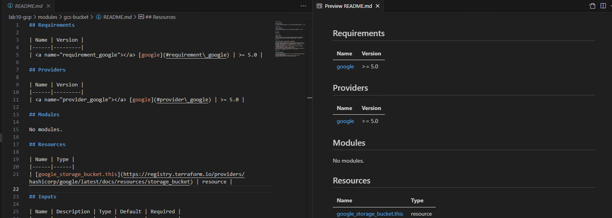
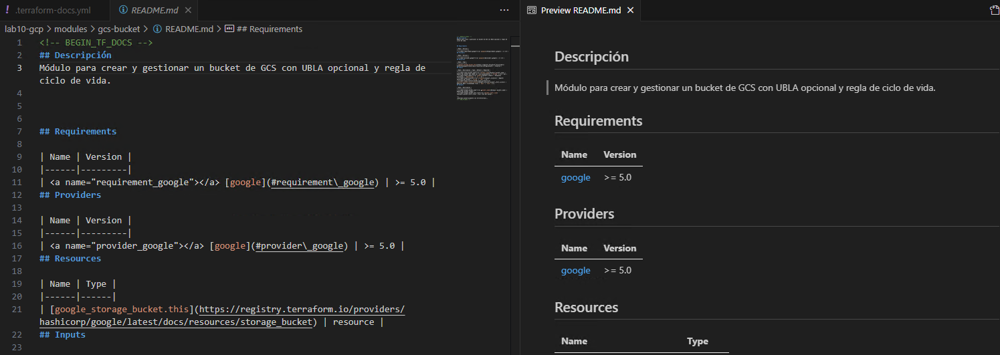
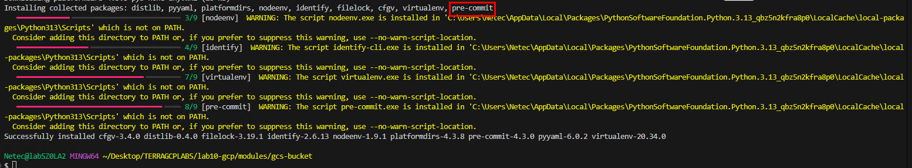
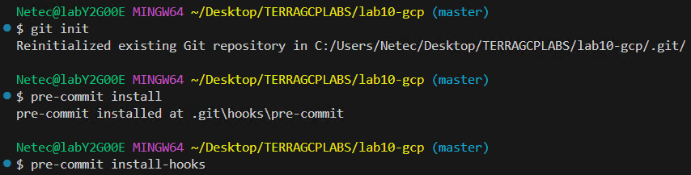
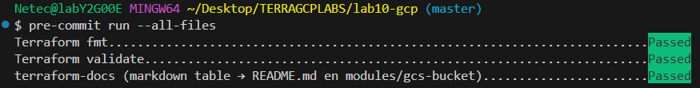
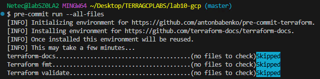
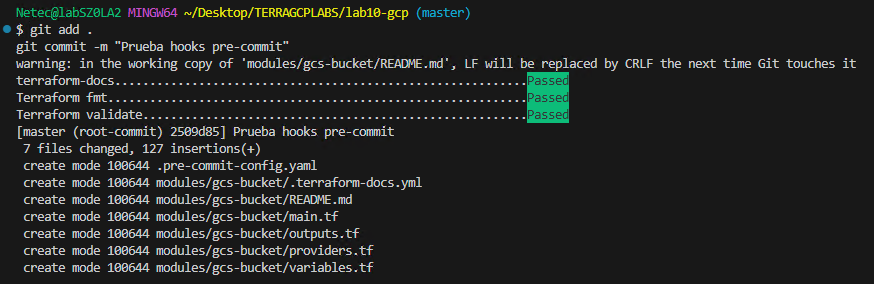

# Práctica 10: Generar Documentación Automática con `terraform-docs`

## Objetivo

Aprender a generar documentación legible y actualizada de forma automática desde los archivos `.tf`, especialmente `variables.tf`, `outputs.tf`, y `main.tf`, usando `terraform-docs`.

## Requisitos

- Tener un módulo o proyecto Terraform funcional.
- Tener un archivo `variables.tf` y/o `outputs.tf`.
- Acceso a línea de comandos con permisos para instalar herramientas.

## Duración aproximada

- 10 minutos

## Región

- us-central1

## Introduccion

`terraform-docs` analiza tu carpeta de Terraform y genera documentación (por ejemplo, Markdown) con las **entradas (variables)**, **salidas (outputs)**, **versiones** y **proveedores**. Evita que la documentación se desactualice, ya que se crea directamente desde los `.tf`. En este lab crearás un módulo GCP de ejemplo (bucket GCS), generarás su README con `terraform-docs` y dejarás hooks para ejecutarlo automáticamente.

---

**[⬅️ Atrás](https://netec-mx.github.io/TRFRM-GCP-INT_Priv/Capítulo9/lab9.html)** | **[Lista General](https://netec-mx.github.io/TRFRM-GCP-INT_Priv/)** | **[Siguiente ➡️](https://netec-mx.github.io/TRFRM-GCP-INT_Priv/Capítulo9/lab11.html)**

---

## Instrucciones

**IMPORTANTE:** Recuerda siempre autenticarte a GCP en la terminal de VSC con el comando `gcloud auth application-default login` y el usuario y contraseña asignado al curso.

### Tarea 1: Preparar la estructura del laboratorio en VSC

Crear carpeta `lab10-gcp` con un **módulo de ejemplo** `modules/gcs-bucket` y un `main` que lo consuma (solo para ilustrar el contexto).

#### Tarea 1.1

- **Paso 1.** En VSCode, abre una **ventana** y selecciona **File > Open Folder...** y abre `TERRAGCPLABS`.

- **Paso 2.** Abre la **Terminal Integrada** en VSCode dentro de la carpeta **TERRAGCPLABS** y ejecuta el siguiente comando:

  - Crear un módulo pequeño facilita visualizar cómo **terraform-docs** descubre inputs/outputs y arma tablas automáticamente.

  ```bash
  mkdir -p lab10-gcp/modules/gcs-bucket && cd lab10-gcp
  ```

  ---

  

- **Paso 3.** Crea los archivos base del proyecto:

  ```bash
  touch modules/gcs-bucket/main.tf modules/gcs-bucket/providers.tf modules/gcs-bucket/variables.tf modules/gcs-bucket/outputs.tf
  ```

- **Paso 4.** Dentro del archivo `providers.tf`agrega el siguiente codigo para declarar **GCP**

  ```hcl
  terraform {
    required_providers {
      google = {
        source  = "hashicorp/google"
        version = ">= 5.0"
      }
    }
  }
  ```

- **Paso 5.** Dentro del archivo `modules/gcs-bucket/variables.tf` agrega las siguientes variables.

  ```hcl
  variable "bucket_name" {
    description = "Nombre del bucket GCS (debe ser único globalmente)"
    type        = string
  }

  variable "location" {
    description = "Región/ubicación del bucket"
    type        = string
    default     = "US"
  }

  variable "uniform_bucket_level_access" {
    description = "Habilita UBLA (recomendado true)"
    type        = bool
    default     = true
  }

  variable "labels" {
    description = "Etiquetas opcionales"
    type        = map(string)
    default     = {}
  }
  ```

- **Paso 6.** Dentro del archivo `modules/gcs-bucket/main.tf` agrega el siguiente recurso.

  ```hcl
  resource "google_storage_bucket" "this" {
    name                        = var.bucket_name
    location                    = var.location
    uniform_bucket_level_access = var.uniform_bucket_level_access
    labels                      = var.labels

    lifecycle_rule {
      condition {
        age = 30
      }
      action {
        type = "Delete"
      }
    }
  }
  ```

- **Paso 7.** Dentro del archivo `modules/gcs-bucket/outputs.tf` la siguiente salida.

  ```hcl
  output "bucket_name" {
    description = "Nombre del bucket creado"
    value       = google_storage_bucket.this.name
  }

  output "bucket_self_link" {
    description = "Self link del bucket"
    value       = google_storage_bucket.this.self_link
  }
  ```

> **TAREA FINALIZADA**

**Resultado esperado:** Módulo GCP de ejemplo listo para documentar con terraform-docs.

---

### Tarea 2: Instalar `terraform-docs`

Instalar **terraform-docs** localmente o preparar su ejecución.

#### Tarea 2.1

- **Paso 8.** En la terminal de VSCode, escribe el siguiente comando apra instalar **terraform-docs**

  - Confirma la instalación con `Y`.

  ```bash
  choco install terraform-docs
  ```

  ---

  

- **Paso 9.** Ahora verifica la instalación con el siguiente comando

  ```bash
  terraform-docs --version
  ```

> **TAREA FINALIZADA**

**Resultado esperado:** Herramienta **terraform-docs** disponible para generar README automáticamente.

---

### Tarea 3: Generar documentación del módulo en Markdown

Crear un `README.md` dentro del módulo con tabla Inputs/Outputs.

#### Tarea 3.1

- **Paso 10.** Desde la raíz del módulo, ejecuta en el el siguiente comando:

  - El comando generara el archivo **README.md**

  ```bash
  cd modules/gcs-bucket
  terraform-docs markdown table . > README.md
  ```

- **Paso 11.** Abre el archivo **README.md** y confirma que aparecen secciones como **Inputs, Outputs, Requirements, Providers y Resources.**

  - Da clic en el icono que se ressalta en el cuadro rojo de la imagen, eso abrira un mejor lector del archivo readme.
  - Analiza el contenido generado
  - **terraform-docs** extrae metadatos desde los archivos .tf y compone documentación consistente con el código.

  

  ---

  

> **TAREA FINALIZADA**

**Resultado esperado:** **README** del módulo actualizado automáticamente con Inputs/Outputs y requisitos.

---

### Tarea 4: Personalizar salida con archivo de configuración

Usar `.terraform-docs.yml` para fijar formato/secciones y plantillas.

#### Tarea 4.1

- **Paso 12.** En el directorio **modules/gcs-bucket/** crea el archivo `.terraform-docs.yml`

  - Asegurate de estar dentro de la carpeta **gcs-bucket** sino ajusta la ruta del directorio.

  ```bash
  touch .terraform-docs.yml
  ```

- **Paso 13.** Ahora agrega el siguiente contenido al archivo **.terraform-docs.yml**

  ```yaml
  version: 0.16
  formatter: markdown table
  sections:
    hide: []
  content: |-
    ## Descripción
    Módulo para crear y gestionar un bucket de GCS con UBLA opcional y regla de ciclo de vida.

    {{ .Header }}

    {{ .Requirements }}
    {{ .Providers }}
    {{ .Resources }}
    {{ .Inputs }}
    {{ .Outputs }}

    ---
    _Generado automáticamente con terraform-docs._
  output:
    file: README.md
    mode: replace
  ```

- **Paso 14.** Ahora escribe el comando para disparar **terraform-docs**

  ```bash
  terraform-docs .
  ```

- **Paso 15.** Observa el resultado, abre el archivo **README.md** y compara con la primera creación

  - Es muy parecido pero demuestra que basado en una plantilla actualiza el contenido del archivo README.md
  - Centralizar el formato en un archivo facilita mantener estándares multi-módulo sin recordar banderas.

  

> **TAREA FINALIZADA**

**Resultado esperado:** Documentación generada con plantilla personalizada y consistente.

---

### Tarea 5: Automatizar con pre-commit

Ejecutar **terraform-docs** automáticamente antes de cada commit. De esta manera se integrara con tu repositorio

#### Tarea 5.1

- **Paso 16.** Primero instala **pre-commit** con el siguiente comando.

  - Tambien se puede usar el comando: `python -m pip install --user pre-commit`
  - Para verificar: `python -m pre_commit --version`

  ```bash
  pip install pre-commit
  ```

  ---

  

- **Paso 17.** Ahora en la raíz de tu proyecto que es la carpeta **lab10-gcp** crea el siguiente archivo.

  - Ajusta las rutas del directorio si es necesario

  ```bash
  cd ../..
  touch .pre-commit-config.yaml
  ```

- **Paso 18.** Agrega el siguiente contenido dentro del archivo.

  ```yaml
  repos:
  - repo: https://github.com/terraform-docs/terraform-docs
    rev: v0.16.0
    hooks:
      - id: terraform-docs-go
        args: ["--output-file", "README.md", "--output-mode", "replace"]
        # cambia 'files' si quieres limitar a ciertos paths:
        files: ^modules/gcs-bucket/.*$
  - repo: https://github.com/antonbabenko/pre-commit-terraform
    rev: v1.91.0
    hooks:
      - id: terraform_fmt
      - id: terraform_validate
  ```

- **Paso 19.** Inicializa el repositorio localmente y activa el hook en tu repo (simulado)

  ```bash
  git init
  pre-commit install
  ```
  
  ---

  

- **Paso 20.** Ahora ejecuta los hooks sobre todos los archivos, escribe el siguiente comando en la terminal.

  - La inicialización puede tardar varios minutos. Espera a que termine
  - Eventualmente finalizara.

  ```bash
  pre-commit autoupdate
  pre-commit run --all-files
  ```

  ---

  

  ---

    

- **Paso 21.** Ahora realiza una prueba local para verificar el hook del **pre-commit**, escribe el siguiente comando.

  - Integrar terraform-docs a `pre-commit` evita olvidos y asegura docs al día en cada PR.

  ```bash
  git add .
  git commit -m "Prueba hooks pre-commit"
  ```

  ---

    

- **Paso 22.** El pre-commit funciona correctamente ahora tienes un sistema automatizado de Git con pre-commit y terraform-docs.

> **TAREA FINALIZADA**

**Resultado esperado:** Flujo automatizado que mantiene la documentación sincronizada con el código.

---

> **¡FELICIDADES HAZ COMPLETADO EL LABORATORIO 10!**

---

## Resultado final

Tu repositorio queda con **documentación automática** confiable y legible para cada módulo Terraform en GCP, sincronizada con el código, y con automatizaciones locales/CI para asegurar su actualización continua.

## Notas y/o Consideraciones

- Mantén descripciones claras en **variables y outputs**, son la base de lo que verá `terraform-docs`.
- Usa un **archivo de configuración** por repo o por módulo para estandarizar el layout.
- Combina con **pre-commit-terraform** para fmt/validate, y con linters de seguridad (tfsec/checkov).

## URLs de referencia

- [terraform-docs](https://terraform-docs.io)
- [Formatos y secciones](https://terraform-docs.io/user-guide/configuration)
- [Docker image oficial](https://quay.io/repository/terraform-docs/terraform-docs)
- [pre-commit](https://pre-commit.com)
- [pre-commit-terraform](https://github.com/antonbabenko/pre-commit-terraform)

---

**[⬅️ Atrás](https://netec-mx.github.io/TRFRM-GCP-INT_Priv/Capítulo9/lab9.html)** | **[Lista General](https://netec-mx.github.io/TRFRM-GCP-INT_Priv/)** | **[Siguiente ➡️](https://netec-mx.github.io/TRFRM-GCP-INT_Priv/Capítulo9/lab11.html)**