# Práctica 11: Estimar Costos con Infracost

## Objetivo

Aprender a instalar, configurar y ejecutar `Infracost` para generar reportes de costos detallados de infraestructura en GCP creada con Terraform, ayudando a tomar decisiones informadas y optimizar gastos.

## Requisitos

- Terraform **1.0+** instalado.
- Cuenta gratuita en [Infracost](https://dashboard.infracost.io).
- Google Cloud SDK instalado y autenticado (`gcloud auth application-default login`).

## Duración aproximada

- 10 minutos.

## Región

- us-central1

## Introducción

En entornos Cloud, conocer el costo estimado antes de aplicar cambios es clave para la planeación financiera y evitar sorpresas en la facturación. `Infracost` permite calcular costos directamente desde el plan de Terraform, integrándose fácilmente en entornos locales y pipelines de CI/CD.

---

**[⬅️ Atrás](https://netec-mx.github.io/TRFRM-GCP-INT_Priv/Capítulo9/lab10.html)** | **[Lista General](https://netec-mx.github.io/TRFRM-GCP-INT_Priv/)** | **[Siguiente ➡️](https://netec-mx.github.io/TRFRM-GCP-INT_Priv/Capítulo9/lab12.html)**

---

## Instrucciones

**IMPORTANTE:** Recuerda siempre autenticarte a GCP en la terminal de VSC con el comando `gcloud auth application-default login` y el usuario y contraseña asignado al curso.

### Tarea 1: Preparar la estructura del laboratorio en VSC

Crear la carpeta **lab11-gcp** y un proyecto Terraform mínimo de GCP para calcular costos todo sera en un archivo monotilitico.

- **Paso 1.** En VSCode, abre una **ventana** y selecciona **File > Open Folder...** y abre `TERRAGCPLABS`.

- **Paso 2.** Abre la **Terminal Integrada** en VSCode dentro de la carpeta **TERRAGCPLABS** y ejecuta el siguiente comando:

  ```bash
  mkdir -p lab11-gcp && cd lab11-gcp

  ---

  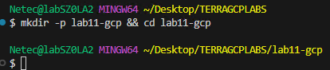

- **Paso 3.** Crea los archivos base del proyecto:

  ```bash
  touch main.tf
  ```

- **Paso 4.** Dentro del archivo `main.tf`agrega el siguiente codigo para declarar crear los recursos.

  - Sustituye el valor de la llave **project_id** por el nombre de tu proyecto asignado al curso.
  - Tambien puedes usar este comando para obtenerlo: `PROJECT_ID="$(gcloud config get-value project)"`
  - Y este comando para visualizarlo: `echo "Proyecto actual: $PROJECT_ID"`

  ```hcl
  terraform {
    required_providers {
      google = {
        source  = "hashicorp/google"
        version = ">= 5.0"
      }
      random = {
        source  = "hashicorp/random"
        version = ">= 3.5"
      }
    }
  }

  provider "google" {
    project = var.project_id
    region  = var.region
    zone    = var.zone
  }

  variable "project_id" {
    type        = string
    description = "ID del proyecto GCP"
    default     = "<TU_PROJECT_ID>"
  }

  variable "region" {
    type        = string
    description = "Región por defecto"
    default     = "us-central1"
  }

  variable "zone" {
    type        = string
    description = "Zona por defecto"
    default     = "us-central1-a"
  }

  # VM de ejemplo (Compute Engine)
  resource "google_compute_instance" "vm" {
    name         = "infracost-demo-vm"
    machine_type = "e2-medium"
    zone         = var.zone
    tags         = ["demo", "costs"]

    boot_disk {
      initialize_params {
        image = "projects/debian-cloud/global/images/family/debian-12"
        size  = 20   # GB del disco (impacta en costo de almacenamiento)
        type  = "pd-standard"
      }
    }

    network_interface {
      network = "default"
      access_config {} # crea IP externa (puede impactar costos si es reservada)
    }

    labels = {
      env = "dev"
    }
  }

  # Bucket de GCS (almacenamiento)
  resource "random_id" "suffix" {
    byte_length = 3
  }

  resource "google_storage_bucket" "bucket" {
    name                        = "infracost-demo-${random_id.suffix.hex}"
    location                    = var.region
    force_destroy               = true
    uniform_bucket_level_access = true
    storage_class               = "STANDARD" # Cambia a NEARLINE/COLDLINE/ARCHIVE para comparar costos
    labels = {
      env = "dev"
    }

    lifecycle_rule {
      condition {
        age = 30
      }
      action {
        type = "Delete"
      }
    }
  }
  ```

- **Paso 5.** Inicializa tu proyecto con el siguiente comando.

  ```bash
  terraform init
  ```

  ---

  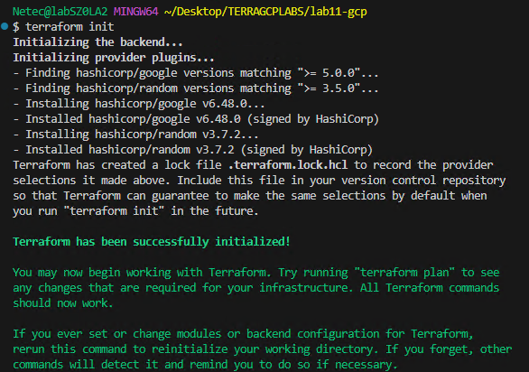

- **Paso 6.** Ejecuta el plan para verificar que no se tengan errores previos a la implementación.

  - La VM y el bucket cubren cómputo y almacenamiento, dos rubros comunes en costos.

  ```bash
  terraform plan
  ```

  ---

  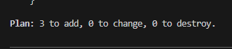

> **TAREA FINALIZADA**

**Resultado esperado:** Proyecto **lab11-gcp** listo con recursos GCP representativos para estimar costos.

---

### Tarea 2: Instalar Infracost CLI

Instalar la herramienta `Infracost` en tu entorno local para poder generar reportes de costos desde Terraform.

#### Tarea 2.1

- **Paso 7.** Instala **Infracost** mediante la herramienta de **Chocolately**

  - Si te pide confirmación escribe: `Y`

  ```bash
  choco install infracost  
  ```

  ---

  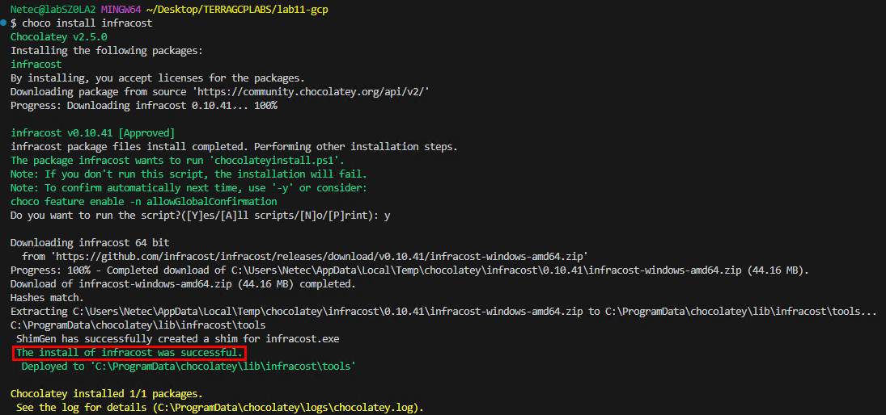

- **Paso 8.** Verifica la instalación con el siguiente comando.

  - Debe mostrar la versión instalada.

  ```bash
  infracost --version
  ```

  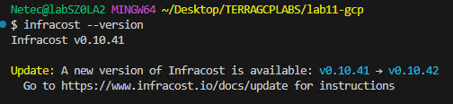

- **Paso 9.** Tambien pudes instalar la extension de `infracost` en Visual Studio Code. Da clic en el icono de extensiones.

  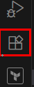

- **Paso 10.** Escribe en el cuadro de busqueda `Infracost`y luego da clic en el botón **Install**.

  - En la ventana emergente confirma **Trust Publisher & Install**

  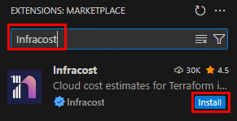

- **Paso 11.** Una vez instalada veras el nuevo icono en el panel de extensiones de VSC.

  

- **Paso 12.** Ahora crea una cuenta de **Infracost** dando clic [**AQUÍ**](https://login.infracost.io/login?state=hKFo2SBURHJyZlNlNHotbmotdW9vX01rdHhFOHpFaDlCRkZtdqFupWxvZ2luo3RpZNkgUUFid182R2tTaFd4ZVU5aFRVTl9xZHVjY2d5MGJLcXejY2lk2SBRVDc3T0pwRm9FOFZLMDdORkFGMXpINkNDVzhYU1ZXUA&client=QT77OJpFoE8VK07NFAF1zH6CCW8XSVWP&protocol=oauth2&audience=https%3A%2F%2Fdashboard.api.infracost.io&icSource=web&redirect_uri=https%3A%2F%2Fdashboard.infracost.io&scope=openid%20profile%20email%20offline_access&response_type=code&response_mode=query&nonce=QVoydEU1aFdmfjFmTTVLLWhjOUFYTE4uTHBsSmVPTGhtT0Z6VUN4UFFvLg%3D%3D&code_challenge=_izGc1TZvIrAFVCdQvQsBH7YiJsc_7w2Rwxtp_hT_qs&code_challenge_method=S256&auth0Client=eyJuYW1lIjoiYXV0aDAtcmVhY3QiLCJ2ZXJzaW9uIjoiMS4xMC4yIn0%3D)

  - Da clic en la opción **Sign Up** y crea tu cuenta.
  - Tambien puedes usar **GitHub** o **Google** como federación de usuario.

- **Paso 13.** Ahora que ya terminaste de crear tu cuenta, regresa a la terminal de VSCode y escribe el siguiente comando para autenticar tu ambiente.

  - Si es necesario realiza el **Log in** de tu cuenta.

  ```bash
  infracost auth login
  ```

  ---

  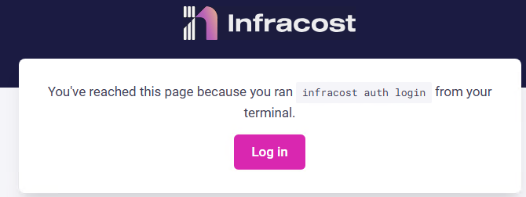

- **Paso 14.** De vuelta a la terminal observaras la autenticación correcta.

  - Tu CLI de Infracost queda vinculada a tu cuenta.

  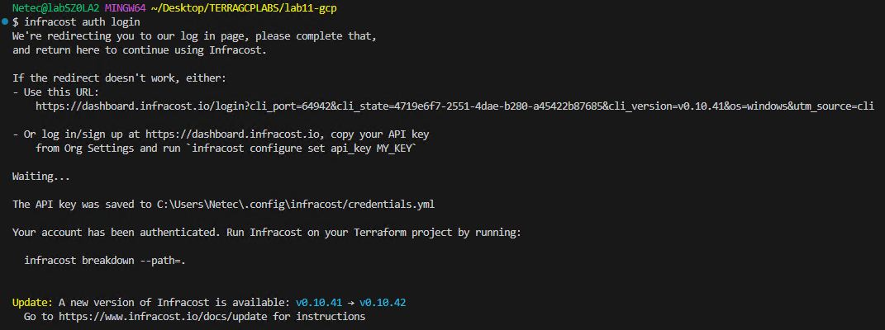

> **TAREA FINALIZADA**

**Resultado esperado:** `Infracost` instalado correctamente y listo para usarse.

---

### Tarea 3: Generar el plan de Terraform para alimentar a Infracost

Crear un plan binario que Infracost usará para enriquecer el cálculo de costos.

#### Tarea 3.1

- **Paso 15.** Genera el plan y guardalo en un archivo que puede ser reusable.

  - **Infracost** puede trabajar con el código o con el plan. Con plan, el análisis suele ser más exacto (resuelve variables, count/for_each, etc.).

  ```bash
  terraform plan -out=tfplan.binary
  terraform show -json tfplan.binary > tfplan.json
  ```

  ---

  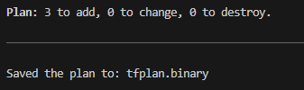

> **TAREA FINALIZADA**

**Resultado esperado:** Plan de Terraform disponible para el análisis de costos.

---

### Tarea 4: Generar reporte de costos con Infracost

Generar un desglose de costos y analizar recursos de mayor impacto.

#### Tarea 4.1

- **Paso 16.** Ejecuta Infracost con el plan binario.

  - El reporte muestra filas para la VM (Compute Engine) y el bucket (GCS), con costos **mensuales estimados**.
  - Existe un **Total** al final del reporte.
  - El formato **table** es útil en terminal.

  ```bash
  infracost breakdown --path tfplan.binary --format table
  ```

  ---

  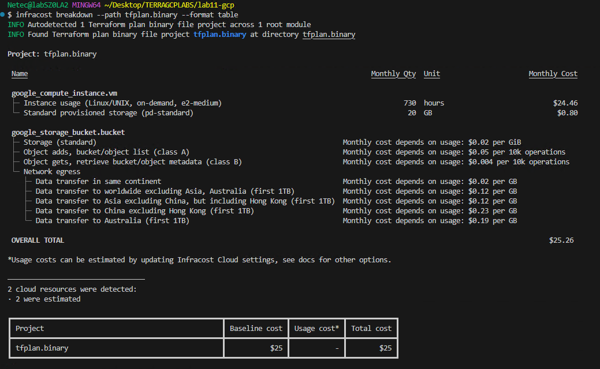

- **Paso 17.** Tambien puedes usar la interpretación para el archivo JSON

  - El **json** sirve para automatizaciones y visualizaciones.

  ```bash
  infracost breakdown --path tfplan.binary --format json
  ```  

  ---

  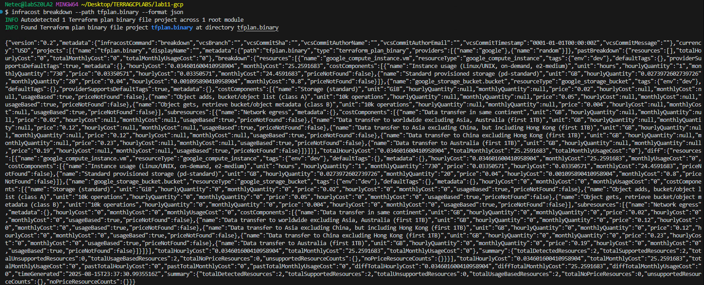

> **TAREA FINALIZADA**

**Resultado esperado:** Reporte de costos legible en consola y, si elegiste, archivo JSON con el mismo contenido.

---

### Tarea 5: Comparar cambios de costos entre archivos, ramas o commits 

Usar `--compare-to` para ver deltas (ideal en PRs)

#### Tarea 5.1

- **Paso 18.** Realiza un cambio de del tipo de recursos de `google_compute_instance`

  - En la linea 41 aproximadamente cambia el valor de **machine_type** a: `e2-standard-2`
  - En la linea 73 aproximadamente cambia el valor de **storage_class** a: `NEARLINE`
  - Guarda el archivo. 

- **Paso 19.** Ahora crea el nuevo json de infracost con la modificación aplicada

  ```bash
  infracost breakdown --path . --format json --out-file infracost-base.json
  infracost diff --path . --compare-to infracost-base.json
  ```

  ---

  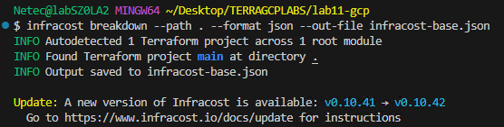

- **Paso 20.** Ahora realiza la comparación de los costos con los servicios modificados.

  - El reporte **diff** muestra aumentos o reducciones en Monthly Cost por recurso y total.
  - Este flujo permite a revisores ver el impacto económico del cambio antes de aprobar.

  ```bash
  infracost diff --path . --compare-to infracost-base.json
  ```

  ---

  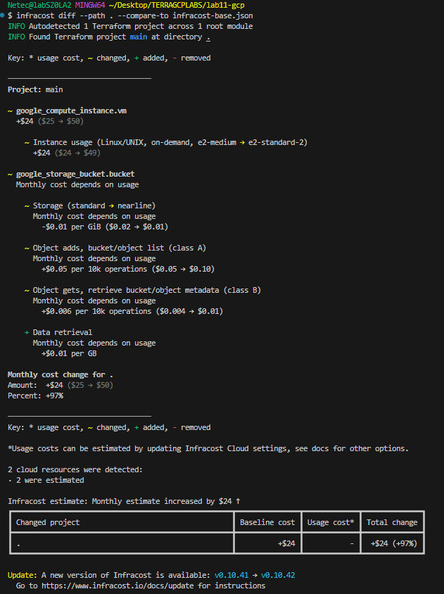

> **TAREA FINALIZADA**

**Resultado esperado:** Diferencias de costo visibles y cuantificadas para facilitar decisiones.

---

> **¡FELICIDADES HAZ COMPLETADO EL LABORATORIO 11!**

---

## Resultado final

Al final de la práctica, tendrás Infracost instalado, configurado y ejecutando estimaciones de costos sobre infraestructura en GCP definida con Terraform, pudiendo ver resultados en tabla o JSON y listos para integrarse a pipelines.

## Notas y/o Consideraciones

- Cambia el tipo de máquina o región para observar variaciones en el costo.
- Infracost soporta múltiples proveedores Cloud, no solo GCP.
- En proyectos grandes, filtra recursos para reportes más enfocados.
- Los costos son estimaciones; pueden variar por descuentos/compromisos o cotizaciones empresariales.
- Revisa que la región sea la correcta: los precios pueden cambiar sustancialmente.
- Evita exponer la API key en repos públicos; usa variables de entorno o secretos de CI.

## URLs de referencia

- [Infracost Docs](https://www.infracost.io/docs/)
- [Infracost GitHub](https://github.com/infracost/infracost)
- [Precios GCP](https://cloud.google.com/pricing)

---

**[⬅️ Atrás](https://netec-mx.github.io/TRFRM-GCP-INT_Priv/Capítulo9/lab10.html)** | **[Lista General](https://netec-mx.github.io/TRFRM-GCP-INT_Priv/)** | **[Siguiente ➡️](https://netec-mx.github.io/TRFRM-GCP-INT_Priv/Capítulo9/lab12.html)**