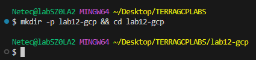
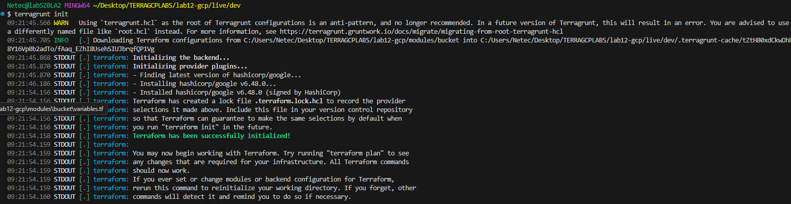
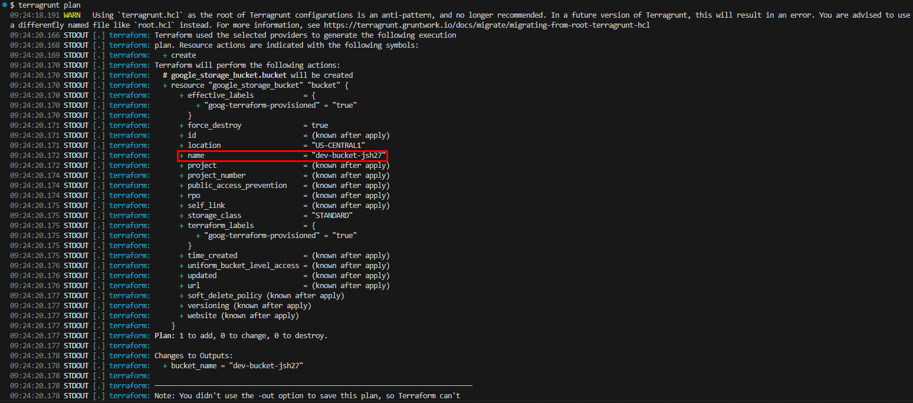
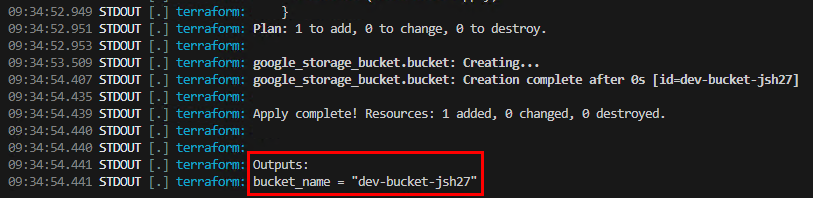
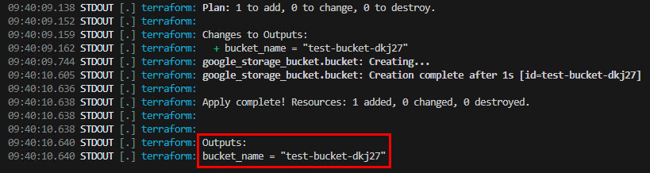
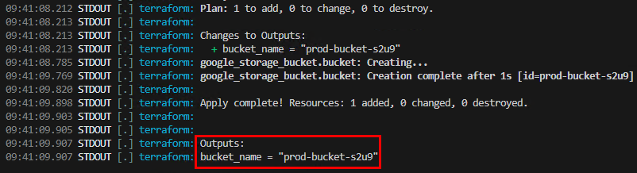
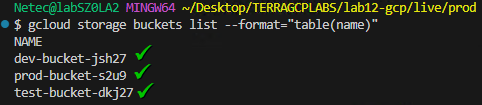
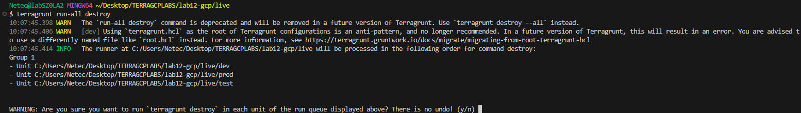
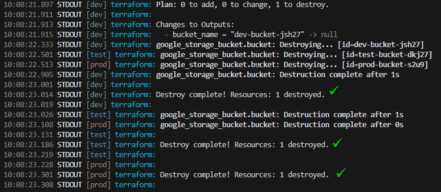
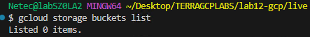

# Práctica 12: Crear un Wrapper Básico con Terragrunt

## Objetivo

Aprender a usar **Terragrunt** como wrapper de Terraform para desplegar recursos en GCP, aprovechando una estructura centralizada de módulos y configuraciones para múltiples entornos.

## Requisitos

- Terraform v1.0+ instalado.
- Cuenta de Google Cloud con proyecto activo.

## Duración aproximada

- 15 minutos.

## Región

us-central1

## Introducción

**Terragrunt** es una herramienta que envuelve Terraform para simplificar la reutilización de módulos y la gestión de entornos. En GCP, nos ayuda a definir infraestructura consistente en distintas regiones o proyectos sin duplicar código.

---

**[⬅️ Atrás](https://netec-mx.github.io/TRFRM-GCP-INT_Priv/Capítulo9/lab11.html)** | **[Lista General](https://netec-mx.github.io/TRFRM-GCP-INT_Priv/)** | **[Siguiente ➡️](https://netec-mx.github.io/TRFRM-GCP-INT_Priv/Capítulo1/lab1.html)**

---

## Instrucciones

**IMPORTANTE:** Recuerda siempre autenticarte a GCP en la terminal de VSC con el comando `gcloud auth application-default login` y el usuario y contraseña asignado al curso.

### Tarea 1: Crear el módulo base

Desarrollaremos un módulo de Terraform para crear un Google Cloud Storage Bucket que será reutilizado en varios entornos.

#### Tarea 1.1

- **Paso 1.** En VSCode, abre una **ventana** y selecciona **File > Open Folder...** y abre `TERRAGCPLABS`.

- **Paso 2.** Abre la **Terminal Integrada** en VSCode dentro de la carpeta **TERRAGCPLABS** y ejecuta el siguiente comando:

  ```bash
  mkdir -p lab12-gcp && cd lab12-gcp
  ```

  ---

  

- **Paso 3.** Crear la carpeta `modules/bucket` y dentro el archivo `main.tf`, `variables.f`, `outputs.tf`:

  - Este **módulo** representa el bloque de construcción principal para nuestros entornos. Usar módulos permite mantener **DRY (Don't Repeat Yourself**) en IaC.

  ```bash
  mkdir -p modules/bucket
  touch modules/bucket/main.tf modules/bucket/variables.tf modules/bucket/outputs.tf
  ```

- **Paso 4.** Agrega el siguiente contenido al archivo `main.tf`

  ```hcl
  resource "google_storage_bucket" "bucket" {
    name                        = var.name
    location                    = var.location
    project                     = var.project_id
    force_destroy               = true
    uniform_bucket_level_access = true
  }
  ```

- **Paso 5.** Agrega el siguiente contenido al archivo `variables.tf`:

  - Sustituye el valor **default** de la llave **project_id** por el nombre de tu proyecto asignado al curso.
  - Tambien puedes usar este comando para obtenerlo: `PROJECT_ID="$(gcloud config get-value project)"`
  - Y este comando para visualizarlo: `echo "Proyecto actual: $PROJECT_ID"`

  ```hcl
  variable "name" {
    type = string
  }
  variable "location" {
    type    = string
    default = "us-central1"
  }
  variable "project_id" {
    type    = string
    default = "TU_PROYECTO"
  }
  ```

- **Paso 6.** Agrega el siguiente contenido al archivo `outputs.tf`:

  ```hcl
  output "bucket_name" {
    value = google_storage_bucket.bucket.name
  }
  ```

> **TAREA FINALIZADA**

**Resultado esperado:** Módulo `bucket` listo para ser invocado por Terragrunt en distintos entornos.

---

### Tarea 2: Configurar `terragrunt.hcl` raíz

Crearemos un archivo `terragrunt.hcl` en la raíz para definir configuración compartida.

#### Tarea 2.1

- **Paso 7.** En la raíz del proyecto crea el archivo `terragrunt.hcl`:

  - Asegurate de estar en la raíz de la carpeta **lab12-gcp** para crear el archivo.
  - Si estas en un directorio diferente ajusta la ruta para crear el archivo.

  ```bash
  touch terragrunt.hcl
  ```

- **Paso 8.** Agrega el siguiente contenido al archivo **terragrunt.hcl**

  ```hcl
  locals {
    region = "us-central1"
  }
  ```

> **TAREA FINALIZADA**

**Resultado esperado:** Archivo terragrunt.hcl centralizado que provea configuración global para todos los entornos.

---

### Tarea 3: Configurar entornos

Crearemos un directorio **live/** con subdirectorios **dev**, **test** y **prod**, cada uno con su archivo `terragrunt.hcl`.

#### Tarea 3.1

- **Paso 9.** Crear estructura de directorios siguiente.

  - Asegurate de estar en la raíz de la carpeta **lab12-gcp** para crear los directorios.
  - Separar entornos en carpetas permite ejecutar despliegues independientes por ambiente.

  ```bash
  mkdir -p live/dev live/test live/prod
  ```

- **Paso 10.** Crear el archivo llamado `live/dev/terragrunt.hcl`:

  ```bash
  touch live/dev/terragrunt.hcl
  ```

- **Paso 11.** Agrega el siguiente contenido al archivo.

  - Cmabia las letras `x`por caracteres aleatorios. El nombre debe de ser unico y en minusculas

  ```hcl
  include {
    path = find_in_parent_folders()
  }

  terraform {
    source = "../../modules/bucket"
  }

  inputs = {
    name     = "dev-bucket-xxxx"
    location = "us-central1"
  }
  ```

- **Paso 12.** Crear el archivo llamado `live/test/terragrunt.hcl`:

  ```bash
  touch live/test/terragrunt.hcl
  ```

- **Paso 13.** Agrega el siguiente contenido al archivo.

  - Cmabia las letras `x`por caracteres aleatorios. El nombre debe de ser unico y en minusculas

  ```hcl
  include {
    path = find_in_parent_folders()
  }

  terraform {
    source = "../../modules/bucket"
  }

  inputs = {
    name     = "test-bucket-xxxx"
    location = "us-central1"
  }
  ```

- **Paso 14.** Crear el archivo llamado `live/prod/terragrunt.hcl`:

  ```bash
  touch live/prod/terragrunt.hcl
  ```

- **Paso 15.** Agrega el siguiente contenido al archivo.

  - Cmabia las letras `x`por caracteres aleatorios. El nombre debe de ser unico y en minusculas

  ```hcl
  include {
    path = find_in_parent_folders()
  }

  terraform {
    source = "../../modules/bucket"
  }

  inputs = {
    name     = "prod-bucket-xxxx"
    location = "us-central1"
  }
  ```

> **TAREA FINALIZADA**

**Resultado esperado:** Directorios **dev**, **test** y **prod** listos para desplegar cada bucket de forma aislada.

---

### Tarea 4: Ejecutar despliegues

Inicializaremos y aplicaremos cambios en un entorno específico.

#### Tarea 4.1

- **Paso 16.** Entra al directorio **dev** y ejecuta los siguientes comandos:

  ```bash
  cd live/dev
  terragrunt init
  ```

  

- **Paso 17.** Luego ejecuta el plan mediante terragrunt.

  - Observa el nombre para el ambiente desdeel archivo `terragrunt.hcl` se le esta mandando el valor al modulo de **Terraform**.

  ```bash
  terragrunt plan
  ```

  

- **Paso 18.** Ahora manda el comando que aplicara los cambios.

  ```bash
  terragrunt apply -auto-approve 
  ```

  ---

    

- **Paso 19.** Repite los comandos para **test**, puedes pegarlos todos juntos.

  ```bash
  cd ../test
  terragrunt init
  terragrunt apply -auto-approve
  ```

  ---

     

- **Paso 20.** Repite los comandos para **prod**, puedes pegarlos todos juntos.

  ```bash
  cd ../prod
  terragrunt init
  terragrunt apply -auto-approve
  ```

  ---

  

- **Paso 21.** Verifica los buckets creados mediante el comando de gcloud.

  ```bash
  gcloud storage buckets list --format="table(name)"
  ```

  ---

    

> **TAREA FINALIZADA**

**Resultado esperado:** Los buckets estan creados en GCP mediante terragrunt para el entorno ejecutado.

---

### Tarea 5: Limpieza de ambientes.

Inicializaremos y aplicaremos cambios en un entorno específico.

#### Tarea 5.1

- **Paso 22.** Ahora elimina toda la infraestructura de regresa al directorio **live**.

  - Confirma con `Y` para continuar con la eliminación
  - La salida es muy grande porque manda a eliminar todo juntos

  ```bash
  cd ..
  terragrunt run-all destroy
  ```

  ---

   

  ---

   

- **Paso 23.** Ahora verifica con el comando de gcloud que no existan los buckets.

  ```bash
  gcloud storage buckets list  
  ```

  ---

    

> **TAREA FINALIZADA**

**Resultado esperado:** La infraestructura de los diferentes ambientes ha sido eliminada.

---

> **¡FELICIDADES HAZ COMPLETADO EL LABORATORIO 12!**

---

## Resultado final

Un proyecto con `Terragrunt` y Terraform en GCP capaz de crear recursos consistentes en múltiples entornos con configuración centralizada y código reutilizable.

## Notas y/o Consideraciones

- Asegúrate de tener roles de **Storage Admin** en GCP antes de ejecutar.
- Los nombres de buckets en GCP son globales y deben ser únicos.
- Considera usar **for_each** o **workspaces** si quieres manejar múltiples buckets dentro de un solo entorno.

## URLs de referencia

- [Terraform GCP Provider](https://registry.terraform.io/providers/hashicorp/google/latest/docs)
- [Terragrunt Documentation](https://terragrunt.gruntwork.io/)
- [Best Practices with Terragrunt](https://terragrunt.gruntwork.io/docs/features/keep-your-terraform-code-dry/)

---

**[⬅️ Atrás](https://netec-mx.github.io/TRFRM-GCP-INT_Priv/Capítulo9/lab11.html)** | **[Lista General](https://netec-mx.github.io/TRFRM-GCP-INT_Priv/)** | **[Siguiente ➡️](https://netec-mx.github.io/TRFRM-GCP-INT_Priv/Capítulo1/lab1.html)**