# Práctica 9: Escanear código con tfsec

## Objetivo

Aprender a utilizar la herramienta `tfsec` para escanear configuraciones Terraform y detectar prácticas inseguras o no recomendadas antes de aplicar cambios en la infraestructura en **Google Cloud Platform (GCP)**.

## Requisitos

- Tener acceso a terminal con permisos de instalación.
- Terraform 1.0+ instalado.

## Duración aproximada

- 10 minutos

## Región

- us-central1

## Introduccion

`tfsec` analiza estáticamente tu código Terraform y señala configuraciones potencialmente inseguras (por ejemplo, firewalls abiertos a Internet o buckets públicos). En este laboratorio, crearás código **inseguro** de ejemplo para GCP, lo escanearás con `tfsec`, corregirás los hallazgos y dejarás configuraciones útiles para integrarlo en flujos locales y de CI/CD.

---

**[⬅️ Atrás](https://netec-mx.github.io/TRFRM-GCP-INT_Priv/Capítulo8/lab8.html)** | **[Lista General](https://netec-mx.github.io/TRFRM-GCP-INT_Priv/)** | **[Siguiente ➡️](https://netec-mx.github.io/TRFRM-GCP-INT_Priv/Capítulo9/lab10.html)**

---

## Instrucciones

**IMPORTANTE:** Recuerda siempre autenticarte a GCP en la terminal de VSC con el comando `gcloud auth application-default login` y el usuario y contraseña asignado al curso.

### Tarea 1: Preparar estructura del laboratorio

Crear la carpeta `lab9-gcp` y un proyecto mínimo con un `main.tf` inseguro para reproducir hallazgos de `tfsec`.

#### Tarea 1.1

- **Paso 1.** En VSCode, abre una **ventana** y selecciona **File > Open Folder...** y abre `TERRAGCPLABS`.

- **Paso 2.** Abre la **Terminal Integrada** en VSCode dentro de la carpeta **TERRAGCPLABS** y ejecuta el siguiente comando:

  ```bash
  mkdir -p lab9-gcp && cd lab9-gcp
  ```

  ---

  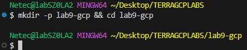

- **Paso 3.** Crea los archivos base del proyecto:

  ```bash
  touch main.tf providers.tf
  ```

- **Paso 4.** Dentro del archivo `providers.tf`agrega el siguiente codigo para declarar **GCP**

  ```hcl
  terraform {
    required_providers {
      google = {
        source  = "hashicorp/google"
        version = ">= 5.0"
      }
    }
  }

  provider "google" {
    project = var.project_id
    region  = var.region
  }
  ```

- **Paso 5.** Crea el archivo `main.tf` con un firewall abierto y un bucket potencialmente público (ejemplo inseguro):

  - `google_compute_network.vpc` tiene un firewall abierto a todo Internet (0.0.0.0/0).
  - `google_storage_bucket.insecure_bucket` es un bucket sin UBLA y con ACLs heredables (malas prácticas)
  - `google_storage_bucket_iam_binding.public_read` es un objeto con ACL pública (no crearás recursos, pero **tfsec** lo detectará en estático si lo agregas)

  ```hcl
  variable "project_id" {
    type        = string
    description = "ID del proyecto GCP"
    default     = "PROJECT_ID"
  }

  variable "region" {
    type        = string
    description = "Región por defecto"
    default     = "us-central1"
  }

  # INSEGURO A PROPÓSITO 
  resource "google_compute_network" "vpc" {
    name                    = "tfsec-demo-vpc"
    auto_create_subnetworks = true
  }

  resource "google_compute_firewall" "allow_ssh_anywhere" {
    name    = "allow-ssh-anywhere"
    network = google_compute_network.vpc.name

    allow {
      protocol = "tcp"
      ports    = ["22"]
    }

    source_ranges = ["0.0.0.0/0"]  # tfsec debe alertar sobre este rango demasiado amplio
    direction     = "INGRESS"
    target_tags   = ["ssh"]
  }

  # POSIBLE EXPOSICIÓN 
  resource "google_storage_bucket" "insecure_bucket" {
    name          = "tfsec-demo-bucket-${random_id.rand.hex}"
    location      = var.region
    force_destroy = true
    uniform_bucket_level_access = false  # tfsec suele recomendar UBLA = true
  }

  resource "random_id" "rand" {
    byte_length = 4
  }

  # DESCOMENTAR PARA PROBAR TFSEC
  # resource "google_storage_bucket_iam_binding" "public_read" {
  #   bucket = google_storage_bucket.insecure_bucket.name
  #   role   = "roles/storage.objectViewer"
  #   members = [
  #     "allUsers"  # Público
  #   ]
  # }
  ```

> **TAREA FINALIZADA**

**Resultado esperado:** Carpeta `lab9-gcp` con un `main.tf` listo para ser analizado por tfsec y producir findings.

---

### Tarea 2: Instalar tfsec

Instalar `tfsec` de la forma que mejor se adapte a tu entorno (Homebrew, binario o Docker).

#### Tarea 2.1

- **Paso 6.** Instalación de tfsec mediante CLI.

  - Si te pregunta confirmación escribe `Y`

  ```bash
  choco install tfsec
  ```

  ---

  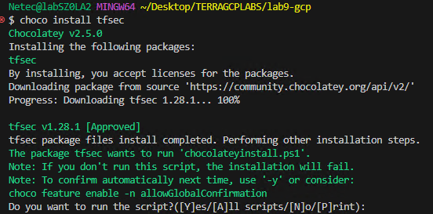

- **Paso 7.** Verifica la instalación con el siguiente comando.

  - La version puede variar.

  ```bash
  tfsec --version
  ```

  ---

  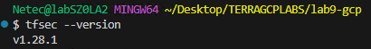

- **Paso 8.** Tambien pudes instalar la extension de `tfsec` en Visual Studio Code. Da clic en el icono de extensiones.

  

- **Paso 9.** Escribe en el cuadro de busqueda `tfsec`y luego da clic en el botón **Install**.

  - En la ventana emergente confirma **Trust Publisher & Install**

  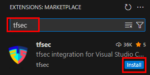

- **Paso 10.** Una vez instalada veras el nuevo icono en el panel de extensiones de VSC.

  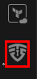

> **TAREA FINALIZADA**

**Resultado esperado:** `tfsec` disponible para ejecutar escaneos en el directorio del proyecto.

---

### Tarea 3: Ejecutar el escaneo e interpretar resultados

Correr `tfsec` sobre el proyecto y revisar las advertencias, con foco en gravedad **HIGH** y **CRITICAL**.

#### Tarea 3.1

- **Paso 11.** Ejecuta el escaneo desde la carpeta del proyecto `lab9-gcp`.

  ```bash
  tfsec .
  ```

- **Paso 12.** El resultado es muy extendo, revisalo muy bien. A continuación se resaltan los puntos mas emblematicos.

  - Firewall con source_ranges = ["0.0.0.0/0"] (SSH abierto a Internet).
  - Observa las recomendaciones de solucion.

  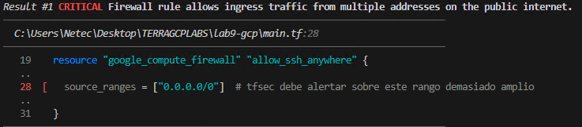

  ---

  - Bucket con `uniform_bucket_level_access = false` y/o permisos potencialmente amplios.
  - Observa las recomendaciones de solucion.

  

  ---

  - **NO** esta cumpliendo con la buena practica de encripción de datos.
  - Observa las recomendaciones de solucion.

  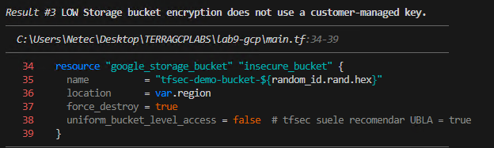

- **Paso 13.** Observa el resumen de la ejecución final.

  - Tiempos de procesamiento
  - Cantidad de archivos revisados
  - Resultados encontrados
  - `tfsec` realiza **análisis estático**; no necesita aplicar ni acceder a tu cuenta de GCP. **Ideal para pre-commit y CI.**

  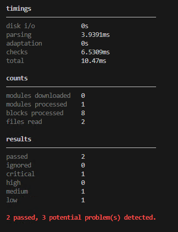

> **TAREA FINALIZADA**

**Resultado esperado:** Reporte de **findings** que identifique las configuraciones inseguras del ejemplo.

---

### Tarea 4: Corregir las configuraciones inseguras y volver a escanear

Aplicar correcciones a los recursos marcados por **tfsec** y verificar que desaparezcan las alertas principales.

#### Tarea 4.1

- **Paso 14.** Abre y edita el archivo **main.tf** para cerrar el firewall y endurecer el bucket.

  - Con mucho cuidado remplaza el recurso **`google_compute_firewall`** y **`google_storage_bucket`**.
  - Se reemplaza **source_ranges** amplio por **IAP** o tu IP corporativa (ejemplo: 203.0.113.10/32)
  - Se refuerzan las politicas del bucket: habilitar UBLA

  ```hcl
  resource "google_compute_firewall" "allow_ssh_iap" {
    name    = "allow-ssh-iap"
    network = google_compute_network.vpc.name

    allow {
      protocol = "tcp"
      ports    = ["22"]
    }

    # Recomendado: rango IAP para túnel SSH
    source_ranges = ["35.235.240.0/32"]
    direction     = "INGRESS"
    target_tags   = ["ssh"]
  }

  resource "google_storage_bucket" "secure_bucket" {
    name          = "tfsec-demo-bucket-${random_id.rand.hex}"
    location      = var.region
    force_destroy = true
    uniform_bucket_level_access = true  # endurecido
  }
  ``` 

- **Paso 15.** Ahora vuelve a ejecutar el comando:

  ```bash
  tfsec .
  ```  

- **Paso 16.** Observa que ya se resolvieron los problemas de seguridad.

  - No todas las advertencias requieren cambio inmediato, pero las de red y acceso público suelen ser prioridad alta.

  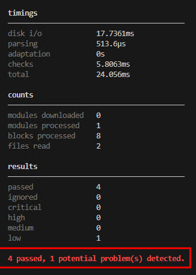 

> **TAREA FINALIZADA**

**Resultado esperado:** `tfsec` ya no reporta hallazgos críticos sobre los recursos actualizados.

---

### Tarea 5: Excepciones justificadas.

Aprender a ignorar reglas justificadamente, y a exportar resultados para pipelines (JSON/SARIF).

#### Tarea 5.1

- **Paso 17.** Ignora una regla en línea solo si tienes justificación válida:

  - En este caso se ignorara la regla faltante como ejemplo.
  - Agrega el siguiente comentario **justo arriba de la declaracion del recurso** para ignorarla.

  ```hcl
  #tfsec:ignore:google-storage-bucket-encryption-customer-key
  ```

  --

  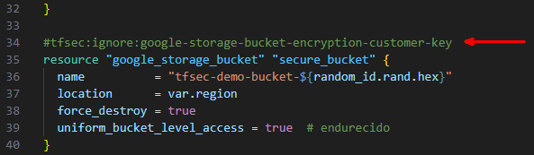 

- **Paso 18.** Ahora vuelve a ejecutar el comando:

  ```bash
  tfsec .
  ``` 

- **Paso 19.** Ahora ya no tenemos incidentes o al menos no los criticos.

  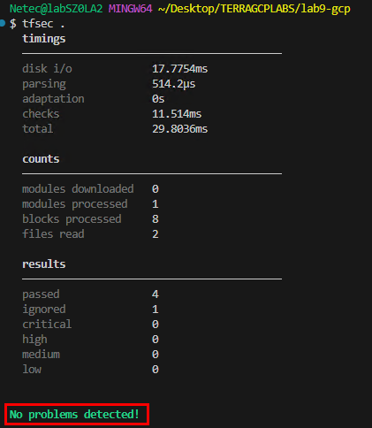 

- **Paso 20.** Finalmente exporta los resultados para CI (SARIF para Code Scanning)

  - **SARIF**, que significa Formato de Intercambio de **Resultados de Análisis Estático** (Static Analysis Results Interchange Format)
  - Define una estructura estándar para describir los resultados de herramientas de análisis estático.
  - Como puedes observar las reglas ignoradas no aparecen en el reporte.

  ```bash
  tfsec --format sarif > tfsec-results.sarif
  ```

  ---

  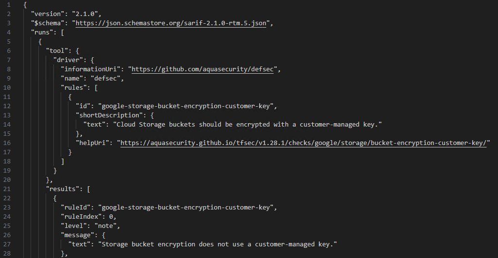 

> **TAREA FINALIZADA**

**Resultado esperado:** Proyecto preparado para integrar tfsec en flujos locales y de CI/CD futuras.

---

> **¡FELICIDADES HAZ COMPLETADO EL LABORATORIO 9!**

---

## Resultado final

Queda establecida una práctica de seguridad preventiva: escaneas tu IaC con **tfsec** antes de aplicar, corriges hallazgos de alto riesgo y controlas excepciones con criterio. El repositorio está listo para integrarse en pipelines con exportación de resultados.

## Notas y/o Consideraciones

- Corre `tfsec` en **cada commit/PR** para detectar problemas temprano.
- Mantén `tfsec` actualizado; los **códigos de regla** y severidades pueden variar por versión.
- No abuses de exclusiones globales; prefiere `justificaciones en línea` y revisiones periódicas.
- Combina `tfsec` con otras herramientas (por ejemplo, `checkov` o `terraform fmt/validate`) para mayor cobertura.

## URLs de referencia

- [tfsec (Aqua Security)](https://aquasecurity.github.io/tfsec/latest/)
- [Checks GCP](https://aquasecurity.github.io/tfsec/latest/checks/google/)
- [Formatos de salida](https://aquasecurity.github.io/tfsec/v1.20.0/guides/usage/)
- [Docker image](https://hub.docker.com/r/aquasec/tfsec)
- [Pre-commit](https://pre-commit.com/)

---

**[⬅️ Atrás](https://netec-mx.github.io/TRFRM-GCP-INT_Priv/Capítulo8/lab8.html)** | **[Lista General](https://netec-mx.github.io/TRFRM-GCP-INT_Priv/)** | **[Siguiente ➡️](https://netec-mx.github.io/TRFRM-GCP-INT_Priv/Capítulo9/lab10.html)**